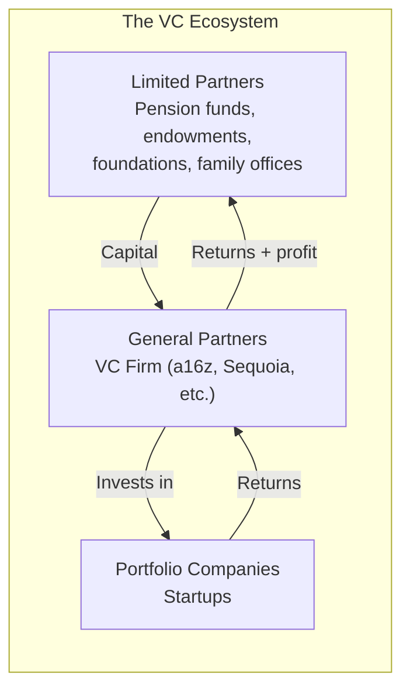
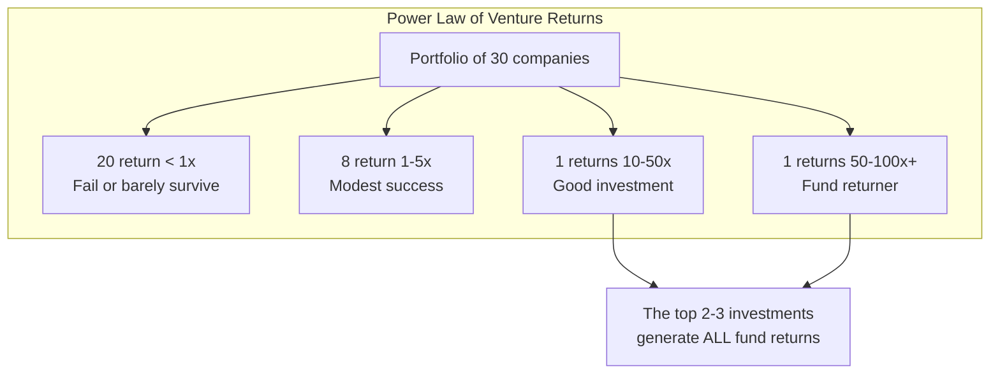
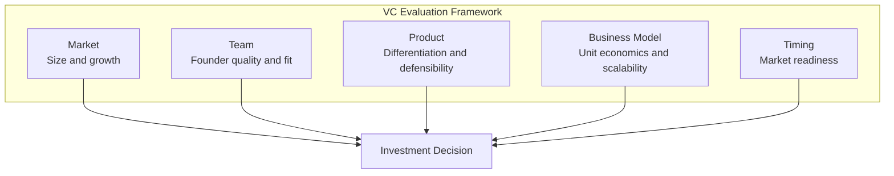
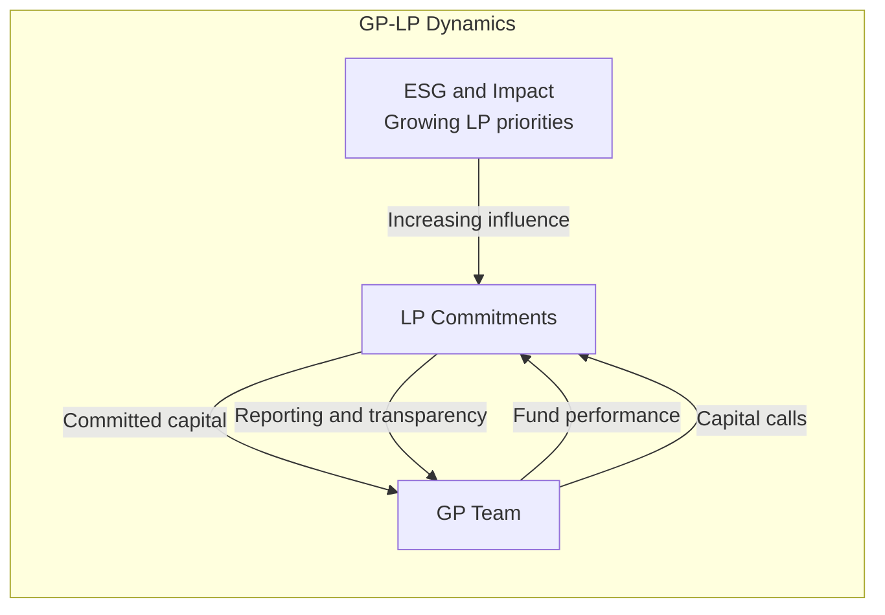

## The VC Ecosystem

VC firms are intermediaries between capital suppliers and capital users.

---

## Fund Structure: 2-and-20

The standard economic model.

| Component | Typical | Explanation |
|---|---|---|
| Management fee | 2% of fund size | Covers salaries, office, operations |
| Carried interest | 20% of profits | GP's share of fund returns |
| Fund life | 10 years | Investment + harvest period |
| Fund size | $50M to $1B+ | Determines check size and strategy |

---

## The Power Law

The single most important concept in venture capital.

### Implications of the Power Law

1. VCs must swing for the fences
2. Capital must be concentrated in the top performers
3. Follow-on decisions are the most important investment decisions
4. Small funds cannot diversify enough to benefit from the power law

---

## How VCs Evaluate Startups

Kupor's emphasis: **Market is the most important factor.**

---

## The GP-LP Relationship

---

## The Venture Capital Firm

Kupor describes the internal structure of a VC firm.

| Role | Responsibility |
|---|---|
| General Partner (GP) | Investment decisions, fundraising, portfolio support |
| Principal | Deal sourcing, evaluation, closing |
| Associate | Screening, diligence, portfolio monitoring |
| Analyst | Market research, deal flow management |
| Platform | Portfolio support, marketing, recruiting |

---

## Reading Guide

| Chapter | Topic | Est. Time | Priority |
|---|---|---|---|
| 1-2 | The VC ecosystem | 45 min | Essential |
| 3-4 | Fund economics | 1h | Essential |
| 5-7 | How VCs invest | 1.5h | Essential |
| 8-10 | Working with VCs | 1h | Essential |
| 11-12 | The LP perspective | 30 min | Important |
| 13-14 | The future of VC | 30 min | Important |
