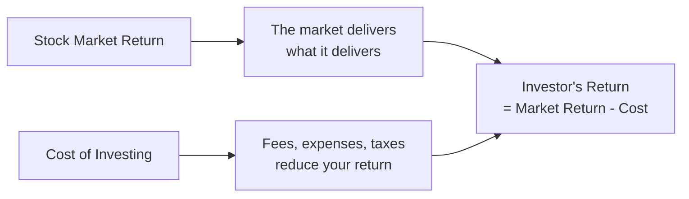
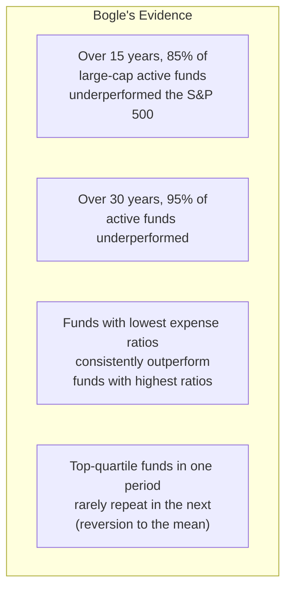
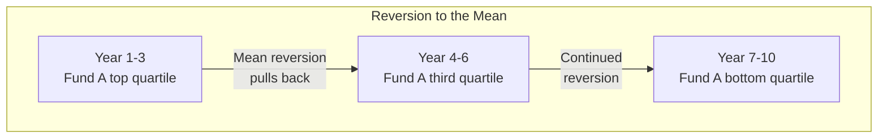
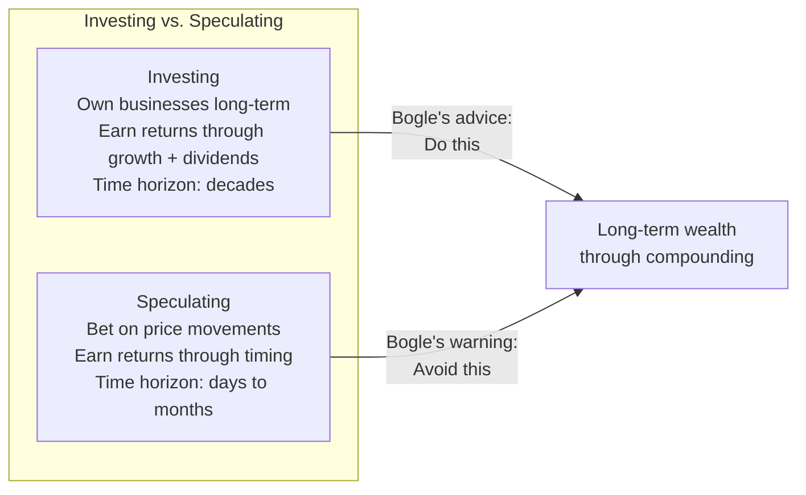

## The Central Equation

Bogle's framework begins with a fundamental truth.

**The insight:** investors as a group must earn the market return minus
their costs. Since active managers charge higher costs, the average
active investor earns less than the average index investor.

---

## The Evidence

---

## The Impact of Costs

The most powerful table in the book.

| Expense Ratio | $100,000 after 30 years (8% gross return) | Lost to fees |
|---|---|---|
| 0.05% (Index fund) | $974,000 | $2,000 |
| 1.00% (Avg active fund) | $744,000 | $232,000 |
| 2.00% (High-cost fund) | $561,000 | $415,000 |

The difference between 0.05% and 2.00% in fees costs the investor
over $400,000 on a $100,000 investment over 30 years.

---

## Reversion to the Mean

The pattern is consistent: top-performing funds attract inflows, the
manager's strategy becomes harder to execute at scale, and performance
regresses toward the mean.

---

## The Two Types of Investing

---

## The Bogle Portfolio

The recommended approach for most investors.

| Asset Class | Allocation | Vehicle |
|---|---|---|
| US Total Stock Market | 60-70% | Total Stock Market Index Fund |
| International Stocks | 10-20% | Total International Index Fund |
| US Bonds | 10-20% | Total Bond Market Index Fund |

Rebalance annually. Minimize turnover. Stay the course.

---

## Reading Guide

| Chapter | Topic | Est. Time | Priority |
|---|---|---|---|
| 1-2 | The case for indexing | 30 min | Essential |
| 3-5 | The evidence | 1h | Essential |
| 6-8 | Costs and compounding | 1h | Essential |
| 9-11 | Active management critique | 1h | Important |
| 12-14 | Implementation | 1h | Important |
