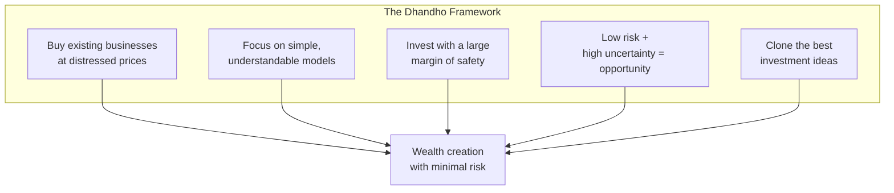
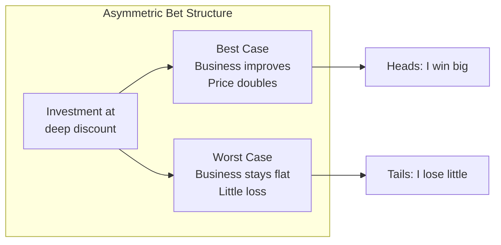
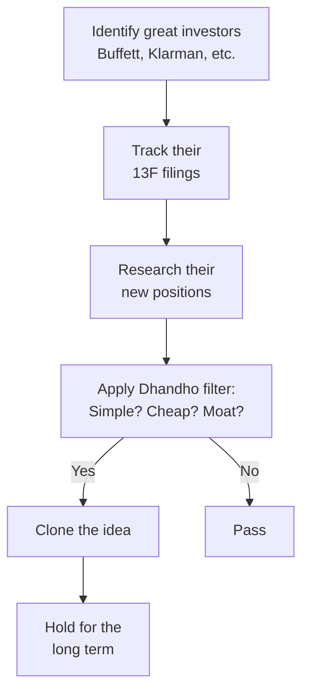

## The Dhandho Philosophy

Dhandho is derived from the Gujarati word for "endeavors that create
wealth." The philosophy was perfected by the Patels.

---

## The Patel Motel Story

The Patels bought run-down motels for pennies on the dollar, improved
operations, and generated enormous wealth.

| Step | Patel Approach | Investing Equivalent |
|---|---|---|
| Buy distressed | Purchase motel at 50% of value | Buy stock at discount to intrinsic value |
| Simple business | Basic motel operations | Simple, understandable business model |
| Improve operations | Better management, lower costs | Wait for catalyst or mean reversion |
| Minimum debt | Conservative financing | Margin of safety in purchase price |
| Long-term hold | Hold for decades | Patient, long-term ownership |

---

## Heads I Win, Tails I Do Not Lose Much

The defining characteristic of Dhandho investing.

---

## The Moat Framework

Pabrai emphasizes durable competitive advantages.

| Moat Type | Example | Durability |
|---|---|---|
| Low-cost producer | Wal-Mart, Southwest | High |
| Brand power | Coke, Gillette | High |
| Network effects | eBay, Visa | Very high |
| Regulatory barrier | Utilities, casinos | High |
| Switching costs | Adobe, SAP | Very high |
| Intangible assets | Patents, licenses | Medium |

---

## The Cloning Strategy

Pabrai's most controversial and distinctive idea.

Pabrai argues that cloning is not lazy — it is efficient. The best
minds in investing spend thousands of hours researching a small number
of ideas. Borrowing their work saves enormous time and effort.

---

## The Pabrai Funds Checklist

Before any investment:

1. Is this a simple, understandable business?
2. Does it have a durable competitive advantage (moat)?
3. Is the business available at a significant discount to intrinsic value?
4. Is the downside protected (margin of safety)?
5. Am I being patient enough to wait for the right price?
6. Am I cloning a proven investor or acting on my own analysis?

---

## Reading Guide

| Chapter | Topic | Est. Time | Priority |
|---|---|---|---|
| 1-3 | The Dhandho philosophy | 1h | Essential |
| 4-5 | The Patel story | 45 min | Essential |
| 6-8 | Moat and margin of safety | 1h | Essential |
| 9-10 | Cloning | 45 min | Essential |
| 11-12 | Implementation | 45 min | Important |
