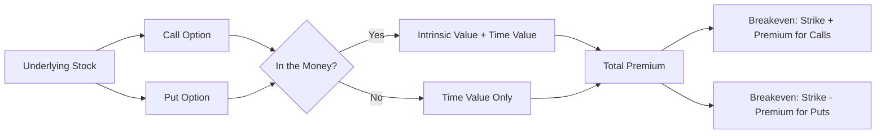
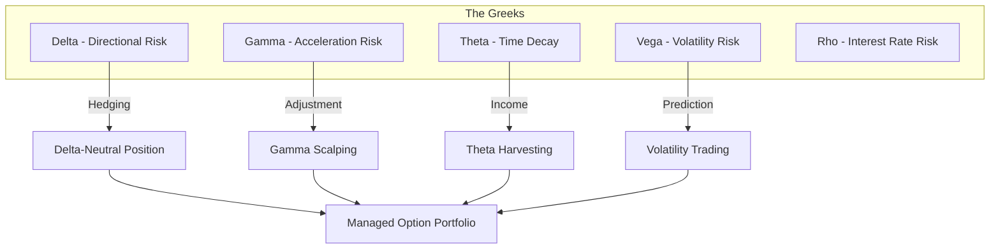
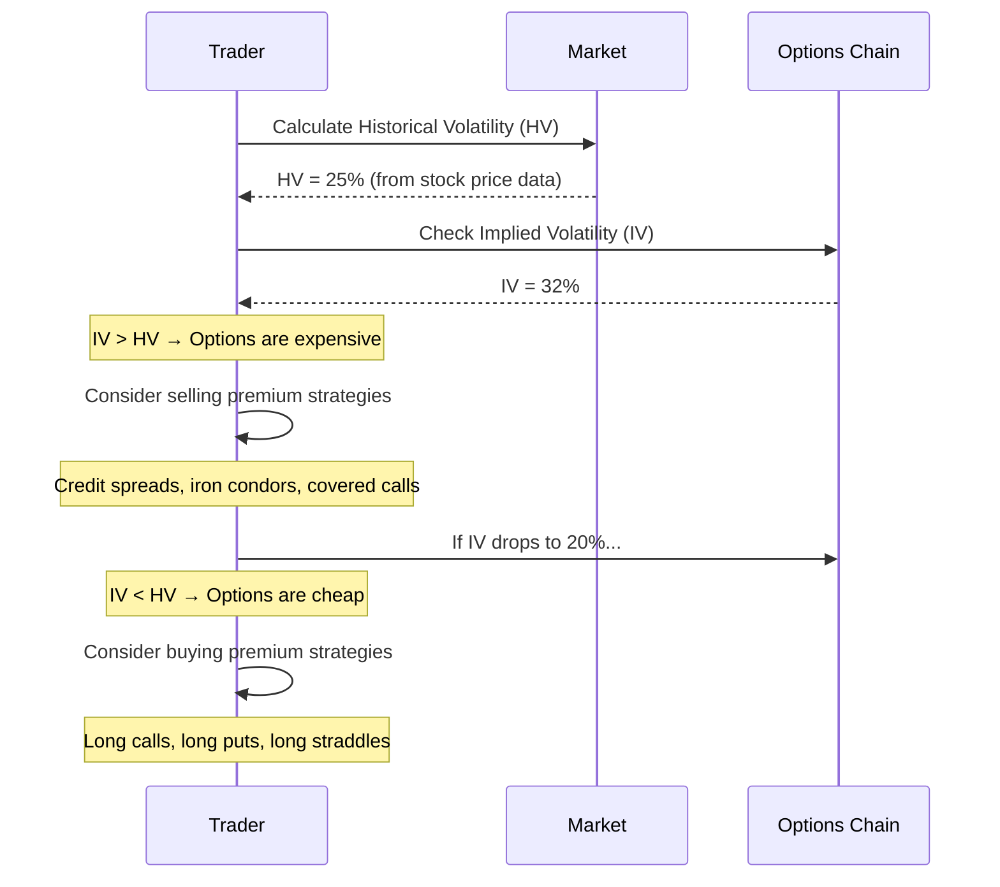
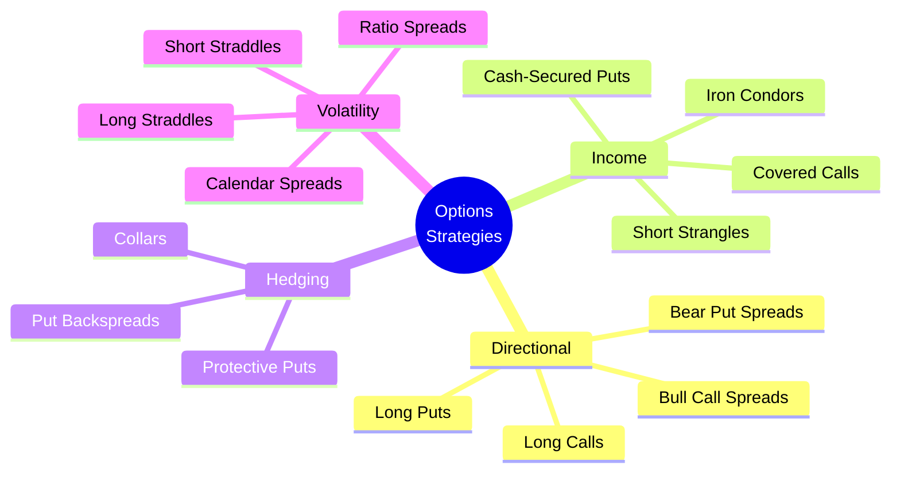

## The Foundation: Calls and Puts

Every options strategy, no matter how complex, is built from two basic instruments. A call option gives the buyer the right, but not the obligation, to purchase 100 shares of the underlying stock at a specified price (the strike price) on or before a specified date (the expiration date). A put option gives the buyer the right to sell 100 shares under the same terms. McMillan establishes these definitions in the first chapter and immediately moves to the pricing relationships that govern them.

The intrinsic value of an option is the amount by which it is in-the-money: for a call, the stock price minus the strike price; for a put, the strike price minus the stock price. Time value is everything else — the premium paid beyond intrinsic value, reflecting the possibility that the option will move further into the money before expiration. McMillan emphasises that time value decays at an accelerating rate as expiration approaches, a phenomenon known as theta decay.

## Put-Call Parity

McMillan devotes substantial attention to put-call parity, the fundamental relationship that links the prices of calls, puts, and the underlying stock. The relationship states that a synthetic stock position — long a call and short a put at the same strike — is equivalent to owning the stock. Any deviation from this relationship creates an arbitrage opportunity that professional traders will exploit, enforcing price consistency across the options chain.

The formula is: Call Price - Put Price = Stock Price - Present Value of Strike Price + Dividends

For the practical trader, put-call parity means that options prices cannot deviate too far from their theoretical values without triggering arbitrage activity. McMillan shows how to use this relationship to identify mispriced options, construct synthetic positions, and understand the implicit cost of early exercise.

## The Greeks: Managing Risk with Precision

McMillan dedicates multiple chapters to the five primary Greeks, treating them not as academic abstractions but as practical tools for position management.

**Delta** measures the expected change in an option's price for a one-point move in the underlying. A call with a delta of 0.60 will rise roughly $0.60 if the stock rises $1.00. Delta also represents the approximate probability that the option will expire in-the-money. McMillan shows how to compute portfolio delta to understand overall directional exposure.

**Gamma** measures the rate of change of delta. High gamma means that delta itself changes rapidly as the stock moves, making the position difficult to hedge. Short options have negative gamma, which means the position loses delta as the stock moves against you — a phenomenon McMillan calls "getting run over by gamma."

**Theta** measures time decay. McMillan emphasises that theta is greatest for at-the-money options in the final weeks before expiration. Option sellers harvest theta; option buyers pay for it.

**Vega** measures sensitivity to implied volatility. McMillan argues that vega is the most misunderstood Greek — traders focus on delta while ignoring that a volatility collapse can destroy the value of long options even if the stock moves in the right direction.

## Volatility Analysis

The single most important contribution of McMillan's book is its treatment of volatility. He distinguishes two types: historical volatility (HV), which measures the actual price movement of the underlying stock over a specified period, and implied volatility (IV), which is the market's forecast of future volatility derived from option prices themselves.

McMillan provides a detailed methodology for calculating HV using a 20-day or 50-day lookback period and annualising the result. He then compares HV to IV to determine whether options are cheap or expensive:

- **IV < HV**: Options are cheap; consider buying (long premium strategies)
- **IV > HV**: Options are expensive; consider selling (short premium strategies)
- **IV = HV**: Options are fairly priced; no volatility edge exists

McMillan also introduces the concept of the volatility skew — the tendency for out-of-the-money puts to trade at higher implied volatilities than out-of-the-money calls, reflecting the market's persistent fear of downside crashes. He shows how to trade the skew through put spreads and risk reversals.

## Core Strategies

McMillan organises strategies by market outlook, not by complexity. Each strategy is presented with entry criteria, breakeven analysis, maximum profit and loss, and adjustment rules.

**Covered Calls**: Buy 100 shares, sell one call. McMillan's preferred income strategy. Best when IV is high and the outlook is mildly bullish. The call premium provides downside protection of the premium received.

**Protective Puts**: Buy 100 shares, buy one put. Insurance against a decline. McMillan argues every concentrated stock position should have a protective put or collar.

**Vertical Spreads**: Buy one option, sell another at a different strike. Bull call spreads, bear put spreads, credit spreads. Limit risk and reduce capital at risk. McMillan emphasises that credit spreads (selling a higher-premium option and buying a lower-premium option) have a higher probability of success but limited upside.

**Straddles and Strangles**: Simultaneously buy (or sell) a call and put at the same or different strikes. Used when the trader expects a large move (long straddle) or no move (short straddle). McMillan provides detailed guidance on managing the gamma risk of short straddles.

**Iron Condors**: Sell an out-of-the-money put spread and an out-of-the-money call spread simultaneously. The quintessential low-volatility, range-bound market strategy. McMillan shows how to select strikes based on the probability of the stock staying within a defined range.

## Position Management and Adjustment

McMillan's most distinctive contribution is his framework for managing existing positions rather than simply entering and exiting. He identifies five adjustment techniques:

1. **Rolling**: Close the current option and open another at a different strike or expiration
2. **Converting**: Transform a directional position into a neutral position (e.g., converting a long call into a bull call spread)
3. **Hedging**: Add an offsetting position to reduce risk
4. **Doubling**: Add to a losing position at a better price (high risk, high reward)
5. **Exiting**: Take the loss when the trade thesis is invalidated

McMillan provides specific rules for when each adjustment is appropriate, tied to the Greeks and the volatility environment. The underlying philosophy is that options traders should not have binary win-lose outcomes; every position can be adjusted to improve the probability of success.

## Chapter Insights

### Part I: Basic Concepts
Establishes the language of options trading. McMillan covers option symbols, trading hours, margin requirements, and the mechanics of exercise and assignment. The critical concept is put-call parity, which he uses to derive synthetic positions.

### Part II: Call Option Strategies
From covered calls to naked calls, McMillan covers every strategy using call options. The covered call receives the most attention as the foundation strategy for income-oriented traders.

### Part III: Put Option Strategies
Protective puts, cash-secured puts, and naked puts. McMillan argues that cash-secured puts are the most attractive strategy for traders who want to own a stock at a discount.

### Part IV: Combination Strategies
Straddles, strangles, spreads, and collars. McMillan introduces the concept of probability analysis — using delta as a proxy for probability of profit — to select strikes and expirations.

### Part V: Volatility
The heart of the book. McMillan shows how to calculate HV, interpret IV, trade the volatility skew, and use volatility as a standalone asset class.

### Part X: Risk Management
Position sizing, portfolio hedging, and psychological discipline. McMillan's risk management framework is worth studying independently of any specific strategy.

## Real World Examples

McMillan illustrates each strategy with real-market examples from his own trading career. A typical example: in October 2008, during the financial crisis, implied volatility on the S&P 500 index options reached levels above 80% — more than double the historical average. McMillan shows how a trader who recognised this as extreme volatility would have sold premium through put credit spreads and iron condors, collecting rich premiums while maintaining defined risk. As volatility mean-reverted over the following months, these positions generated substantial profits.

Another example: a trader holding 500 shares of Apple at $150 who wants to generate income while protecting against a decline. McMillan constructs a collar: sell five call options at the $160 strike and buy five put options at the $140 strike. The call premium offsets the put cost, creating a low-cost hedge. If Apple stays between $140 and $160, the trader keeps the stock and collects any dividends. If Apple falls below $140, the puts provide full protection.

## Practical Applications

For the income-focused trader, McMillan recommends starting with covered calls and cash-secured puts on high-quality stocks with liquid options markets. For the speculator, he recommends vertical spreads over naked options because they define risk. For the institutional investor, he provides a framework for using index options to hedge portfolio exposure without disrupting the underlying holdings.

## Reading Guide

### Sufficiency Assessment

This summary captures the core framework of McMillan's options trading methodology: the Greeks, volatility analysis, basic and intermediate strategies, and position management. It omits the encyclopedic coverage of every strategy variant and the detailed tax treatment.

### Recommended Reading Path

| Reader Type | Time | What to Read |
|---|---|---|
| Casual | ~30 min | This summary + Part I of the book |
| Interested | ~10 hr | Summary + Parts I-V + Part X |
| Practitioner | ~40 hr | Full book, especially Parts V and X |

### Chapters to Read in Full

- **Part I** — Fundamental concepts and put-call parity
- **Part V** — Volatility analysis (the book's best contribution)
- **Part X** — Risk management

### Chapters to Skim or Skip

- **Parts VI-IX** — Exotic instruments (LEAPS, futures options) unless you trade those specific markets
- **Tax appendix** — Consult a tax professional; the law changes frequently

### What You'll Miss by Not Reading the Full Book

Hundreds of worked examples, specific adjustment rules for each strategy type, and the accumulated wisdom of a professional trader who has navigated every market environment from 1980 onward.
