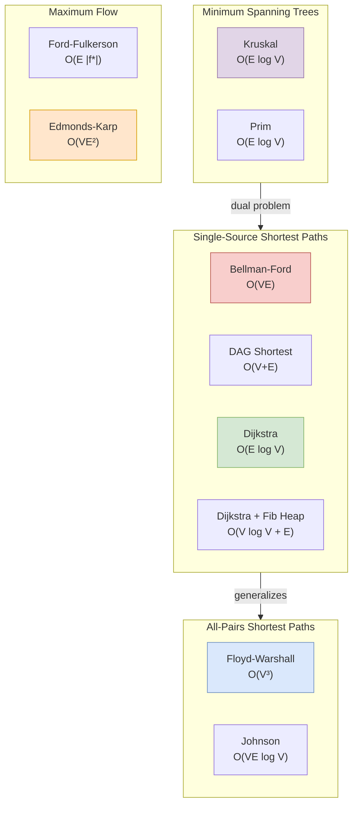

```mermaid
mindmap
  root((CLRS Key Concepts))
    Asymptotic Analysis
      Big-O: Upper bound
      Big-Omega: Lower bound
      Big-Theta: Tight bound
      Master Theorem
      Recurrences
    Sorting
      Insertion Sort O(n^2)
      Merge Sort O(n log n)
      Heapsort O(n log n)
      Quicksort O(n log n) expected
      Counting Sort O(n + k)
      Radix Sort O(d(n + k))
      Bucket Sort O(n) expected
      Comparison lower bound
    Data Structures
      Hash Tables
      Binary Search Trees
      Red-Black Trees
      B-Trees
      Heaps / Priority Queues
      Fibonacci Heaps
    Design Paradigms
      Divide and Conquer
      Dynamic Programming
      Greedy Algorithms
      Amortized Analysis
    Graph Algorithms
      BFS / DFS
      Topological Sort
      Strongly Connected Components
      Minimum Spanning Trees
      Shortest Paths (Dijkstra, Bellman-Ford)
      All-Pairs (Floyd-Warshall, Johnson)
      Maximum Flow
      Bipartite Matching
    Advanced Topics
      NP-Completeness
      Approximation Algorithms
      Online Algorithms
      Multithreaded Algorithms
      Computational Geometry
      String Matching (KMP, Rabin-Karp)
```

---

## 1. Asymptotic Analysis Framework

CLRS builds every analysis on five asymptotic notations. The key insight
is that constant factors and lower-order terms are irrelevant for large
inputs — what matters is the *growth rate*.

```mermaid
flowchart LR
    subgraph Notations["Asymptotic Notations"]
        O[O(g(n))<br/>Upper Bound<br/>f(n) <= c·g(n)]
        OM[Omega(g(n))<br/>Lower Bound<br/>f(n) >= c·g(n)]
        TH[Theta(g(n))<br/>Tight Bound<br/>c1·g <= f <= c2·g]
    end

    subgraph Hierarchy["Common Growth Rates"]
        ONE["1 (constant)"]
        LOG["log n (logarithmic)"]
        LIN["n (linear)"]
        NLOG["n log n (linearithmic)"]
        QUAD["n² (quadratic)"]
        CUB["n³ (cubic)"]
        EXP["2ⁿ (exponential)"]
        FACT["n! (factorial)"]
    end

    Notations --> |"classify"| Hierarchy

    style ONE fill:#d5e8d4,stroke:#82b366
    style LOG fill:#d5e8d4,stroke:#82b366
    style LIN fill:#d5e8d4,stroke:#82b366
    style NLOG fill:#dae8fc,stroke:#6c8ebf
    style QUAD fill:#ffe6cc,stroke:#d79b00
    style CUB fill:#ffe6cc,stroke:#d79b00
    style EXP fill:#f8cecc,stroke:#b85450
    style FACT fill:#f8cecc,stroke:#b85450
```

The **master theorem** is the single most practical tool: given a
divide-and-conquer recurrence T(n) = a T(n/b) + f(n), compare f(n) to
n^(log_b a):

- If f(n) grows slower → T(n) = Theta(n^(log_b a))
- If they grow alike → T(n) = Theta(n^(log_b a) log n)
- If f(n) grows faster (and $a f(n/b) \le c f(n)$) → T(n) = Theta(f(n))

---

## 2. Sorting: The Model Problem

Sorting is the workhorse of algorithm analysis because it has so many
solutions with distinct tradeoffs:

| Algorithm | Worst | Average | Best | Space | Stable | In-Place |
|-----------|-------|---------|------|-------|--------|----------|
| Insertion sort | O(n^2) | O(n^2) | O(n) | O(1) | Yes | Yes |
| Merge sort | O(n log n) | O(n log n) | O(n log n) | O(n) | Yes | No |
| Heapsort | O(n log n) | O(n log n) | O(n log n) | O(1) | No | Yes |
| Quicksort | O(n^2) | O(n log n) | O(n log n) | O(log n) | No | Yes |
| Counting sort | O(n + k) | O(n + k) | O(n + k) | O(k) | Yes | No |
| Radix sort | O(d(n + k)) | O(d(n + k)) | O(d(n + k)) | O(n + k) | Yes | No |

The **comparison-sorting lower bound**: any algorithm that sorts by
comparing pairs of elements requires at least Omega(n log n) comparisons
in the worst case. This is proven via the decision-tree model — there
are n! possible permutations, so a binary decision tree must have at
least n! leaves, giving height >= log_2(n!) ~ n log_2 n.

---

## 3. Dynamic Programming

DP is the most powerful design technique in the book. It solves problems
with **optimal substructure** (optimal solution contains optimal
solutions to subproblems) and **overlapping subproblems** (same
subproblems recur).

The canonical DP pattern:

```
1. Characterize optimal substructure
2. Define recurrence for optimal value
3. Compute bottom-up (or top-down with memoization)
4. Reconstruct solution from computed table
```

| Problem | Table Size | Recurrence |
|---------|-----------|------------|
| Rod cutting | O(n) | r_n = max(p_n, r_1 + r_{n-1}, ..., r_{n-1} + r_1) |
| Matrix-chain | O(n^2) | `m[i,j] = \min_{i \le k \lt j}(m[i,k] + m[k+1,j] + p_{i-1} p_k p_j)` |
| LCS | O(mn) | c[i,j] = 0 (if i=0 or j=0); c[i-1,j-1]+1 (if x_i=y_j); max(c[i-1,j], c[i,j-1]) (else) |
| Optimal BST | O(n^3) | `e[i,j] = \min_{i \le r \le j}(e[i,r-1] + e[r+1,j] + w(i,j))` |
| Bitmask TSP | O(n^2 2^n) | $dp[\text&#123;mask&#125;][v] = \min(dp[\text&#123;mask&#125; \setminus \&#123;v\&#125;][u] + w(u,v))$ |

---

## 4. Graph Algorithm Time Complexities



Graph algorithm classification:
- **BFS** finds shortest paths in unweighted graphs. O(V + E).
- **DFS** explores deep first; classifies edges into tree, back,
  forward, cross. Applications: topological sort (DAGs), strongly
  connected components (Kosaraju or Tarjan).
- **Dijkstra** requires non-negative weights. Priority-queue based.
- **Bellman-Ford** relaxes all edges V-1 times; handles negative edges
  and detects negative cycles.
- **Floyd-Warshall** is 3 nested loops on the adjacency matrix. Elegant
  and simple for dense graphs.
- **Kruskal** sorts edges and uses union-find. **Prim** grows a tree
  from a root using a min-priority queue.

---

## 5. NP-Completeness and Reductions

A problem is **NP-complete** if:
1. It is in NP (a solution can be verified in polynomial time)
2. Every problem in NP reduces to it in polynomial time

The standard reduction chain:

**SAT** → **3-CNF-SAT** → **CLIQUE** → **VERTEX-COVER** →
**HAM-CYCLE** → **TSP** → **SUBSET-SUM**


For NP-hard optimization problems, **approximation algorithms** provide
provably good solutions:

| Problem | Approximation Ratio | Algorithm |
|---------|-------------------|-----------|
| Vertex cover | 2 | Pick edges greedily |
| TSP (metric) | 2 | MST doubling; Christofides: 3/2 |
| Set cover | ln n + 1 | Greedy |
| MAX-CUT | 1/2 | Random assignment |
| MAX-3-SAT | 7/8 | Random assignment + conditional expectations |

---

## 6. Online Algorithms (New in 4th Edition)

Online algorithms process input incrementally without knowing future
requests. The **competitive ratio** compares online performance to the
optimal offline algorithm.

| Problem | Algorithm | Competitive Ratio |
|---------|-----------|-----------------|
| Ski rental | Rent 1, then buy after b days | 2 - 1/b |
| Paging | LRU / FIFO (demand paging) | k (cache size) |
| Paging | Flush-When-Full | k |
| Paging | LFD (optimal offline) | 1 (unachievable online) |
| Online bipartite matching | Ranking (Karp-Vazirani-Vazirani) | 1 - 1/e |

---

## 7. Key Theorems Reference

| Theorem | Chapter | Statement |
|---------|---------|-----------|
| Master theorem | 4 | Solves T(n) = a T(n/b) + f(n) |
| Comparison-sort lower bound | 8 | Omega(n log n) comparisons needed |
| Red-black tree height | 13 | $h \le 2 \lg(n+1)$ |
| Max-flow min-cut | 22 | Max flow value = min cut capacity |
| Max-flow integrality | 22 | If capacities are integers, there exists an integer max flow |
| Cook-Levin | 31 | SAT is NP-complete |
| Savitch's theorem | 31 (3rd ed.) | NSPACE(f(n)) subset of SPACE(f^2(n)) |

---

## 8. CLRS by the Numbers

| Metric | Value |
|--------|-------|
| Pages (4th ed.) | 1,312 |
| Chapters | 35 |
| Parts | 7 |
| Authors | 4 (Cormen, Leiserson, Rivest, Stein) |
| Years between 1st and 4th ed. | 32 |
| Lines of pseudocode | ~15,000 |
| Exercises | ~1,400 |
| Problems | ~200 |
| Languages translated | 12+ |
| Estimated copies sold | 1,000,000+ |
