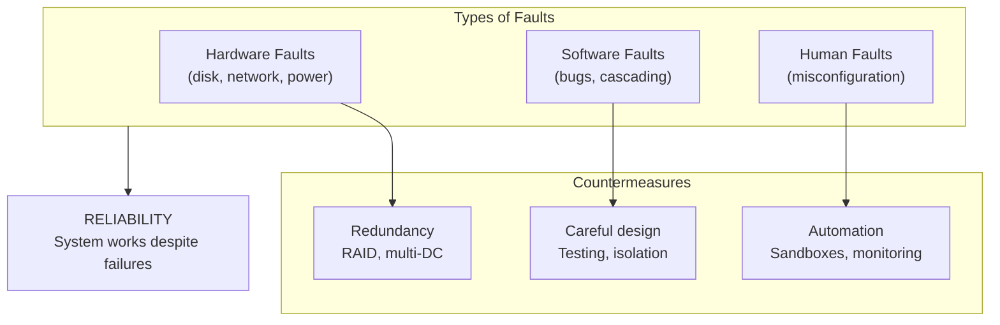
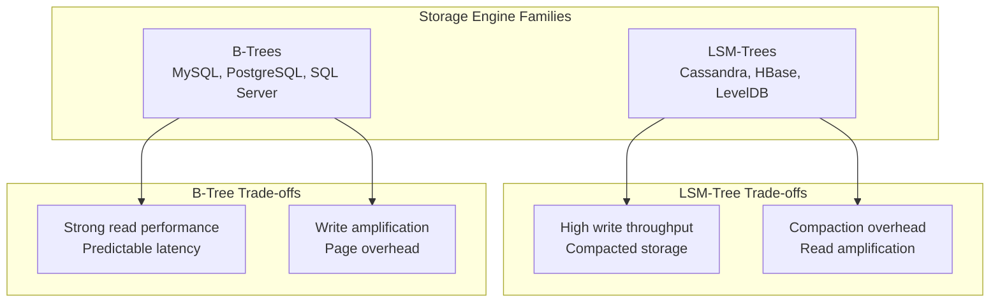
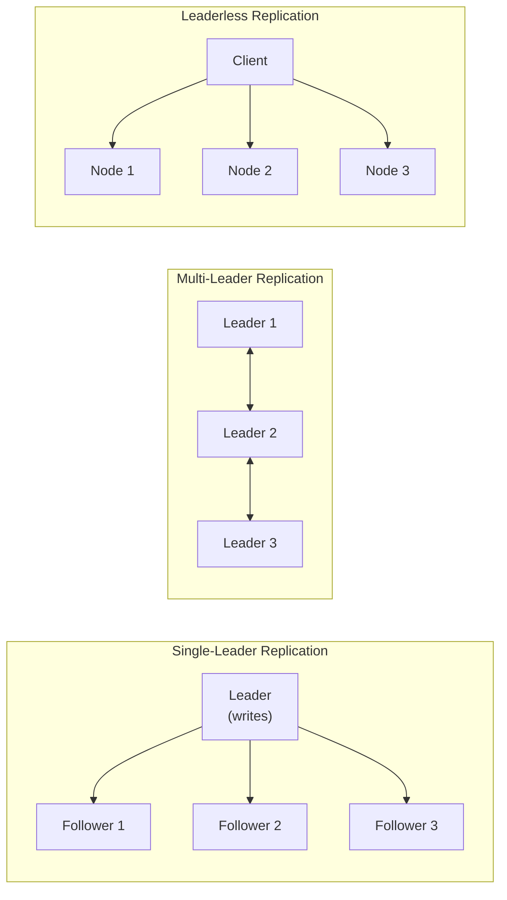
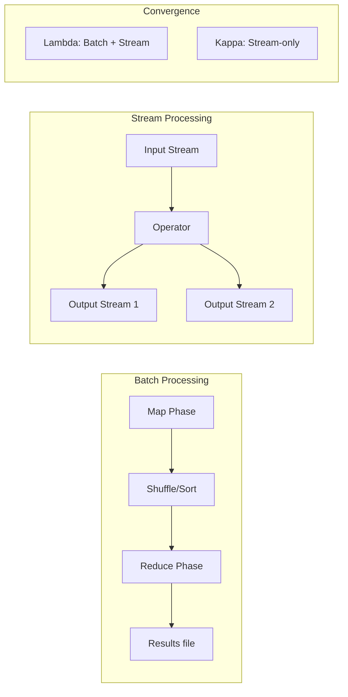

## The Three Pillars

Kleppmann defines three fundamental properties every data system needs:

### Reliability

The system should continue to work correctly even when faults occur.
Faults can be hardware (disk failure, power outage), software (bugs,
cascading failures), or human (misconfiguration).

### Scalability

Ability to handle increased load. Define load parameters (requests per
second, read/write ratio, data volume) and measure performance metrics
(response time, throughput).

### Maintainability

Three design goals: Operability (easy ops), Simplicity (low complexity),
Evolvability (easy to change). Most costs are in maintenance, not
initial development.

---

## Data Models and Query Languages

The choice of data model shapes how you think about your data.

| Model | Strengths | Weaknesses |
|-------|-----------|------------|
| Relational (SQL) | Joins, constraints, standard query language | Rigid schema, impedance mismatch |
| Document (NoSQL) | Schema flexibility, locality | Weak joins, no standard query |
| Graph | Rich relationships, traversal | Complex queries, less mature |

Kleppmann argues that the future is multi-model — using the right model
for the right part of your system.

---

## Storage and Retrieval

Two families of storage engines dominate:

Transactional (OLTP) and analytic (OLAP) workloads require different
storage strategies. Column-oriented storage compresses better and scans
faster than row-oriented storage.

---

## Encoding and Evolution

| Format | Schema | Compatibility | Speed |
|--------|--------|--------------|-------|
| JSON / XML | No schema | Textual, verbose | Slow parsing |
| Thrift | Required | Binary, compact | Fast |
| Protocol Buffers | Required | Binary, very compact | Fast |
| Avro | Required (writer/reader) | Best for long-term storage | Fast |

Avro's approach is particularly elegant: the writer's schema and
reader's schema can differ, and the system resolves the differences
at read time.

---

## Replication

Single-leader is simplest but has a single point for writes.
Multi-leader works across data centers but requires conflict resolution.
Leaderless (Dynamo-style) offers highest availability but weakest
guarantees.

---

## Partitioning

- **Key-range partitioning:** Simple, supports range queries, but risk of hotspots
- **Hash partitioning:** Distributes data evenly, but breaks range queries

---

## Transactions

| Isolation Level | Prevents Dirty Reads | Prevents Lost Updates | Prevents Phantom Reads | Performance Cost |
|---|---|---|---|---|
| Read Committed | Yes | No | No | Low |
| Snapshot Isolation | Yes | Yes | No | Medium |
| Serializable | Yes | Yes | Yes | High |

---

## The Trouble with Distributed Systems

1. **Unreliable networks:** Packets can be delayed, duplicated, or dropped.
2. **Unreliable clocks:** Time-of-day clocks can jump backwards.
3. **Process pauses:** GC, VM pauses, or scheduling can stop a process.

---

## Batch and Stream Processing

---

## Practical Applications

### For Choosing a Database

- Need strong consistency and complex joins? Use a relational database.
- Need flexible schema and fast iteration? Use a document database.
- Need high write throughput? Consider LSM-tree engines.
- Need rich relationship queries? Use a graph database.

### For System Design

- Define your load parameters before choosing technology.
- Use the simplest replication strategy that meets your needs.
- Plan for partition rebalancing before you need it.
- Instrument everything — you cannot fix what you cannot measure.

---

## Reading Guide

| Chapter | Pages | Est. Time | Difficulty | Priority |
|---------|-------|-----------|------------|----------|
| 1: Reliable, Scalable, Maintainable | 1-24 | 1h | Easy | Essential |
| 2: Data Models | 25-57 | 1.5h | Medium | Essential |
| 3: Storage & Retrieval | 58-104 | 2h | Hard | Essential |
| 4: Encoding | 105-132 | 1h | Medium | Essential |
| 5: Replication | 133-183 | 2h | Hard | Essential |
| 6: Partitioning | 184-215 | 1.5h | Medium | Essential |
| 7: Transactions | 216-270 | 2h | Hard | Essential |
| 8: Distributed Systems Trouble | 271-310 | 1.5h | Medium | Essential |
| 9: Consistency | 311-349 | 1.5h | Hard | Important |
| 10: Batch Processing | 350-405 | 2h | Medium | Important |
| 11: Stream Processing | 406-466 | 2h | Hard | Important |
| 12: The Future | 467-505 | 1.5h | Medium | Optional |
