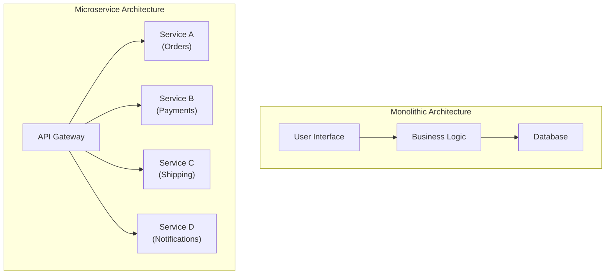
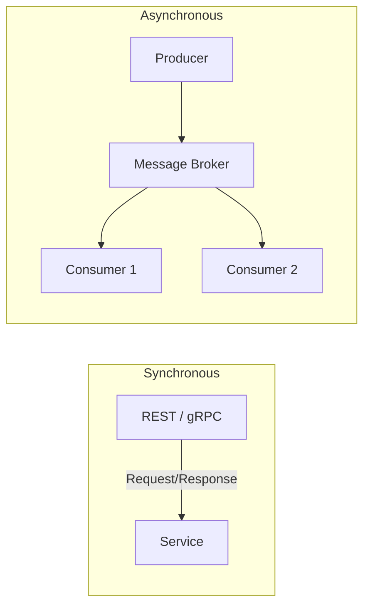
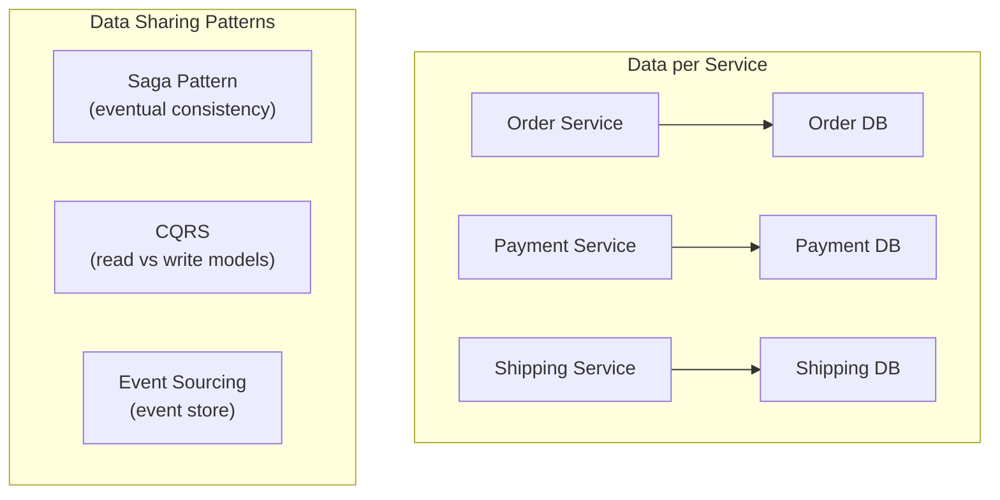
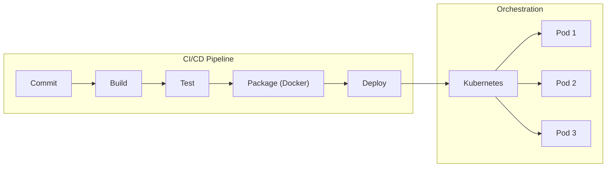

## The Microservice Mindset

Microservices are independently deployable services modeled around
business domains. Each service owns its data, runs in its own process,
and communicates via well-defined APIs.

---

## Service Decomposition

Newman recommends using bounded contexts from Domain-Driven Design to
identify service boundaries.

| Decomposition Strategy | Approach | Best For |
|----------------------|----------|----------|
| Business capability | Map to business functions | Stable domains |
| Subdomain | Follow DDD bounded contexts | Complex domains |
| Volatility | Separate by change frequency | Rapidly evolving features |

---

## Inter-Service Communication

---

## Data Management

The database-per-service pattern is central to microservices:

---

## Observability

| Pillar | Tool Examples | What It Answers |
|--------|--------------|-----------------|
| Logging | ELK Stack, Loki | What happened? |
| Metrics | Prometheus, Datadog | When did it happen? |
| Tracing | Jaeger, Zipkin | Where did it happen? |

---

## Testing Strategy

Newman advocates moving from the testing pyramid to a testing trophy:

1. **Unit tests** — fast, isolated, high coverage
2. **Contract tests** — verify service interactions
3. **Integration tests** — test against real dependencies
4. **End-to-end tests** — critical paths only

---

## Deployment and Containers

---

## Reading Guide

| Chapter | Topic | Est. Time | Priority |
|---------|-------|-----------|----------|
| 1-2 | Microservice fundamentals | 2h | Essential |
| 3-4 | Decomposition and DDD | 2.5h | Essential |
| 5-6 | Communication patterns | 3h | Essential |
| 7-8 | Data and transactions | 2.5h | Essential |
| 9-10 | Testing and deployment | 3h | Important |
| 11-13 | Monitoring and security | 2h | Important |
| 14-16 | Organizational and migration | 2h | Important |
