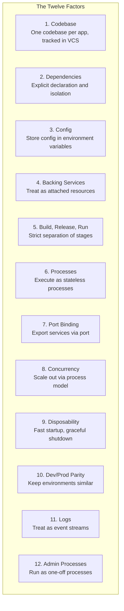
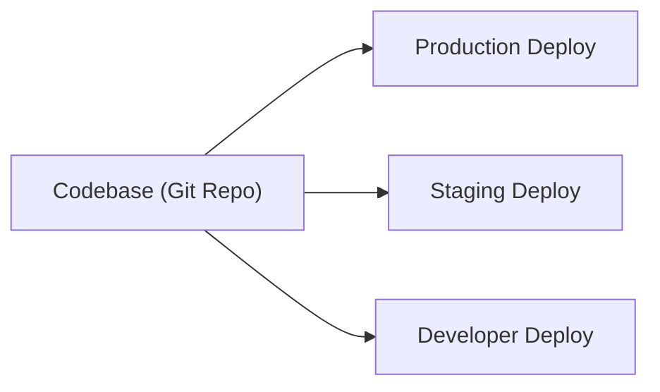
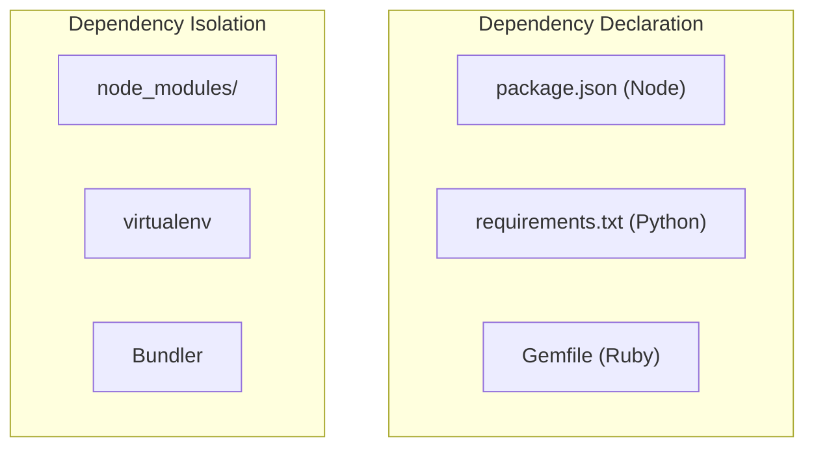
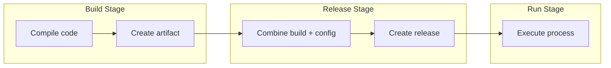

## Overview of the Twelve Factors

The twelve factors form a complete methodology for building applications
that are portable, resilient, and suitable for modern cloud platforms.

---

## Factor 1: Codebase

One codebase tracked in revision control, many deploys.

---

## Factor 2: Dependencies

Explicitly declare and isolate dependencies.

---

## Factor 3: Config

Store config in environment variables. Code and config are strictly
separated — every deploy can have different config without code changes.

| Config Type | Example | Belongs In |
|------------|---------|-----------|
| Resource handles | DATABASE_URL | Environment |
| Third-party credentials | API_KEY | Environment |
| Deployment-specific | HOSTNAME | Environment |
| Application logic | DEBUG_MODE | Environment |

---

## Factor 4: Backing Services

Treat databases, message queues, caches as attached resources —
swappable via URL change without code modification.

---

## Factor 5: Build, Release, Run

---

## Factor 6: Processes

Execute the app as stateless processes. Never store state in the
process — use a stateful backing service.

---

## Factor 7: Port Binding

The app is self-contained and exports HTTP as a service via port binding.
No server injection required.

---

## Factor 8: Concurrency

Scale out via the process model. Different process types handle
different workloads.

| Process Type | Purpose |
|-------------|---------|
| web | Handle HTTP requests |
| worker | Background job processing |
| clock | Scheduled task execution |

---

## Factors 9-12: Operations

| Factor | Principle | Key Practice |
|--------|-----------|-------------|
| 9. Disposability | Fast startup and graceful shutdown | Handle SIGTERM |
| 10. Dev/Prod Parity | Keep environments similar | Use same backing services |
| 11. Logs | Treat as event streams | stdout, not log files |
| 12. Admin Processes | One-off tasks in production | Run migrations as processes |

---

## Reading Guide

| Factor | Topic | Est. Time | Priority |
|--------|-------|-----------|----------|
| 1-2 | Codebase and Dependencies | 15 min | Essential |
| 3-4 | Config and Backing Services | 20 min | Essential |
| 5 | Build, Release, Run | 15 min | Essential |
| 6-8 | Processes, Port Binding, Concurrency | 20 min | Essential |
| 9-10 | Disposability and Dev/Prod Parity | 15 min | Important |
| 11-12 | Logs and Admin Processes | 15 min | Important |
