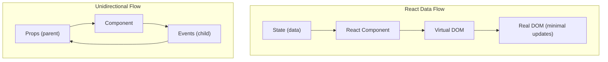
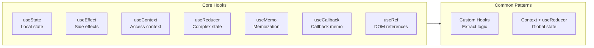
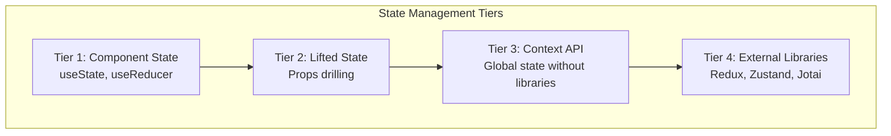
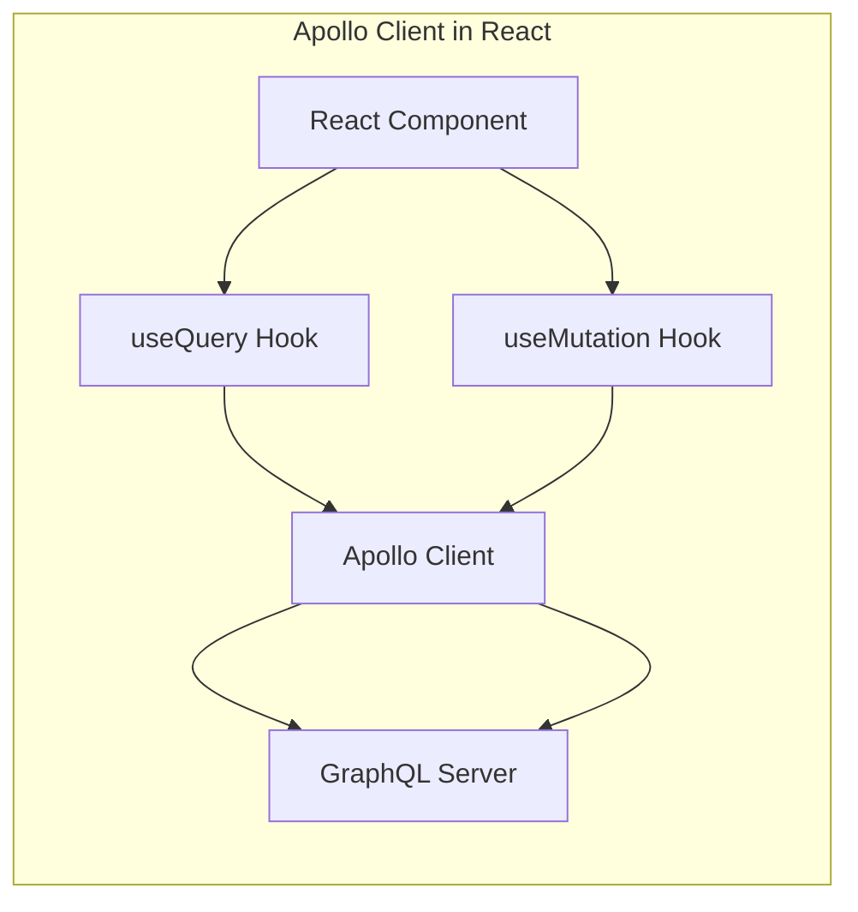

## React's Core Mental Model

React is a declarative, component-based library for building user
interfaces. The key insight: describe what the UI should look like
for any given state, and React handles the DOM updates efficiently.

---

## Components and JSX

Components are the building blocks of React. JSX is syntactic sugar
for React.createElement calls.

| Rendering Type | When to Use |
|---------------|-------------|
| Conditional Rendering | Show/hide based on state |
| List Rendering | Display arrays of data |
| Composition | Build complex UIs from small components |

---

## Hooks

Hooks replace class lifecycle methods with functional primitives.

---

## State Management

State management scales through tiers:

---

## React Router

Client-side routing enables single-page applications:

| Route Type | Purpose |
|-----------|---------|
| Static routes | Fixed URL paths |
| Dynamic routes | URL parameters |
| Nested routes | Layout inheritance |
| Protected routes | Authentication gates |

---

## GraphQL with Apollo

---

## Testing React

| Test Type | Tool | What It Tests |
|-----------|------|--------------|
| Component rendering | React Testing Library | What users see |
| User interactions | fireEvent / userEvent | Button clicks, form input |
| State changes | render + act | Hook and state behavior |
| Integration | MSW + Testing Library | Full component flows |

---

## Reading Guide

| Chapter | Topic | Est. Time | Priority |
|---------|-------|-----------|----------|
| 1-3 | React fundamentals | 2h | Essential |
| 4-5 | Hooks deep dive | 3h | Essential |
| 6 | State management | 1.5h | Essential |
| 7 | React Router | 1h | Important |
| 8 | GraphQL | 1.5h | Optional |
| 9-10 | Testing and deployment | 1h | Important |
