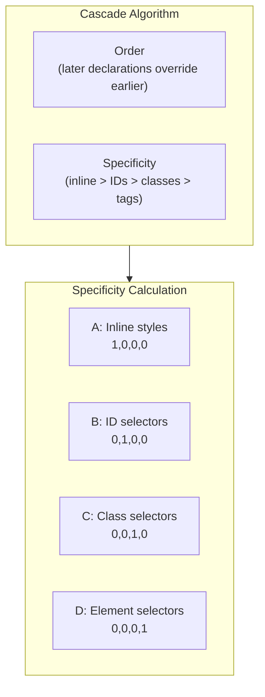
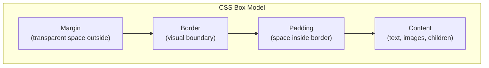
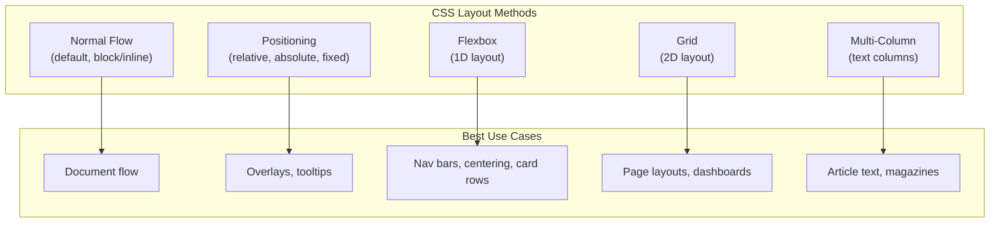
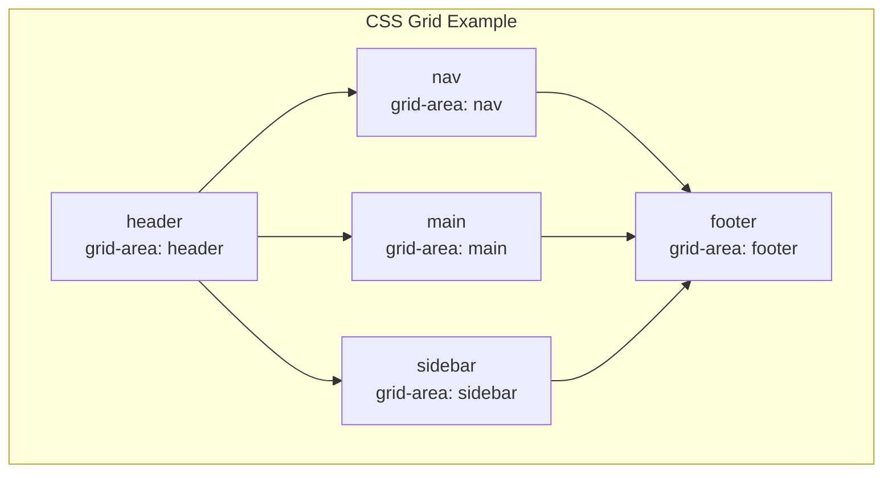

## The Cascade and Specificity

The cascade is the algorithm that resolves conflicting CSS declarations.

---

## Box Model

Every element generates a box with four areas:

| Property | Controls | Default |
|----------|----------|---------|
| width / height | Content area | auto |
| padding | Inner spacing | 0 |
| border | Edge line | none |
| margin | Outer spacing | 0 |

---

## Layout Systems

---

## Flexbox

One-dimensional layout for distributing space along a single axis.

| Container Property | Purpose |
|-------------------|---------|
| display: flex | Enable flexbox |
| flex-direction | Row or column |
| justify-content | Main axis alignment |
| align-items | Cross axis alignment |
| flex-wrap | Allow wrapping |

---

## Grid

Two-dimensional layout for rows and columns simultaneously.

---

## Custom Properties

CSS Custom Properties (variables) enable dynamic theming:

| Feature | Benefit |
|---------|---------|
| --property-name | Declare a custom property |
| var(--name) | Use the value |
| Cascade inheritance | Override per component |
| JavaScript access | Read/write via style.setProperty |

---

## Responsive Design

| Technique | Description |
|-----------|-------------|
| Media Queries | Respond to viewport size |
| Container Queries | Respond to container size |
| Fluid typography | clamp() for responsive text |
| Relative units | rem, em, %, vw, vh |

---

## Reading Guide

| Chapter | Topic | Est. Time | Priority |
|---------|-------|-----------|----------|
| 1-3 | Selectors and cascade | 3h | Essential |
| 4-7 | Box model and values | 4h | Essential |
| 8-10 | Layout (Flexbox, Grid) | 5h | Essential |
| 11-13 | Typography and color | 3h | Important |
| 14-16 | Transforms and transitions | 3h | Important |
| 17-19 | Responsive and modern CSS | 3h | Important |
