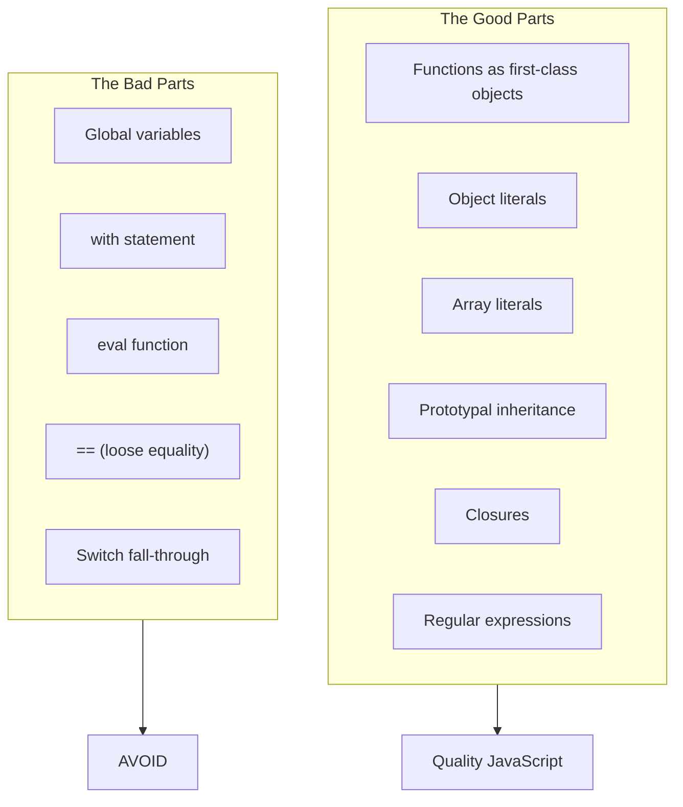
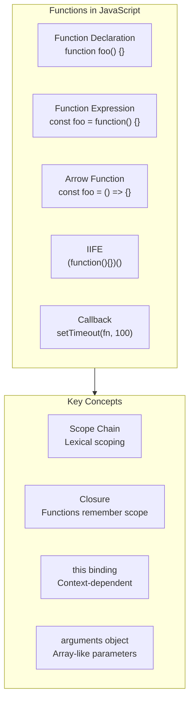
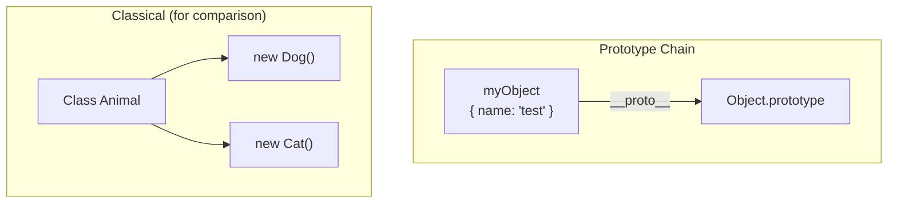
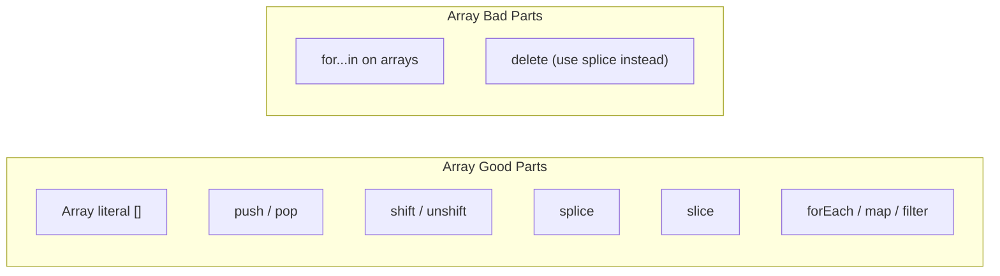

## The Good Parts Philosophy

Crockford's central claim: JavaScript contains a beautiful, elegant,
powerful core — but it also contains problematic features. The key
to writing good JavaScript is to use the good parts and avoid the
bad ones.

---

## Functions

Functions are the core building block of JavaScript.

---

## Object Creation

Crockford recommends object literals and the module pattern over
classical constructor functions.

| Pattern | Good Part? | Use Case |
|---------|-----------|----------|
| Object literal {} | Yes | Simple objects, namespaces |
| Module pattern (IIFE) | Yes | Private state, encapsulation |
| Constructor with new | Caution | Use with capital letter convention |
| Object.create | Yes | Prototypal inheritance |
| Class syntax (ES6) | Modern | Not covered in the book |

---

## Prototypal Inheritance

JavaScript uses prototypal inheritance — objects inherit directly from
other objects.

---

## Arrays

JavaScript arrays are objects with special length behavior.

---

## Regular Expressions

Crockford provides a concise guide to regex patterns useful for
everyday JavaScript programming.

| Pattern | Matches |
|---------|---------|
| /^\s*$/ | Empty or whitespace-only |
| /^[\w-]+(\.[\w-]+)*@/ | Email-like identifiers |
| /\/\*[\s\S]*?\*\// | Block comments |

---

## Style and Conventions

Crockford strongly advocates for:

1. Consistent indentation (2 spaces)
2. Always use curly braces for blocks
3. Use === and !== exclusively
4. No space between function name and parameters
5. Capitalize constructor functions
6. Declare variables at the top of their scope

---

## Reading Guide

| Chapter | Topic | Est. Time | Priority |
|---------|-------|-----------|----------|
| 1-2 | Philosophy and syntax | 30 min | Essential |
| 3-4 | Functions and objects | 1h | Essential |
| 5 | Inheritance | 45 min | Essential |
| 6 | Arrays | 30 min | Essential |
| 7-8 | Regex and methods | 45 min | Important |
| Appendix A | The Awful Parts | 30 min | Essential |
| Appendix B | The Bad Parts | 30 min | Important |
| Appendix C | JSLint | 20 min | Optional |
