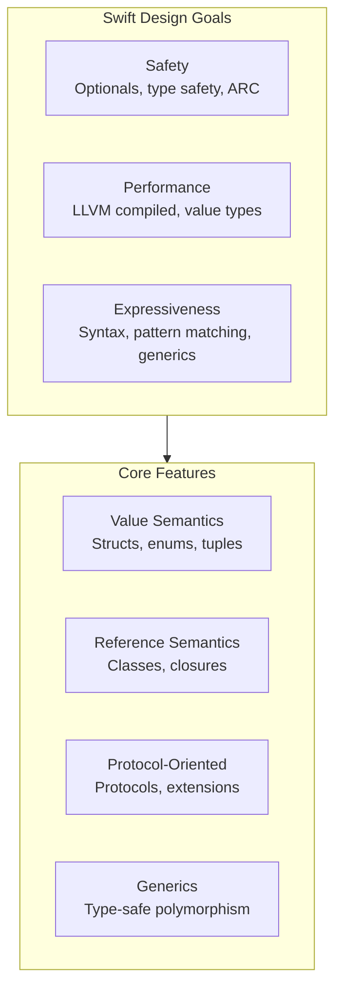
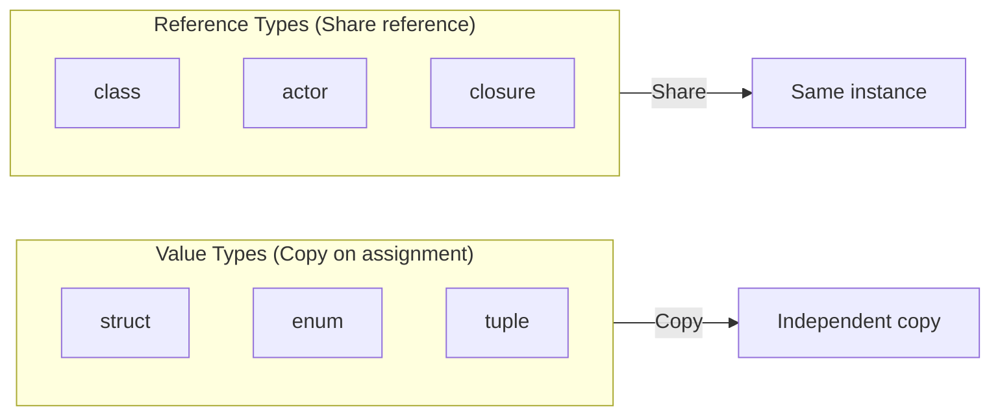
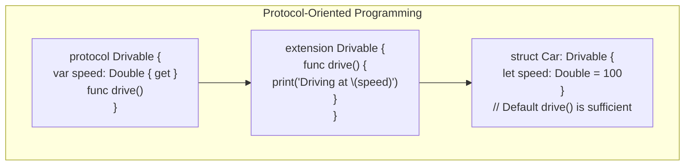
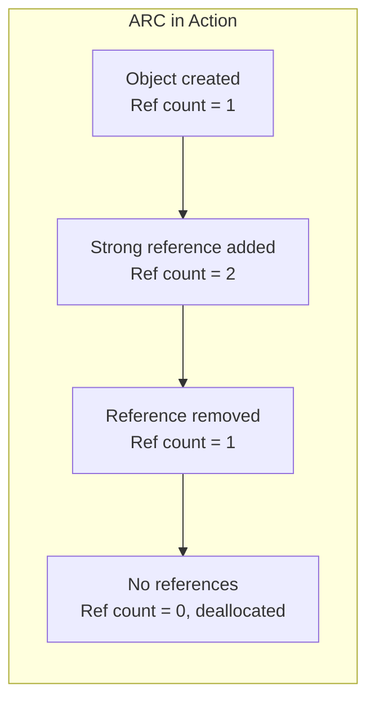
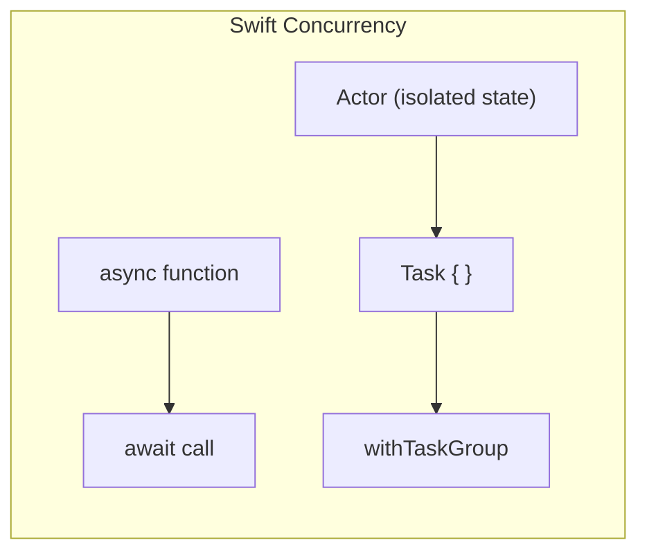

## Swift's Design Philosophy

Swift is a safe, fast, and expressive language designed by Apple for
systems programming and app development. It combines the performance
of compiled languages with the readability of modern scripting languages.

---

## Types: Value vs. Reference

---

## Optionals

Optionals are Swift's type-safe way to handle the absence of a value.

| Feature | Syntax | Purpose |
|---------|--------|---------|
| Optional declaration | var name: String? | Value may be nil |
| Force unwrap | name! | Crash if nil |
| Optional binding | if let name = name | Safe unwrap |
| Guard let | guard let name = name | Early exit on nil |
| Nil coalescing | name ?? "default" | Provide default |
| Optional chaining | name?.count | Chain safe access |

---

## Protocol-Oriented Programming

Protocols define capabilities. Protocol extensions provide default
implementations. This is Swift's signature paradigm.

---

## Memory Management with ARC

Automatic Reference Counting manages memory for reference types.

| Reference Type | Default | Effect |
|---------------|---------|--------|
| strong (default) | Increases ref count | Object stays alive |
| weak | Does not increase | Automatically nil when deallocated |
| unowned | Does not increase | Assumes lifetime equality |

---

## Concurrency with Async/Await

Swift's structured concurrency model uses async/await, actors, and
task groups.

---

## Error Handling

Swift uses do/catch for structured error handling — not exceptions.

| Keyword | Purpose |
|---------|---------|
| throws | Function can throw an error |
| try | Call a throwing function |
| try? | Convert error to nil |
| try! | Assert no error (crash if throws) |
| catch | Handle specific error types |

---

## Reading Guide

| Chapter | Topic | Est. Time | Priority |
|---------|-------|-----------|----------|
| 1-3 | Basics and types | 2h | Essential |
| 4-5 | Collection types and control flow | 2h | Essential |
| 6-8 | Functions, closures, enums | 3h | Essential |
| 9-10 | Classes and structures | 2h | Essential |
| 11-14 | Protocols, generics, extensions | 3h | Essential |
| 15-18 | Memory, error handling, concurrency | 3h | Important |
| 19-22 | Advanced topics | 2h | Optional |
