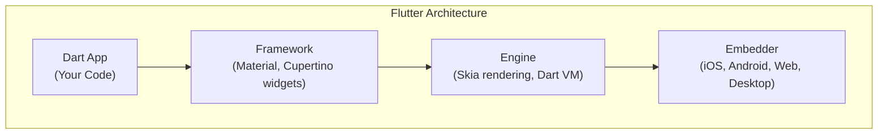
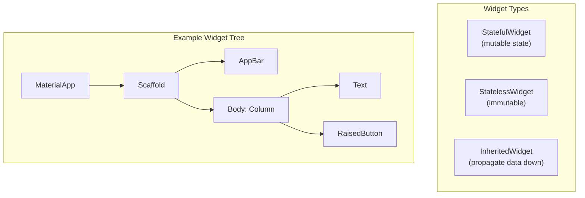
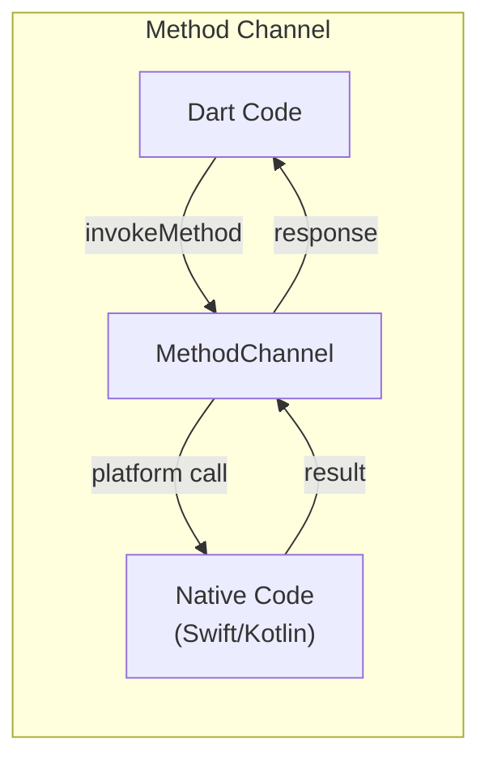

## Flutter's Architecture

Flutter renders its own widgets using the Skia graphics engine —
no platform UI components are used.

---

## Widgets: The Core Abstraction

Everything in Flutter is a widget. Widgets are immutable descriptions
of part of the user interface.

---

## Layout Widgets

| Widget | Purpose | Axis |
|--------|---------|------|
| Row | Horizontal layout | Horizontal |
| Column | Vertical layout | Vertical |
| Stack | Overlapping children | Z-axis |
| Container | Single child with decoration | All |
| Expanded | Fill available space | Flex |
| SizedBox | Fixed dimensions | All |

---

## State Management

State management scales from simple to complex:

```mermaid
flowchart LR
    subgraph State_Options["State Management Options"]
        S1["setState<br/>(local widget state)"]
        S2["InheritedWidget<br/>(manual propagation)"]
        S3["Provider<br/>(recommended for most apps)"]
        S4["Riverpod<br/>(compile-safe Provider)"]
        S5["BLoC<br/>(business logic components)"]
        S6["Redux<br/>(predictable state container)"]
    end

    S1 --> S2 --> S3
    S3 --> S4
    S3 --> S5
    S3 --> S6
```

---

## Animations

| Animation Type | Widget/Class | Use Case |
|---------------|-------------|----------|
| Implicit | AnimatedContainer | Simple value transitions |
| Explicit | AnimationController | Custom animation control |
| Physics-based | SpringSimulation | Natural motion |
| Hero | Hero widget | Shared element transitions |

---

## Platform Channels

---

## Testing

| Test Type | What It Tests | Speed |
|-----------|--------------|-------|
| Unit test | Individual functions | Fast |
| Widget test | Single widget rendering | Medium |
| Integration test | Full app flows | Slow |

---

## Reading Guide

| Chapter | Topic | Est. Time | Priority |
|---------|-------|-----------|----------|
| 1-3 | Dart and Flutter basics | 2h | Essential |
| 4-6 | Widgets and layout | 3h | Essential |
| 7-8 | State management | 2.5h | Essential |
| 9-10 | Navigation and routing | 1.5h | Important |
| 11-12 | Animations | 2h | Important |
| 13-14 | Platform integration | 1.5h | Optional |
| 15-16 | Testing and deployment | 1h | Important |
