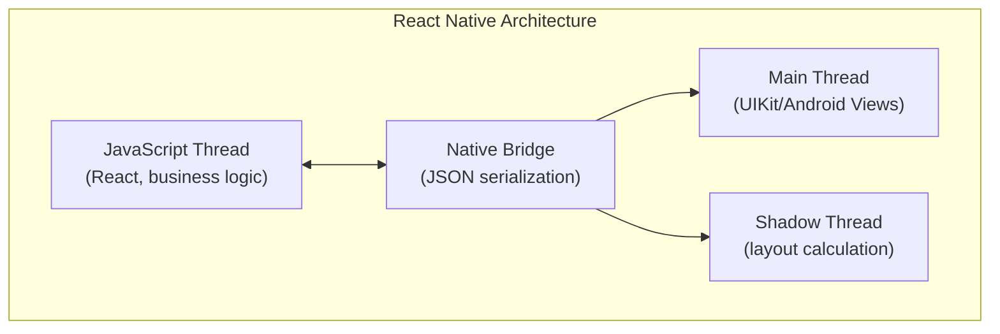
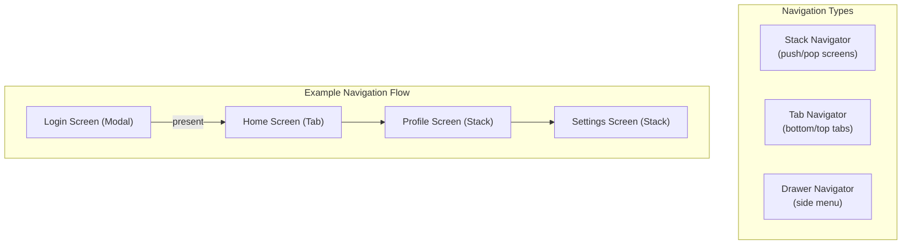
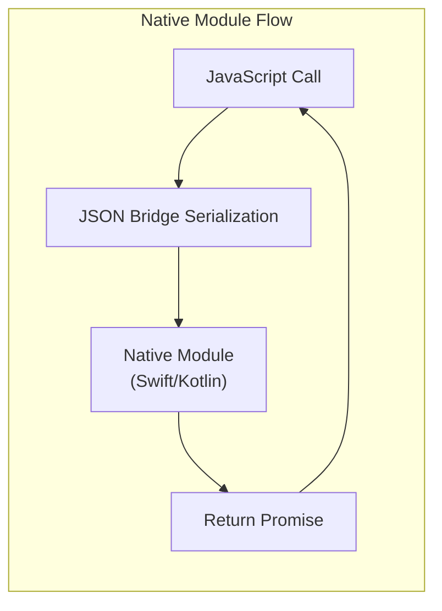

## React Native's Architecture

React Native uses a JavaScript-to-native bridge to render platform UI
components, not web views.

---

## Core Components

| Component | Description | Web Equivalent |
|-----------|-------------|---------------|
| View | Container | div |
| Text | Text display | span or p |
| TextInput | Text input | input |
| ScrollView | Scrollable container | overflow: scroll |
| FlatList | Virtualized list | -- |
| TouchableOpacity | Pressable element | button |
| Image | Image display | img |

---

## Navigation

React Native uses native navigation, not browser routing.

---

## State Management

React Native supports the same state management options as React web:

| Approach | Best For | Complexity |
|----------|----------|------------|
| Component state (useState) | Simple local UI state | Low |
| Context API | Global theme, auth | Medium |
| Redux | Complex app state | High |
| MobX | Observable-based state | Medium |
| Zustand | Simple global state | Low |

---

## Native Modules

When React Native lacks an API, native modules bridge the gap.

---

## Platform-Specific Code

| Strategy | Implementation |
|----------|---------------|
| Platform.select | if (Platform.OS === 'ios') |
| File extension | Button.ios.js / Button.android.js |
| Platform-specific API | Check Platform.OS at runtime |

---

## Performance Optimization

| Technique | Impact |
|-----------|--------|
| FlatList instead of ScrollView | Virtualized rendering |
| PureComponent / React.memo | Skip unnecessary re-renders |
| Native driver for animations | Offload to UI thread |
| Hermes engine | Faster JS startup |
| Image caching | Network image optimization |

---

## Reading Guide

| Chapter | Topic | Est. Time | Priority |
|---------|-------|-----------|----------|
| 1-3 | React Native fundamentals | 2h | Essential |
| 4-5 | Components and styling | 2h | Essential |
| 6-7 | Navigation | 1.5h | Essential |
| 8 | State management | 2h | Essential |
| 9 | Networking and data | 1h | Important |
| 10 | Native modules | 1.5h | Optional |
| 11 | Performance | 1h | Important |
| 12 | Deployment | 1h | Important |
