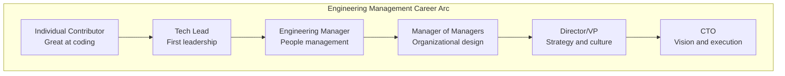
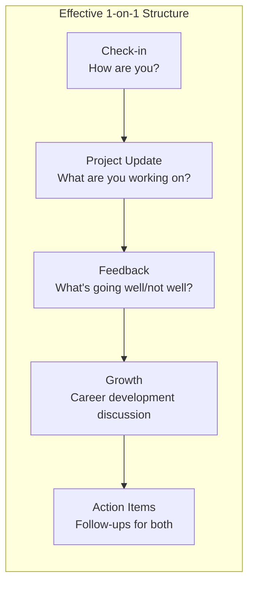
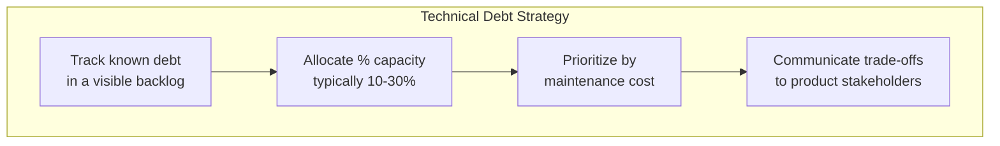
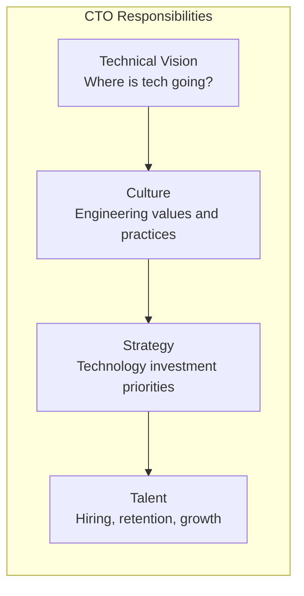

## The Manager's Career Arc

Fournier structures the book around the stages of an engineering
manager's career.

---

## The First Transition: IC to Manager

The hardest transition in engineering management.

| Skill | IC Priority | Manager Priority |
|-------|-------------|------------------|
| Technical output | Highest | Delegated |
| Code quality | Direct | Through reviews |
| Decision making | Individual | Consensus-building |
| Communication | Technical | Technical + organizational |
| Time allocation | Deep work | Meetings + 1-on-1s |

---

## 1-on-1 Meetings

The most important tool in a manager's toolkit.

---

## Giving Feedback

| Feedback Type | When | How |
|--------------|------|-----|
| Positive | Immediately | Specific behavior + impact |
| Constructive | One-on-one | Behavior + impact + request |
| Formal review | Quarterly | Written + documented |
| Peer feedback | Continuous | 360-degree input |

---

## Managing Technical Debt

Fournier treats technical debt as a management responsibility.

---

## Organizational Design

| Team Size | Structure | Communication Channels |
|-----------|-----------|----------------------|
| 3-5 | Squad | O(n²) — manageable |
| 6-8 | Optimal team | Needs clear ownership |
| 9-12 | Overloaded | Must split |
| 12+ | Definitely too big | Split into sub-teams |

---

## Managing Managers

When you manage managers, your role shifts:

1. Develop your managers as leaders
2. Focus on organizational health, not team details
3. Set context and strategy, not task assignments
4. Handle escalations that exceed a manager's scope

---

## The CTO Role

---

## Reading Guide

| Chapter | Topic | Est. Time | Priority |
|---------|-------|-----------|----------|
| 1 | The path and mindset | 30 min | Essential |
| 2-3 | Mentorship and tech lead | 1h | Essential |
| 4 | Managing a team | 1h | Essential |
| 5 | Managing multiple teams | 45 min | Essential |
| 6 | Managing managers | 45 min | Important |
| 7-8 | Strategy and organizational design | 1h | Important |
| 9 | Culture and CTO role | 30 min | Important |
