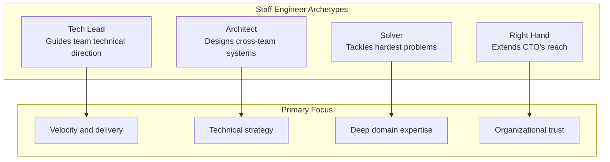
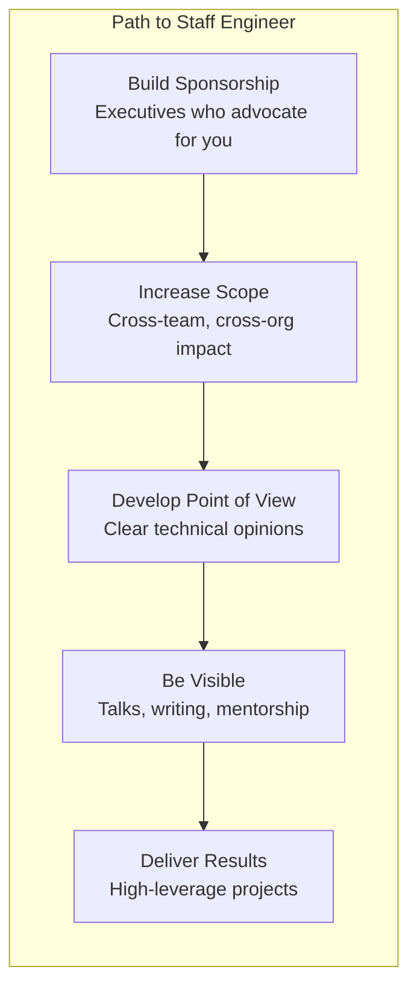
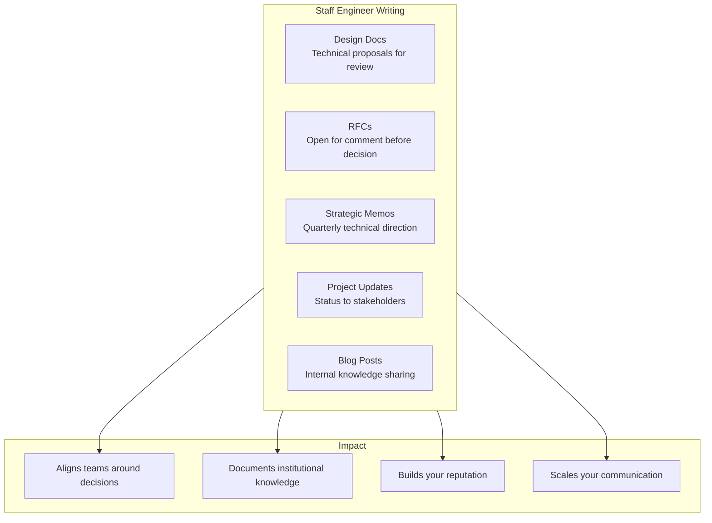

## The Four Archetypes

Larson identifies four distinct Staff Engineer archetypes:

---

## Getting the Promotion

---

## Leading Without Authority

Staff Engineers influence without direct reports.

| Influence Type | Strategy | Example |
|---------------|----------|---------|
| Technical | Demonstrate expertise | Review design docs |
| Social | Build relationships | Coffee chats, 1-on-1s |
| Reputation | Earn trust | Deliver consistently |
| Relational | Connect people | Cross-team introductions |

---

## Writing as a Leadership Tool

Writing scales communication across the organization.

---

## Technical Strategy

Setting technical direction as a Staff Engineer:

| Step | Action |
|------|--------|
| 1. Observe | Understand the current state |
| 2. Identify | Find the biggest leverage points |
| 3. Propose | Write a clear, opinionated proposal |
| 4. Socialize | Get feedback from stakeholders |
| 5. Execute | Drive implementation through influence |
| 6. Iterate | Adjust based on results |

---

## Time Management

| Activity | Ideal Allocation |
|----------|-----------------|
| Strategic work | 40% |
| Mentoring and sponsorship | 20% |
| Technical deep dives | 20% |
| Writing and communication | 15% |
| Interviewing and hiring | 5% |

---

## Reading Guide

| Part | Topic | Est. Time | Priority |
|------|-------|-----------|----------|
| Part 1: Overview | What is Staff Engineer? | 1h | Essential |
| Part 1: Operations | Day-to-day work | 1.5h | Essential |
| Part 1: Getting Promoted | Strategy | 1.5h | Essential |
| Part 2: Interviews | Industry perspectives | 4h | Important |
