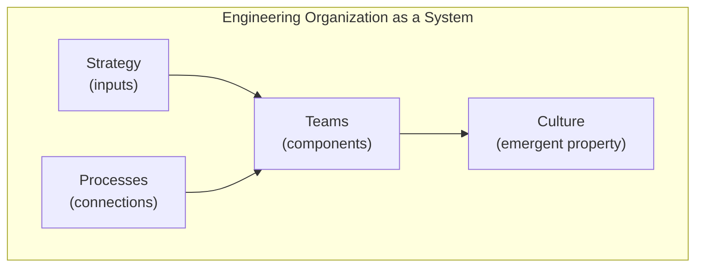
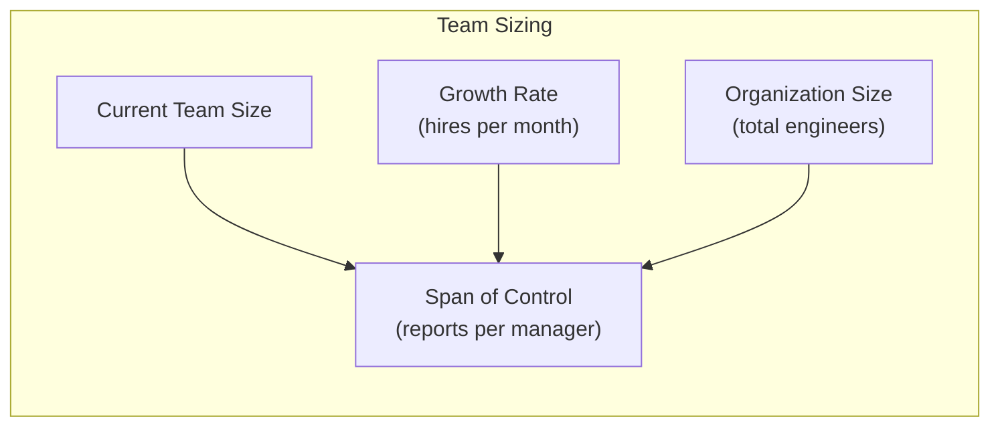
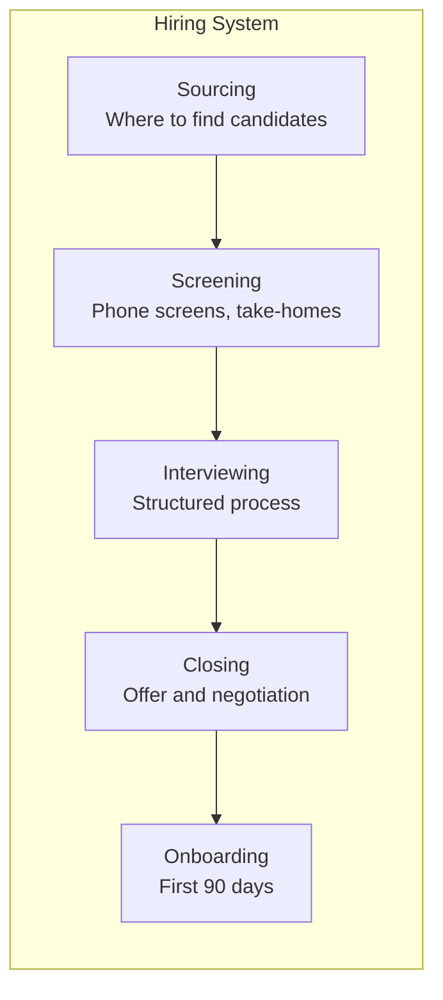
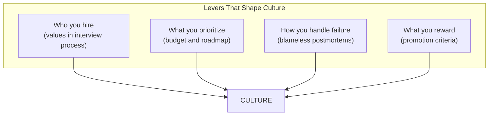

## Organizations as Systems

Larson's central thesis: engineering organizations are systems that can
be designed, analyzed, and improved using engineering principles.

---

## Team Design Principles

| Principle | Guideline |
|-----------|-----------|
| Small teams | 6-8 people max |
| Clear mission | Each team has an explicit purpose |
| Minimal dependencies | Design for team autonomy |
| Dunbar number | Split teams at 10-12 people |
| Conway's Law | Architecture follows communication |

---

## Sizing Engineering Teams

Larson provides formulas for calculating team sizes and growth rates.

---

## Managing Technical Debt

| Debt Category | Description | Target Allocation |
|--------------|-------------|------------------|
| Planned debt | Intentional shortcuts | 10-20% |
| Unplanned debt | Accumulated shortcuts | 10-20% |
| Infrastructure | Platform investment | 5-15% |
| Innovation | New capabilities | 50-70% |

---

## Hiring as a System

---

## Incident Response

| Phase | Action | Timeframe |
|-------|--------|-----------|
| Detection | Monitoring alert | Real-time |
| Response | Acknowledge, page | < 5 min |
| Mitigation | Stop the bleeding | < 15 min |
| Resolution | Fix root cause | Varies |
| Follow-up | Blameless postmortem | < 1 week |

---

## Engineering Velocity

Larson distinguishes between output and outcomes:

| Measure | What It Captures | Pitfall |
|---------|-----------------|---------|
| Story points | Output | Easy to game |
| Deploy frequency | Output | Ignores impact |
| Cycle time | Efficiency | Not meaningful alone |
| Customer outcomes | Value | Harder to measure |

---

## Culture as Emergent Property

Culture cannot be imposed — it emerges from systems and incentives.

---

## Reading Guide

| Section | Topic | Est. Time | Priority |
|---------|-------|-----------|----------|
| Organizations | Teams and size | 1.5h | Essential |
| Organizations | Tech debt and investment | 1h | Essential |
| Tools | Hiring and onboarding | 1.5h | Essential |
| Approaches | Incident response and velocity | 1h | Important |
| Culture | Values and practices | 1h | Important |
| Appendices | Templates and checklists | 1h | Reference |
