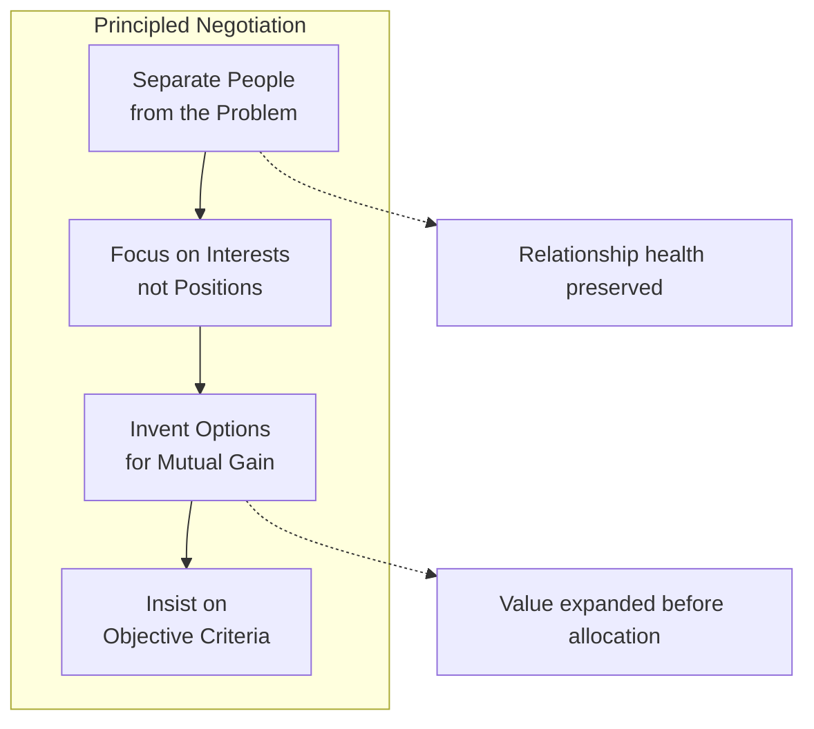
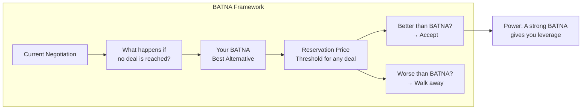
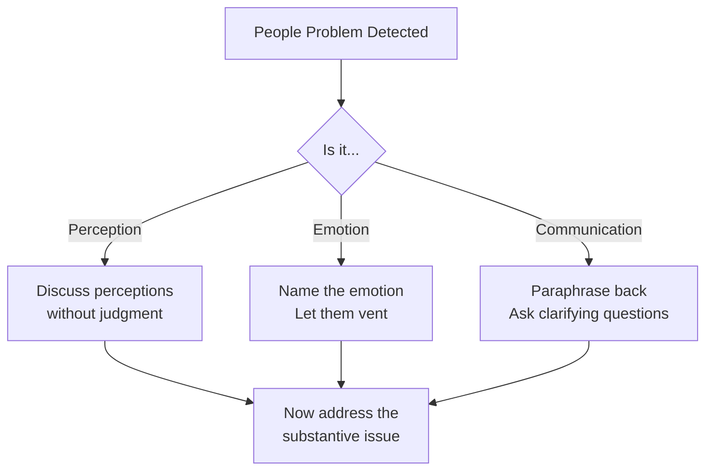
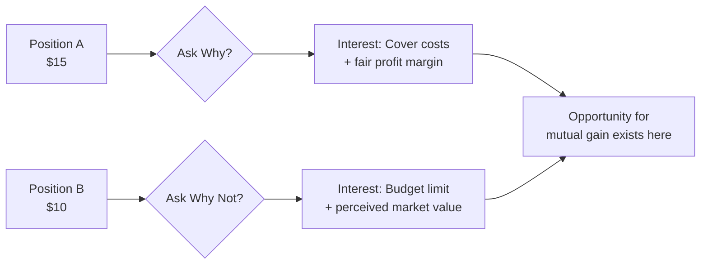
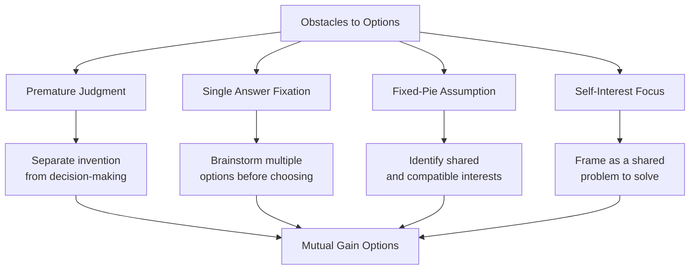
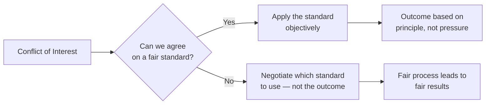

## The Principled Negotiation Framework

The Harvard Negotiation Project's method rests on four interconnected
pillars.

---

## The Two Types of Negotiation

| Dimension | Soft Negotiation | Hard Negotiation | Principled Negotiation |
|-----------|-----------------|------------------|------------------------|
| Goal | Agreement at any cost | Victory at any cost | Wise outcome efficiently |
| People | Treat as friends | Treat as adversaries | Work side by side |
| Trust | Give trust freely | Distrust everything | Trust independently |
| Positions | Change easily | Dig in firmly | Focus on interests |
| Concessions | Make them readily | Demand them | Yield to principle |
| Bottom line | Reveal it | Conceal it | Know your BATNA |

---

## BATNA: Your Best Alternative To a Negotiated Agreement

BATNA is the most important concept in the book.

Calculating your BATNA requires three steps:
1. List all alternatives if no agreement is reached
2. Improve the best alternative
3. Determine your reservation price — the worst acceptable deal

---

## Separate People from the Problem

Negotiators are people first. Three categories of people problems:

| Problem Type | Symptoms | Solution |
|---|---|---|
| Perception | Different interpretations of facts | Put yourself in their shoes |
| Emotion | Fear, anger, frustration | Acknowledge emotions explicitly |
| Communication | Not listening, misunderstanding | Active listening, reframing |

---

## Focus on Interests, Not Positions

A position is what someone says they want. An interest is *why* they
want it.

| Party | Position | Underlying Interests |
|---|---|---|
| Buyer | "I want it for $10" | Save money, feel like a good deal |
| Seller | "I want $15" | Fair price, cover costs, profit |
| Landlord | "$2,000/month, no pets" | Protect property, minimize risk |
| Tenant | "$1,500/month, allow my dog" | Affordability, companionship |

The key question: **"Why?"** and **"Why not?"**

---

## Invent Options for Mutual Gain

Four obstacles to creative agreement:

1. **Premature judgment** — criticizing before understanding
2. **Searching for the single answer** — assuming a fixed pie
3. **Assuming a fixed pie** — win-lose thinking
4. **Letting the problem solve you** — focusing only on your interests

---

## Insist on Objective Criteria

When interests directly conflict, use fair standards:

| Criterion Type | Examples |
|---|---|
| Market value | Comparable sales, appraisals |
| Legal precedent | Court rulings, regulations |
| Expert opinion | Industry standards, professional judgment |
| Efficiency | Cost-benefit analysis, time savings |
| Fairness | Equal treatment, need-based allocation |

The shift: instead of "What should you give me?" ask "On what basis
should we decide?"

---

## Reading Guide

| Chapter | Topic | Est. Time | Priority |
|---|---|---|---|
| 1 | The problem: positions | 20 min | Essential |
| 2-3 | People and interests | 45 min | Essential |
| 4 | Options for mutual gain | 30 min | Essential |
| 5 | Objective criteria | 30 min | Essential |
| 6 | BATNA | 30 min | Essential |
| 7-8 | Tactics and power | 45 min | Important |
| 9-10 | Ten questions and conclusion | 30 min | Important |
