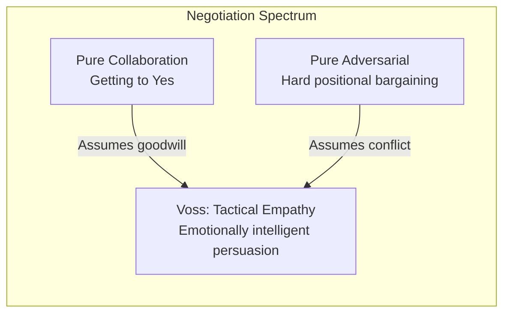
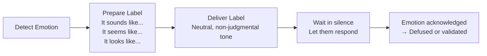
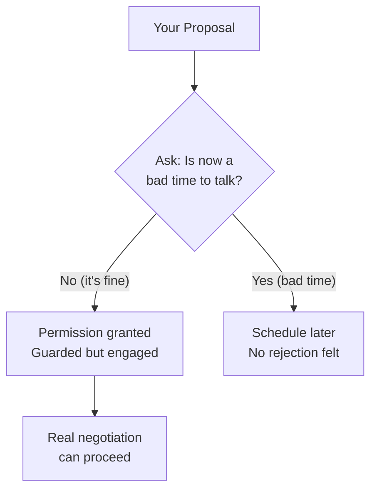
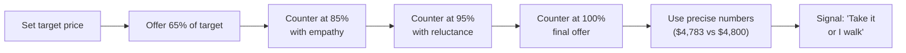
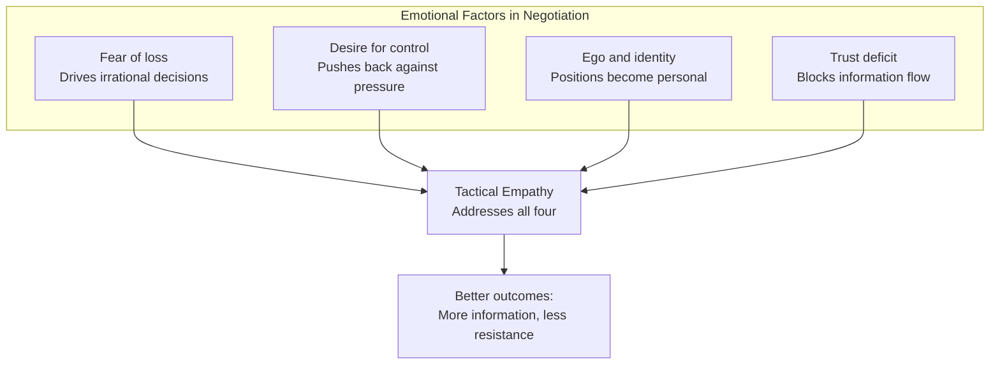

## The Negotiation Continuum

Voss positions his approach against the Harvard model.

---

## The Nine Core Techniques

### 1. The Late-Night FM DJ Voice

A calm, slow, downward-inflected voice signals confidence and control.
It creates an environment where the other party feels safe to talk.

### 2. Mirroring

Repeat the last 1-3 words the other person says, with an upward
inflection. This encourages elaboration without asking a direct question.

| They say | You mirror |
|---|---|
| "This price is too high." | "Too high?" |
| "We've never done it that way." | "Never done it that way?" |

### 3. Labeling

Name the other person's emotion to diffuse it.

### 4. The Accusation Audit

List every terrible thing the other party could say about you before
they say it. This preempts their objections and builds trust.

| Instead of avoiding: | Say: |
|---|---|
| "Our price is fair." | "It sounds like our price feels unreasonable to you." |
| "We're reliable." | "You're probably thinking we'll drop the ball." |

### 5. Calibrated Questions

Open-ended questions starting with "How" or "What" that give the other
party the illusion of control while you steer the conversation.

| Wrong Question | Calibrated Question |
|---|---|
| "Can you lower the price?" | "How am I supposed to do that?" |
| "Will you accept these terms?" | "What would make this work for you?" |
| "Why is that your position?" | "What is the underlying concern?" |

### 6. The Rule of "No"

Getting to "no" is safer and more productive than getting to "yes."

### 7. "That's Right"

The two most powerful words in negotiation. When the other party says
"That's right," they feel understood and validated. It signals a
breakthrough.

### 8. Bending Reality with Deadlines and Fairness

Use time pressure strategically. Label unfair treatment: "It seems like
you're treating me unfairly" — which usually triggers a correction.

### 9. The Ackerman Model of Bargaining

A systematic offer-and-counteroffer sequence:

---

## The Emotional Architecture of Negotiation

---

## Reading Guide

| Chapter | Technique | Est. Time | Priority |
|---|---|---|---|
| 1 | The new rules | 30 min | Essential |
| 2 | Mirroring | 30 min | Essential |
| 3 | Labeling and empathy | 30 min | Essential |
| 4 | Calibrated questions | 30 min | Essential |
| 5 | The power of "no" | 30 min | Essential |
| 6-7 | Ackerman model | 40 min | Essential |
| 8-9 | Dark side tactics | 40 min | Important |
| 10-11 | Real-world applications | 30 min | Important |
