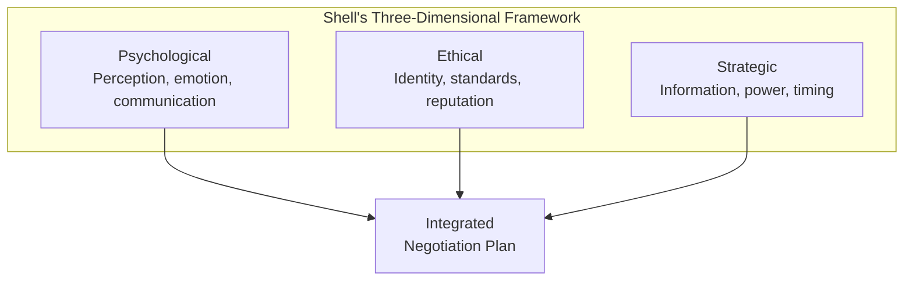
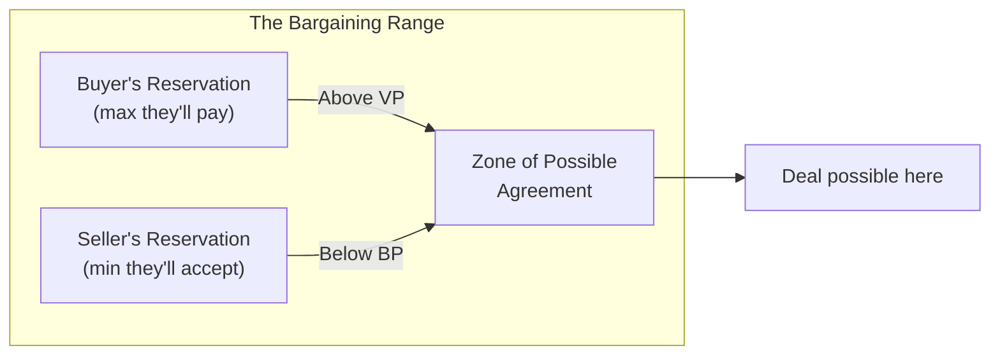
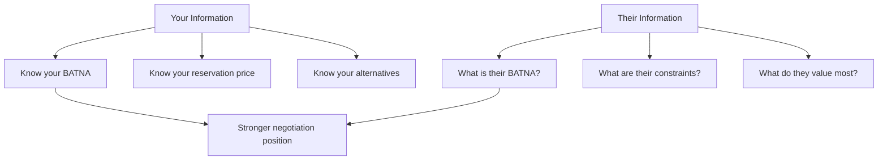
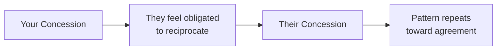

## The Three Dimensions of Negotiation

Shell organizes negotiation into three interconnected dimensions.

---

## The Five Negotiation Styles

Shell's self-assessment identifies five dominant styles.

| Style | Tendency | Strength | Weakness |
|---|---|---|---|
| Competitor | Win at all costs | Gets results under pressure | Damages relationships |
| Collaborator | Solve together | Finds creative solutions | Time-consuming |
| Compromiser | Split the difference | Quick resolution | Leaves value on table |
| Accommodator | Preserve relationship | Builds goodwill | Vulnerable to exploitation |
| Avoider | Delay or withdraw | Avoids conflict | Leaves needs unmet |

---

## The Bargaining Range

The single most important strategic concept.

Key variables:

| Variable | Definition | Example |
|---|---|---|
| Reservation price | Walkaway point | Seller: $90,000 |
| Aspiration point | Ideal outcome | Seller: $110,000 |
| ZOPA | Overlap between BPs | $95,000 - $105,000 |
| BATNA | What happens if no deal | Seller keeps the house |

---

## Information Leverage

Information is the currency of negotiation advantage.

Shell's rule: the party with better information about the other side's
reservation price and alternatives will negotiate a better outcome.

---

## The Four Psychological Leverage Principles

Shell draws on Cialdini's influence research.

### 1. Reciprocity

### 2. Consistency

People want to appear consistent with their prior statements and
commitments. Get them to state principles before discussing specifics.

### 3. Social Proof

People look to others to determine appropriate behavior. Use precedents,
market standards, and what "similar parties" have agreed to.

### 4. Liking and Trust

People negotiate more favorably with people they like. Invest in
relationship before substance.

---

## Ethical Boundaries

Shell provides a framework for ethical decision-making.

| Ethical Standard | Question | Example |
|---|---|---|
| The publicity test | Would I be comfortable if this appeared on the front page? | Avoid lies that would damage reputation |
| The role model test | Would I want someone I respect to see me doing this? | Avoid manipulation that conflicts with identity |
| The gut test | Does this feel wrong? | Trust your intuition about boundaries |

---

## Reading Guide

| Chapter | Topic | Est. Time | Priority |
|---|---|---|---|
| 1-2 | Bargaining styles and self-assessment | 1h | Essential |
| 3-4 | The bargaining range and ZOPA | 1h | Essential |
| 5-6 | Information and power | 1h | Essential |
| 7-8 | Ethical standards | 1h | Important |
| 9-10 | Psychological leverage | 1h | Essential |
| 11-12 | Strategy and planning | 1h | Important |
