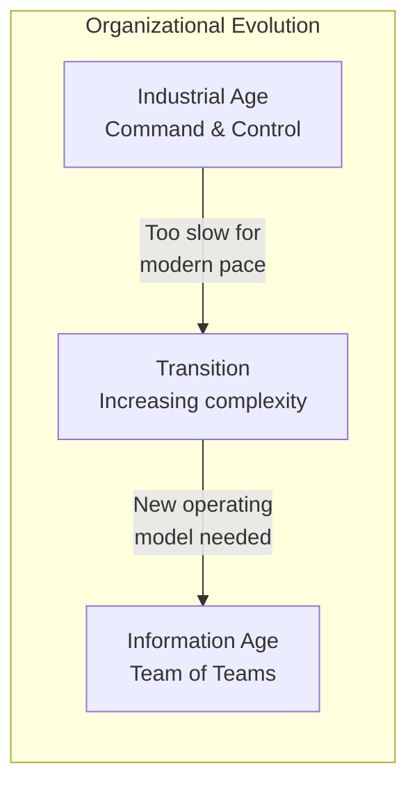
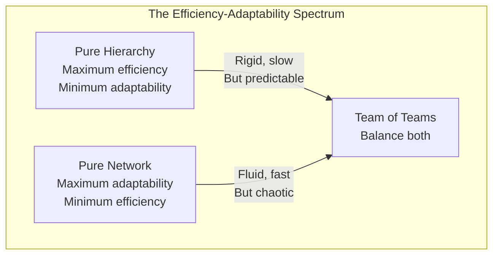
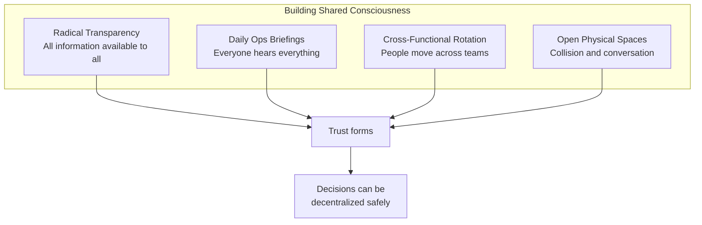
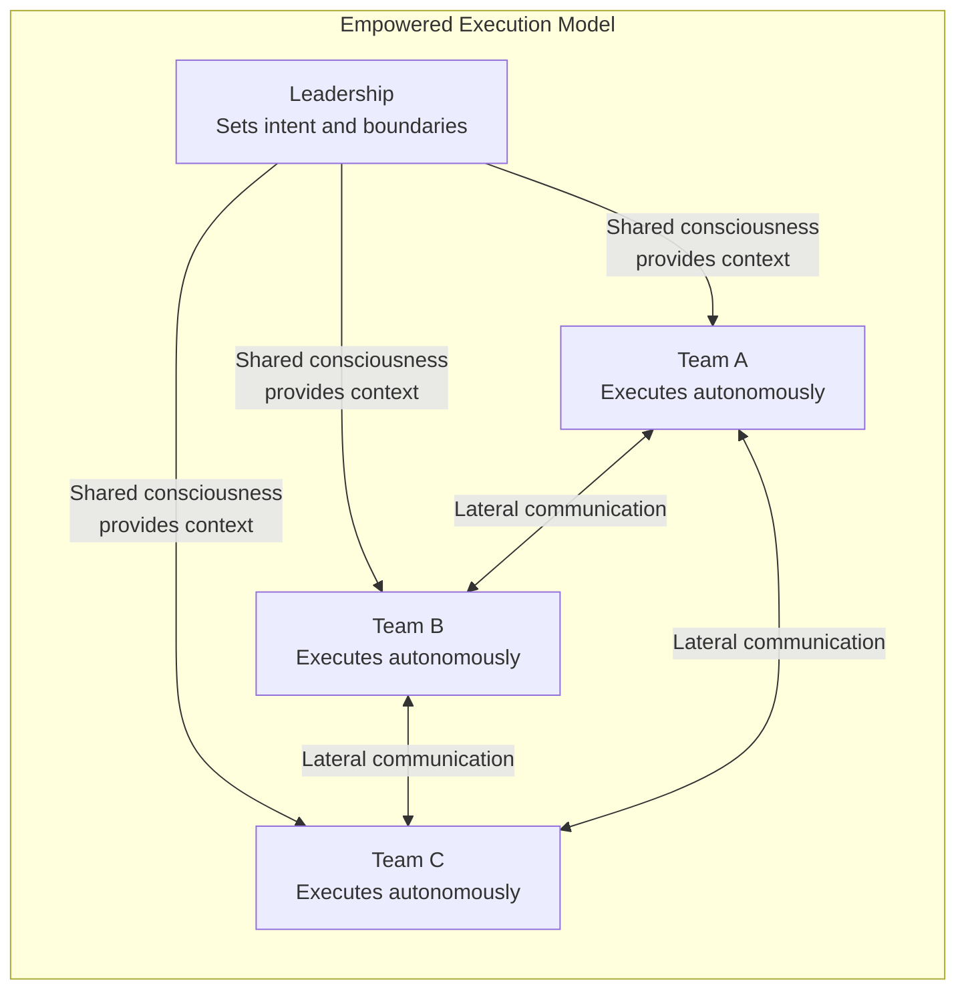
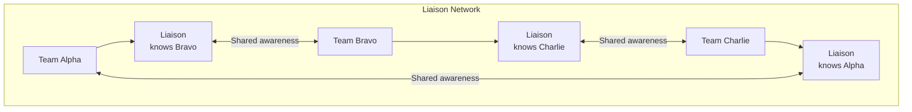

## The Organizational Evolution

McChrystal traces the shift from industrial to complex environments.

---

## The Problem: Efficiency vs. Adaptability

| Attribute | Hierarchy | Network | Team of Teams |
|---|---|---|---|
| Speed | Slow | Fast | Fast |
| Coordination | Centralized | Chaotic | Structured |
| Scalability | High | Low | High |
| Adaptability | Low | High | High |
| Accountability | Clear | Ambiguous | Clear |

---

## Shared Consciousness

The foundation of decentralized execution.

### The Daily Operations Briefing (O&I)

The centerpiece of shared consciousness. A 90-minute daily meeting
where every team shares what they know. Not for decision-making — for
information sharing.

| Before O&I | After O&I |
|---|---|
| "My team has this data" | "The organization has this data" |
| "I don't know what they're doing" | "I can see the whole picture" |
| "Wait for command decisions" | "I can decide based on full context" |

---

## Empowered Execution

Once teams share consciousness, they must have authority to act.

The rule: anyone can make any decision as long as they have the full
context. No permission needed — only notification.

---

## The Leader as Gardener

McChrystal's most important leadership reframe.

| Traditional Leader | Gardener Leader |
|---|---|
| Directs every action | Shapes the ecosystem |
| Makes decisions | Creates decision-making capability |
| Controls information | Enables information flow |
| Answers questions | Asks better questions |
| Central authority | Distributed responsibility |

---

## The Liaison Role

Dedicated boundary-spanning officers who sit in other teams' meetings.

---

## Reading Guide

| Chapter | Topic | Est. Time | Priority |
|---|---|---|---|
| 1-3 | The problem with hierarchies | 1.5h | Essential |
| 4-6 | Shared consciousness | 1.5h | Essential |
| 7-8 | Empowered execution | 1h | Essential |
| 9-11 | Leadership and culture | 1.5h | Essential |
| 12-13 | Implementation | 1h | Important |
