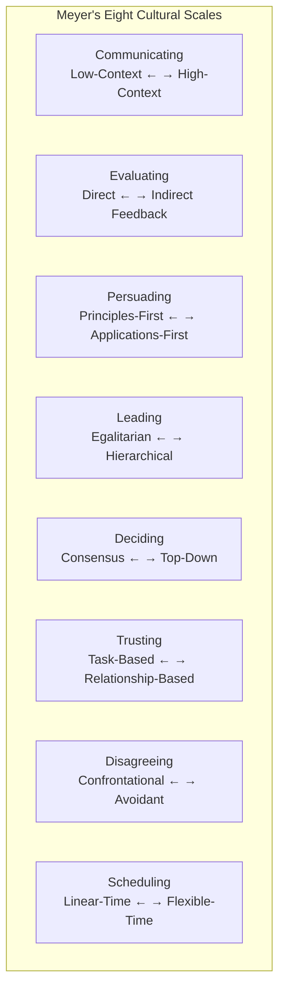
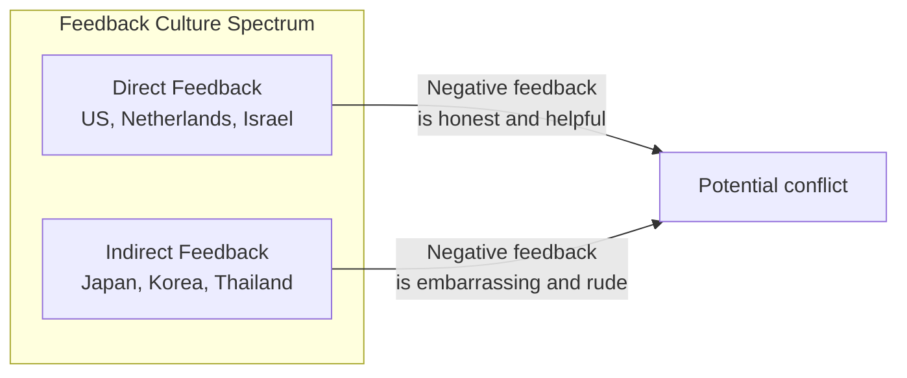
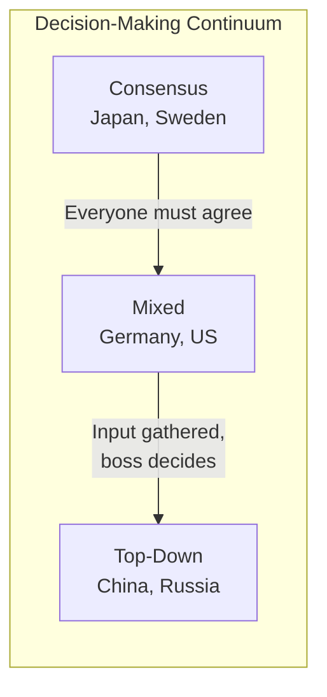
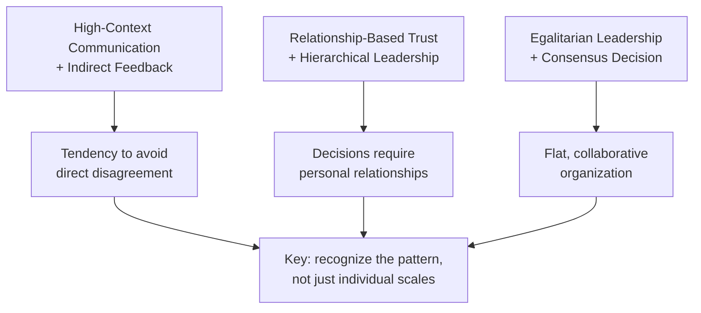

## The Eight-Scale Framework

Meyer's framework maps cultures along eight continuous scales.

---

## Scale 1: Communicating

Low-context cultures say what they mean. High-context cultures embed
meaning in the context.

| Low-Context (e.g., US, Germany) | High-Context (e.g., Japan, Saudi Arabia) |
|---|---|
| Good communication is explicit | Good communication is implicit |
| "Say what you mean" | "Read between the lines" |
| Written contracts are essential | Relationships override contracts |
| Direct "no" is acceptable | Indirect refusal to save face |

---

## Scale 2: Evaluating (Feedback)

The most dangerous scale: Americans giving "constructive feedback" to
Japanese colleagues often cause devastating humiliation without realizing it.

---

## Scale 3: Persuading

| Principles-First | Applications-First |
|---|---|
| Start with theory, then apply | Start with concrete examples |
| "Why" before "how" | "How" before "why" |
| Common in France, Italy, Russia | Common in US, UK, Canada |

---

## Scale 4: Leading

| Egalitarian | Hierarchical |
|---|---|
| Flat structures | Clear hierarchy |
| Boss is "first among equals" | Boss is superior |
| Subordinates challenge openly | Subordinates defer |
| Denmark, Israel, Netherlands | China, Japan, Russia |

---

## Scale 5: Deciding

Critical insight: **Consensus does not mean egalitarian.** Japan is
highly hierarchical but makes decisions by consensus. The US is
egalitarian but the boss makes the final call.

---

## Scale 6: Trusting

| Task-Based Trust | Relationship-Based Trust |
|---|---|
| Trust through work | Trust through relationship |
| "We work well together" → trust | "We know each other" → trust |
| US, Denmark, Switzerland | China, Brazil, Nigeria |
| Trust is earned by competence | Trust is built through shared experience |

---

## Scale 7: Disagreeing

| Confrontational | Avoidant |
|---|---|
| Debate improves ideas | Debate threatens harmony |
| Raise voice = passion | Raise voice = loss of control |
| Israel, France, US | Japan, Thailand, Indonesia |

---

## Scale 8: Scheduling

| Linear-Time | Flexible-Time |
|---|---|
| Time is linear | Time is fluid |
| Schedule drives activity | Relationships drive activity |
| Punctuality = respect | Punctuality is flexible |
| Germany, Switzerland, Japan | India, Brazil, Saudi Arabia |

---

## Cross-Scale Interactions

The scales interact in complex ways.

---

## Reading Guide

| Chapters | Scales Covered | Est. Time | Priority |
|---|---|---|---|
| 1-2 | Communicating | 1h | Essential |
| 3 | Evaluating | 30 min | Essential |
| 4 | Persuading | 30 min | Essential |
| 5 | Leading | 30 min | Essential |
| 6 | Deciding | 30 min | Essential |
| 7 | Trusting | 30 min | Essential |
| 8-9 | Disagreeing and scheduling | 45 min | Essential |
| 10 | Putting it together | 30 min | Important |
