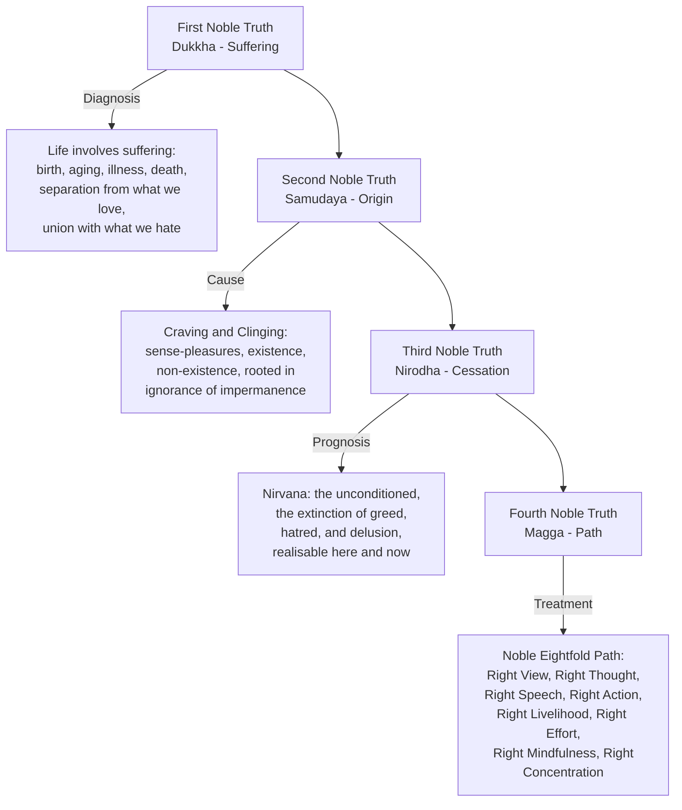
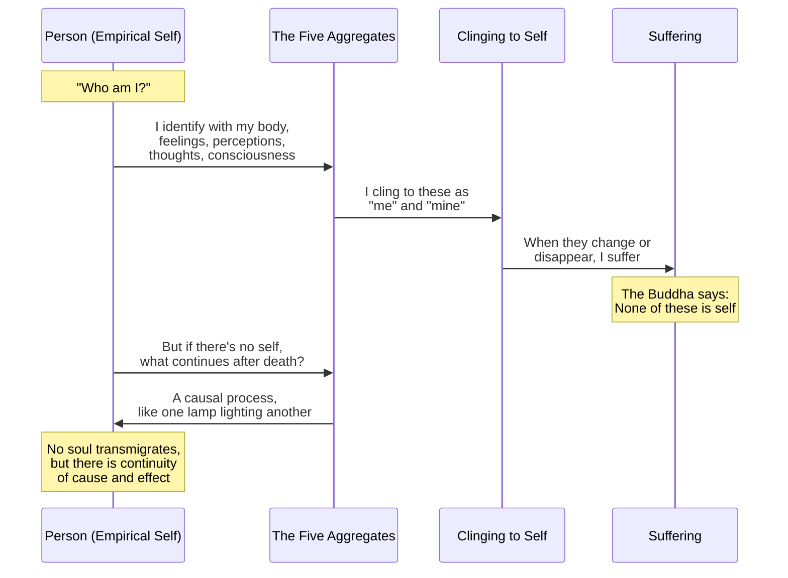
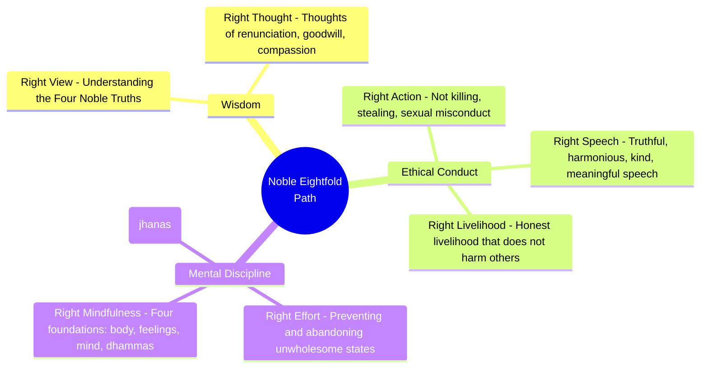

## The Four Noble Truths

Rahula presents the Four Noble Truths as a complete diagnostic framework, analogous to a medical diagnosis. The first truth identifies the disease (suffering), the second identifies its cause (craving), the third affirms that a cure exists (cessation), and the fourth prescribes the treatment (the Noble Eightfold Path). This structure is intentional: the Buddha described himself as a physician, and the Four Noble Truths follow the medical model of his time.

## Anatta: The Doctrine of Non-Self

Rahula identifies anatta as the Buddha's most distinctive and most challenging teaching. The Buddha analysed the person into five aggregates (khandhas): form (physical body), feeling (sensations), perception (recognition), mental formations (thoughts, intentions, habits), and consciousness (awareness). He then argued that none of these aggregates, individually or collectively, constitute a permanent, unchanging self.

This is not a denial that persons exist empirically. It is a denial that persons have an essence — an eternal soul or atman — that survives death unchanged. The Buddha's position is that what we call a person is a constantly changing stream of psycho-physical processes, causally connected from moment to moment and from life to life.

Rahula emphasises that the anatta teaching is not nihilistic. Understanding non-self is liberating because it releases the practitioner from the anxiety of protecting and defending a self that does not exist. When there is no self to be threatened, fear, anger, and possessiveness naturally dissolve.

## Dependent Origination

The doctrine of dependent origination (paticca-samuppada) explains how suffering arises through a chain of twelve interconnected factors. Each factor arises in dependence on the preceding one, and the cessation of each factor leads to the cessation of the succeeding one. This is the Buddha's explanation of how rebirth and suffering occur without a self or soul.

Rahula explains that this chain can be broken at any point through mindfulness and wisdom. The most practical point of intervention is feeling: by observing feelings without reacting with craving, the chain is interrupted and suffering ceases.

## Karma and Rebirth

Rahula devotes a full chapter to clarifying what the Buddha actually taught about karma. The word karma means "action" — specifically, volitional action driven by intention. The Buddha taught that intentional actions produce results (vipaka) that shape future experience, but he explicitly rejected the idea that karma is fate. Human beings have free will and can change the direction of their lives through conscious effort.

Rebirth is not reincarnation of a soul. The Buddha used the analogy of one flame lighting another: the second flame is neither identical to the first nor entirely different. What continues is a causal process, not a substantial entity.

Rahula also addresses the common misconception that Buddhism teaches karma as a system of cosmic justice. The Buddha's teaching on karma is descriptive, not prescriptive: actions have consequences by natural law, not because a divine being rewards or punishes.

## The Noble Eightfold Path

The path to the cessation of suffering is divided into three training categories: wisdom (panna), ethical conduct (sila), and mental discipline (samadhi). Rahula emphasises that these three categories are not sequential stages but interdependent aspects of a single path that must be developed simultaneously.

Right View is the beginning and the culmination of the path. It starts with intellectual understanding of the Four Noble Truths and deepens through direct insight as meditation practice matures. Right Thought involves cultivating thoughts of renunciation, goodwill, and compassion while abandoning thoughts of sensuality, ill will, and cruelty.

Ethical conduct provides the foundation for mental discipline. Without ethical purification, the mind remains agitated and incapable of the sustained attention required for deep meditation. But Rahula emphasises that Buddhist ethics are not commandments — they are voluntary undertakings based on understanding that certain actions lead to suffering for oneself and others.

Right Mindfulness is the practice of bare attention to body, feelings, mind, and mental objects. It is the direct path to insight because it allows the practitioner to see things as they truly are — impermanent, unsatisfactory, and non-self.

## Nirvana

Nirvana is not a place, a state of consciousness, or nothingness. It is the unconditioned reality, the cessation of greed, hatred, and delusion. Rahula presents nirvana as achievable in this very life — the Buddha himself attained it at age thirty-five and lived for another forty-five years teaching others how to realise it for themselves.

Rahula acknowledges that nirvana cannot be described in positive terms because it transcends the categories of conditioned existence. The Buddha described it in negative terms — "the unborn, unoriginated, unmade, unformed" — not because it is nothing, but because language cannot capture what lies beyond the conditioned world.

## Meditation According to Rahula

Rahula presents meditation as the practical method for developing insight. He distinguishes two types: samatha (tranquillity meditation) which develops concentration, and vipassana (insight meditation) which develops wisdom. Both are necessary, but wisdom is the ultimate goal.

The foundation of meditation is mindfulness of breathing (anapanasati), which Rahula describes in detail following the Buddha's instructions in the Satipatthana Sutta. The practitioner simply observes the breath without controlling it, allowing attention to settle naturally.

## Chapter Insights

### Chapter 1: The Buddha
Rahula presents the Buddha as a human being who achieved enlightenment through his own effort, not a god or prophet. This emphasis on human potential is central to the Buddhist worldview.

### Chapter 2: The Four Noble Truths
Each truth receives detailed exposition with extensive quotations from the Pali Canon. Rahula emphasises that the first truth is not pessimistic — it is realistic.

### Chapter 3: Anatta
The most intellectually demanding chapter. Rahula carefully distinguishes the Buddhist position from both eternalism and annihilationism.

### Chapter 4: Karma and Rebirth
Rahula clarifies common misunderstandings and presents the Buddhist position as a middle way between determinism and chaos.

### Chapter 5: Meditation
Practical instructions for mindfulness of breathing, with emphasis on the purpose rather than the technique.

### Chapter 6: The Noble Eightfold Path
Each factor of the path is explained in relation to the others, showing how they function as an integrated system.

### Chapter 7: The Buddha's Teaching and Society
Rahula addresses the Buddha's social philosophy, including his critique of the caste system and his teachings on political leadership.

## Real World Examples

Rahula uses examples from everyday life throughout the book. He illustrates anatta by asking readers to examine their own experience: when we say "my body," "my feeling," "my mind," we imply possession rather than identity. The body ages, feelings change, thoughts come and go — if any of these were truly self, we could control them at will.

## Reading Guide

### Sufficiency Assessment

This summary captures the core doctrines of the Buddha's teaching as presented by Rahula. It covers the Four Noble Truths, anatta, dependent origination, karma, the Noble Eightfold Path, and nirvana, but omits the extensive Pali Canon quotations and the complete meditation instructions.

### Recommended Reading Path

| Reader Type | Time | What to Read |
|---|---|---|
| Casual | ~30 min | This summary |
| Interested | ~3 hr | Summary + Chapters 2, 3, 6 of the book |
| Practitioner | ~8 hr | Full book + selected Pali text translations |

### Chapters to Read in Full

- **Chapter 2** — The Four Noble Truths (the entire doctrine in one chapter)
- **Chapter 3** — Anatta (the most important and subtle concept)
- **Chapter 6** — The Noble Eightfold Path (the practical core)
- **Chapter 7** — The Buddha and Society (often overlooked but valuable)

### Chapters to Skim or Skip

- **Chapter 1** — The Buddha's life (useful background but widely available elsewhere)
- **Chapter 8** — The Buddha and Other Thinkers (comparative references are dated)

### What You'll Miss by Not Reading the Full Book

The richness of the Pali Canon quotations, the careful philosophical argumentation, and Rahula's unique authority as a monk-scholar writing from within the tradition.
