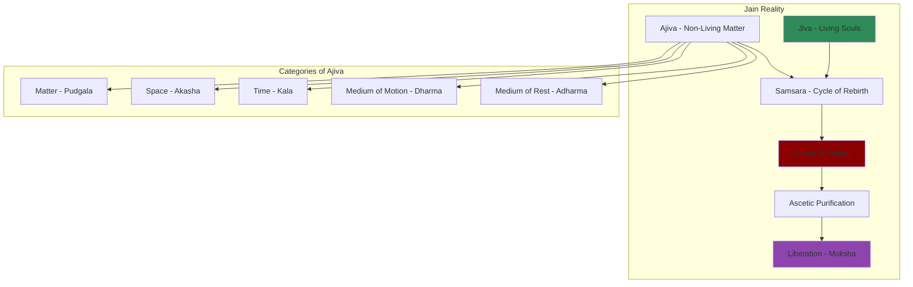
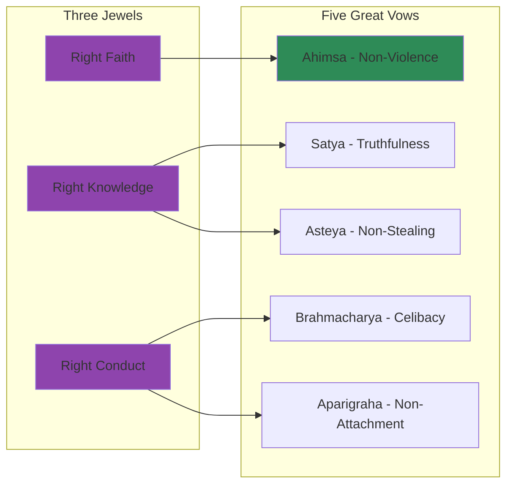

# Core Concepts

## The Jain Worldview

Jainism is a non-theistic, dualistic philosophy. The universe consists of two eternal categories: jiva (living souls) and ajiva (non-living matter). Souls are infinite in number, each possessing perfect knowledge, perception, power, and bliss in their pure state. Karma is a subtle form of matter that binds to the soul, obscuring its true nature.

## The Three Jewels

The path to liberation is defined by the Three Jewels: right faith (samyag-darshana), right knowledge (samyag-jnana), and right conduct (samyag-charitra). These three together lead to liberation. Right conduct includes the five great vows taken by Jain ascetics.

## Ahimsa: The Central Principle

Non-violence is the most distinctive and important Jain principle. It extends to all living beings, from humans to insects to microorganisms. This principle shapes every aspect of Jain life: the strict vegetarian diet, the practice of filtering water, the sweeping of paths before walking, and the refusal of occupations involving harm to living beings.

## Anekantavada: The Doctrine of Many-Sidedness

Jain epistemology holds that reality is complex and cannot be captured from a single viewpoint. The doctrine of anekantavada (non-absolutism) teaches that truth is relative to perspective. This philosophical position manifests in the practice of syadvada (the theory of conditional predication), where all statements are qualified by "in a certain sense."

## Karma as Material

Unlike most Indian traditions that see karma as a law of cause and effect, Jainism conceives of karma as a subtle form of matter that actually attaches to the soul. The goal of ascetic practice is to stop the influx of new karma and to shed existing karma, allowing the soul to rise to its natural state of perfection at the top of the universe.

# Chapter Insights

## Historical Origins

Dundas traces Jainism to the teachings of Mahavira (c. 599-527 BCE), a contemporary of the Buddha. Mahavira was the 24th tirthankara (ford-maker), one of a line of enlightened teachers who have revealed the eternal Jain path.

## The Canon

The Jain scriptures are vast and written primarily in Ardhamagadhi Prakrit. Dundas explains the canon's structure, its major texts, and the debates about which texts are authoritative.

## Monastic Life

The ascetic community is the heart of Jainism. Monks and nuns take the five great vows and follow elaborate rules of conduct. Dundas describes their daily life, their dependence on lay supporters, and the differences between the Digambara and Svetambara sects.

## Lay Practice

The laity observes the vows to a lesser degree and supports the monastic community. Dundas discusses Jain social organization, business practices, and the role of temples and festivals.

## Modern Jainism

The book concludes with Jainism's encounter with modernity: educational reform, the diaspora, and efforts to present Jainism to a global audience.

# Reading Guide

## Sufficiency Assessment

This summary captures the core doctrines and structure of Jainism. The full book offers much deeper historical and textual analysis.

## Recommended Reading Path

| Reader Type | Time | What to Read |
|---|---|---|
| Curious | ~20 min | This summary |
| Student | ~4-5 hr | Summary + chapters on doctrines and monasticism |
| Scholar | ~10-12 hr | Full book |

## What You'll Miss

- Detailed analysis of Jain scriptures
- The history of Jain sectarian divisions
- Regional variations in Jain practice
