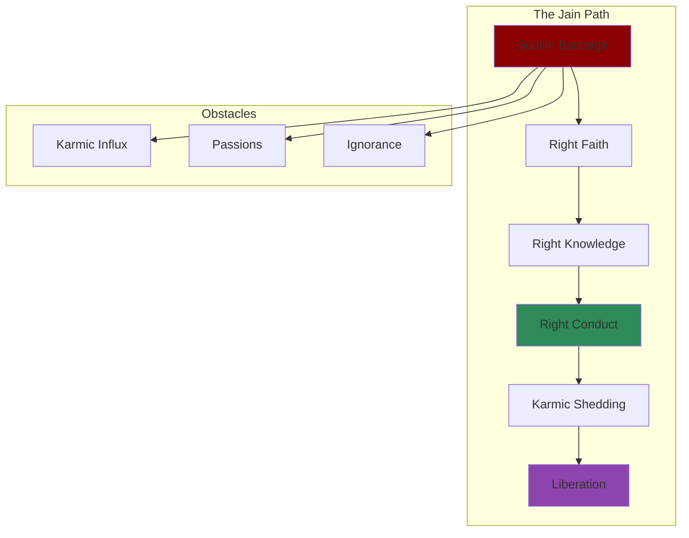
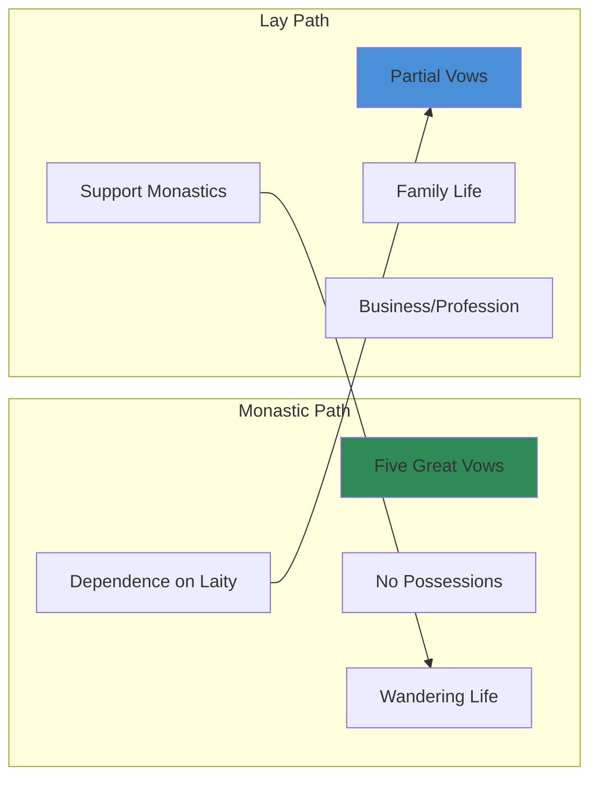

# Core Concepts

## The Jain Path

Fohr presents Jainism as a coherent spiritual path with a clear goal: liberation from the cycle of rebirth. The means to this goal is the systematic purification of the soul through the removal of karmic matter. The path is demanding, requiring rigorous discipline, but is open to all.

## Ahimsa in Practice

Non-violence is not merely a negative prohibition but a positive practice of compassion. Fohr explains how ahimsa shapes Jain diet (strict vegetarianism that avoids root vegetables), occupation (avoiding professions that harm living beings), and daily life (filtering water, sweeping paths before walking).

## Monastic and Lay Jainism

Fohr clearly distinguishes between the monastic path (full-time renunciation with strict vows) and the lay path (householder life with partial observance). The relationship between monks and laity is central to Jain social organization: the laity supports the monastic community materially, and the monks provide spiritual guidance.

## Jain Cosmology

The Jain universe is eternal and uncreated. It has a definite shape — like a cosmic person standing with hands on hips — with realms for gods, humans, animals, and hell-beings. Time moves in endless cycles of ascending and descending ages, and we are currently in the fifth age of the descending half-cycle.

## Karma Theory

Karma in Jainism is understood as a subtle material substance that binds to the soul. There are eight types of karma that obscure the soul's natural qualities. The goal of spiritual practice is to stop new karmic influx and to shed existing karma through ascetic practices.

# Chapter Insights

## History and Origins

Fohr traces Jainism from the tirthankaras, especially Mahavira (the 24th tirthankara), through its development alongside Buddhism and Hinduism. She explains the split between the Digambara and Svetambara sects.

## Doctrines

Clear explanations of the Jain categories of reality, the nature of the soul, karma theory, and the path to liberation.

## Ethics

The five great vows are explained in detail, along with their application in daily life.

## Practice

Jain ritual life: temple worship, festivals like Paryushana and Mahavir Jayanti, and the annual fasts.

## Modern Jainism

Fohr discusses how Jainism has adapted to modernity, including the role of Jain nuns, educational institutions, and the Jain diaspora.

# Reading Guide

## Sufficiency Assessment

This summary captures the main structure of Fohr's introduction. The full book offers more detail on each topic.

## Recommended Reading Path

| Reader Type | Time | What to Read |
|---|---|---|
| Curious | ~15 min | This summary |
| Student | ~3-4 hr | Summary + core chapters |
| Full | ~6-8 hr | Full book |

## What You'll Miss

- Extended discussion of Jain ritual
- The chapter on Jain art and literature
- Comparisons with other Indian traditions
