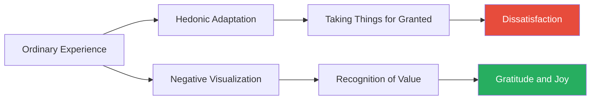
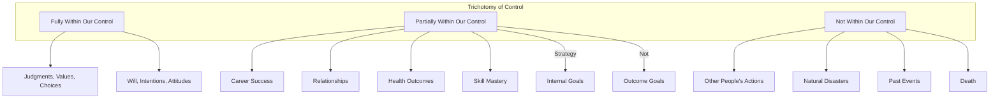
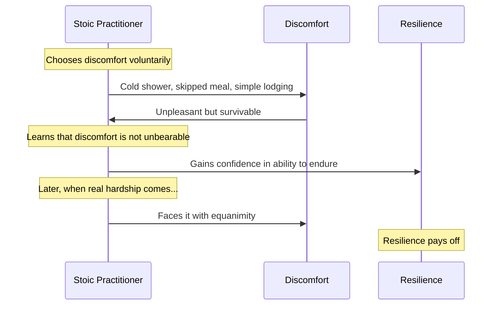

## Negative Visualization

Irvine identifies negative visualization (premeditatio malorum in Latin) as the single most powerful Stoic technique. The practice involves regularly imagining the loss of the things we value: our health, our possessions, our loved ones, and ultimately our own lives. This might sound morbid, but Irvine argues it has three powerful psychological effects.

First, it extinguishes the hedonic adaptation that makes us take our blessings for granted. Humans have a remarkable capacity to become accustomed to any circumstance, good or bad. Negative visualization forces us to re-evaluate what we have and to recognise its value before it is lost. Second, it reduces the impact of actual loss by preparing us psychologically. When we have contemplated the possibility of loss, the actual event is less devastating. Third, it transforms ordinary experience into something precious.

Irvine recommends practising negative visualization at specific times: when you wake up (imagine losing the day ahead), when you are with loved ones (imagine losing them), and when you experience pleasure (imagine the experience ending). The technique should be applied with balance — the goal is not to induce anxiety but to cultivate appreciation.

## The Trichotomy of Control

Irvine's most original contribution to modern Stoicism is his refinement of Epictetus's dichotomy of control into a trichotomy. Epictetus divided everything into two categories: things within our control (our judgments, choices, and values) and things outside our control (everything else). Irvine argues that there is a meaningful third category: things over which we have some but not total control, such as whether our tennis serve lands in the court or whether our children succeed in life.

For things in this middle category, Irvine advises setting internal rather than external goals. In tennis, do not aim to win the match; aim to play your best. In parenting, do not aim for your child to succeed; aim to be a loving and supportive parent. This shift from outcome goals to process goals removes the anxiety of trying to control what cannot be controlled while still pursuing worthwhile objectives.

## Stoic Mindfulness

Irvine devotes a chapter to what he calls Stoic mindfulness — the continuous self-monitoring recommended by Epictetus and Seneca. The goal is to maintain a "guardian within" that observes our impressions and judges them before we act on them. This practice has two components.

First, the trigger technique. Before responding to any event, pause and ask: is this within my control? If not, the appropriate response is acceptance, not distress. Second, the evaluation of impressions. When an impression arises — "that person insulted me" — we should evaluate it before giving assent. Is the impression accurate? Is the response it suggests aligned with our values?

Irvine connects this to modern cognitive behavioural therapy, which Aaron Beck and Albert Ellis explicitly based on Stoic principles. The Stoic insight that it is not events that disturb us but our judgments about events is the foundation of CBT.

## Voluntary Discomfort

Stoics did not merely endure hardship philosophically; they sought it out. Seneca practised periodic poverty, sleeping on the ground and eating only the simplest food. Cato the Younger walked barefoot and exposed himself to extreme weather. The purpose was not asceticism for its own sake but psychological training.

Irvine recommends four forms of voluntary discomfort: cold showers (to harden the body against physical discomfort), occasional fasting (to break the tyranny of appetite), simple living (to reduce dependence on luxury), and periodic poverty (to remind ourselves that we can survive with very little). Each practice builds what Nassim Taleb would later call antifragility — the capacity to benefit from disorder.

## The Practice of Joy

Irvine distinguishes between two kinds of happiness. The first is the modern, hedonic conception: happiness as a preponderance of positive emotions over negative ones. This kind of happiness is fragile because it depends on favourable external circumstances. The second is the Stoic conception: joy (chara) is a deep, stable sense of well-being that flows from virtue and wise judgment. It does not require wealth, status, or applause. It requires only that we live in accordance with our values.

The path to Stoic joy is not through maximizing pleasure but through minimizing unnecessary desire. When we want only what we already have, we are immune to disappointment. This is not the same as being satisfied with mediocrity; it means pursuing worthwhile goals while being content with whatever outcome follows.

## Applying Stoicism in Daily Life

Irvine devotes the second half of the book to specific applications. On social relations, he advises associating primarily with people who share your values and avoiding those who provoke you to vice. On insults, the best response is either humour or silence — never anger, which signals that the insult has struck home. On grief, he recommends preparation through negative visualization and, when loss occurs, the recognition that grief is natural but should not be indulged endlessly.

On luxury and status, Irvine is at his most challenging. The pursuit of status is a zero-sum game that generates anxiety without lasting satisfaction. The Stoic alternative is to seek the good opinion of people whose judgment you respect and to be indifferent to everyone else.

## Chapter Insights

### Chapter 1: The Rise of Stoicism
Irvine surveys the Hellenistic philosophical schools and explains why Stoicism is the best candidate for a modern philosophy of life.

### Chapter 2-4: Core Techniques
The trichotomy of control, negative visualization, and Stoic mindfulness are presented as interrelated practices that reinforce each other.

### Chapter 5-8: Psychological Practices
Irvine covers the management of desire, the value of the present moment, and the practice of self-denial.

### Chapter 9-14: Applications
Each chapter addresses a specific area of modern life, with concrete advice drawn from Seneca, Epictetus, and Marcus Aurelius.

### Chapter 15-17: Broader Questions
The relationship between Stoicism and religion, Stoicism and science, and the ultimate goal of Stoic practice.

## Reading Guide

### Sufficiency Assessment

This summary captures Irvine's core framework and all the major techniques. It omits the historical background, many of the specific examples from ancient texts, and Irvine's personal experiments.

### Recommended Reading Path

| Reader Type | Time | What to Read |
|---|---|---|
| Casual | ~20 min | This summary |
| Interested | ~3 hr | Summary + Chapters 2, 3, 4, 10, 11 |
| Practitioner | ~12 hr | Full book, try one technique per week |

### Chapters to Read in Full

- **Chapters 2-4** — The core techniques
- **Chapter 10** — Social relations
- **Chapter 11** — Insults

### What You'll Miss by Not Reading the Full Book

Irvine's personal experiments with Stoicism, the richness of the ancient examples, and the nuanced discussion of how to adapt Stoic principles to individual circumstances.
