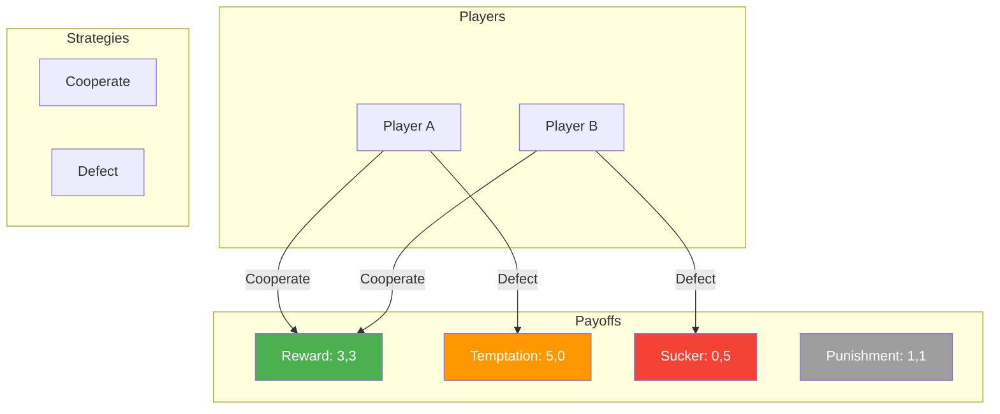
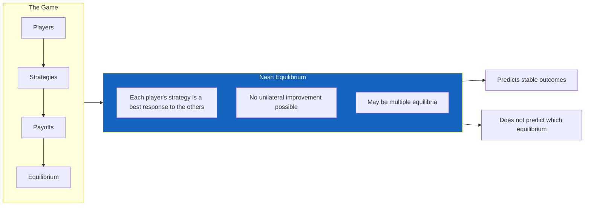
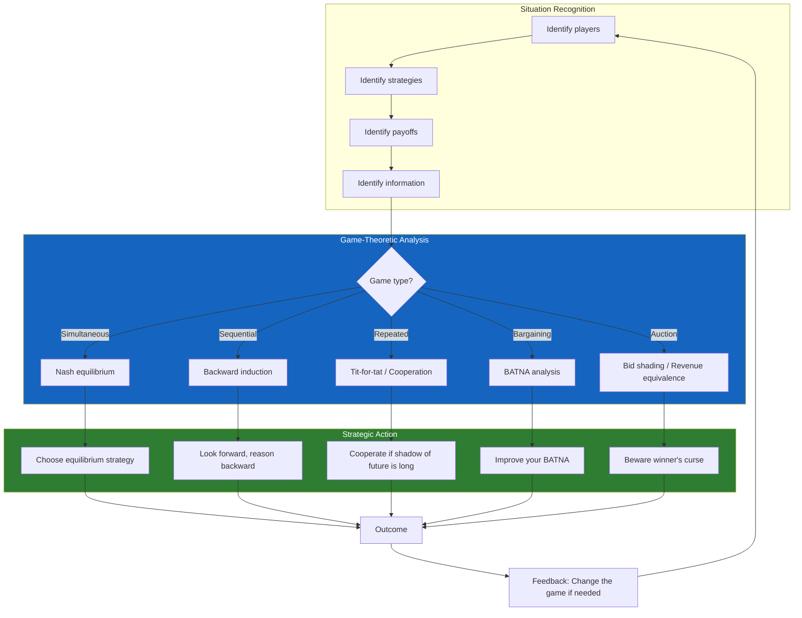

---

## Prologue: Why Strategy Matters

Dixit and Nalebuff open with a simple observation: most decisions in life are not made in isolation. When you choose a price for your product, competitors respond. When you negotiate a salary, your employer has their own limits and alternatives. When you bid at auction, every other bidder's choice affects whether you win and what you pay. These are strategic situations — games — and they demand a different kind of thinking than the optimization problems taught in standard economics and business courses.

The authors define game theory as "the science of strategic thinking." Its core question: what should you do when the outcome depends on what other people do, and they know that the outcome depends on what you do? This recursive reasoning — I think about what you think I will do — is the fundamental mental operation of game theory. The book is structured to teach this recursive mode of thought through a series of canonical games and their real-world applications.

---

## Part 1: The Foundations of Strategic Thinking

### Chapter 1 — Introduction: What Is Strategy?

The authors distinguish strategic from non-strategic situations. Non-strategic decisions — like whether to bring an umbrella — depend only on nature, not on the choices of other intentional agents. Strategic decisions — like whether to lower your price — depend on the anticipated choices of other players who are themselves anticipating your choices. This mutual anticipation creates an infinite regress: I think that you think that I think... The art of strategy is knowing when to stop the regress and how to decide under the resulting uncertainty.

Ten basic principles of strategic thinking are introduced as a preview:

1. Look forward and reason backward
2. If you have a dominant strategy, use it
3. Eliminate dominated strategies
4. Search for and exploit Nash equilibria
5. In repeated games, strategies for cooperation are sustainable when the shadow of the future is long
6. Make commitments credible
7. Use mixed strategies to keep opponents guessing
8. Design games to your advantage when you can
9. Bargaining power comes from patience and outside options
10. Information is power — use it strategically

### Chapter 2 — Nash Equilibrium: The Foundation of Strategic Analysis

John Nash's revolutionary idea, developed in his 1950 Ph.D. dissertation at Princeton, is this: a set of strategies is stable when no player can benefit by unilaterally changing their own strategy. This is the Nash equilibrium — the single most important concept in game theory.

The authors illustrate with the simplest possible game: two drivers approaching an intersection. Each can stop or go. The payoffs are arranged such that each driver wants to go if the other stops, and desperately wants to stop if the other goes. The Nash equilibria are (Stop, Go) and (Go, Stop) — stable patterns where neither driver can improve by changing alone. But which equilibrium actually occurs? This is the problem of equilibrium selection, which game theory does not fully resolve. Culture, convention, and history fill the gap: in some countries the rule is "first to arrive goes first"; in others, "the driver on the right goes first."

The authors emphasize that the Nash equilibrium is a description of stability, not optimality. Prisoner's dilemma's Nash equilibrium is (Defect, Defect) — both players confess — even though (Cooperate, Cooperate) would make both better off. An outcome can be an equilibrium and terrible; knowing this is the beginning of strategic wisdom.

### Chapter 3 — The Prisoner's Dilemma: The Paradox of Rational Defection

The prisoner's dilemma is to game theory what E=mc² is to physics: simple in statement, profound in implication. Two criminals are arrested. Each is offered a deal: testify against the other and go free while the other gets 10 years; if both testify, each gets 5 years; if neither testifies, each gets 1 year on a minor charge. From each individual's perspective, testifying is always better regardless of what the other does — it is a dominant strategy. But when both pursue their dominant strategy, the outcome (5 years each) is worse for both than the cooperative outcome (1 year each).

This is the paradox: individually rational choices produce collectively irrational outcomes. The prisoner's dilemma explains arms races, price wars, environmental degradation, and why global cooperation on climate change is so difficult. It is not a puzzle to be solved but a structural feature of many real strategic situations.

The authors then turn to the most important extension: the repeated prisoner's dilemma. When the same players interact repeatedly, cooperation can emerge. The key insight is that in a one-shot game, defection is the only rational choice. In a repeated game, the "shadow of the future" — the prospect of future interactions — can sustain cooperation if players care enough about future payoffs. The most famous and remarkably effective strategy is tit-for-tat: cooperate on the first move, then mirror your opponent's previous move. It is nice (never the first to defect), provocable (immediately retaliates), forgiving (resumes cooperation after one punishment round), and clear (easy for opponents to understand).

### Chapter 4 — Sequential Games: Look Forward, Reason Backward

Many strategic interactions unfold over time. A firm enters a market, an incumbent decides whether to fight or accommodate. A nation threatens war, the opponent decides whether to back down or escalate. These sequential games are analyzed by backward induction: identify the last move in the game, determine what the last player will do, then work backward, eliminating choices that will not be taken.

The authors introduce the concept of subgame perfect equilibrium — a refinement of Nash equilibrium that requires credible threats at every point in the game tree. A threat to fight a price war is only credible if the threatening firm would actually benefit from fighting once entry occurs. The cleanest way to make threats credible is to make backing down impossible — burn the bridges, sink the ships, remove the option to retreat.

### Chapter 5 — Simultaneous-Move Games: The Logic of Mutual Best Responses

When moves are simultaneous — or, more precisely, when players must choose without knowing the other's choice — the logic changes. The Nash equilibrium concept comes into its own. The authors walk through the canonical simultaneous-move games: the battle of the sexes (couple deciding whether to go to boxing or ballet — each prefers a shared activity to separate activities, but each has a different preferred activity), the game of chicken (two drivers heading toward each other — the one who swerves is "chicken," but if neither swerves both die), and the coordination game (two firms choosing technology standards).

Each game has a different equilibrium structure. The battle of the sexes has two Nash equilibria; chicken has two pure-strategy equilibria and one mixed-strategy equilibrium; coordination games have multiple equilibria that can be selected by history, convention, or deliberate design. The authors emphasize that identifying the game structure is more than half the battle: once you know whether you are playing prisoner's dilemma, chicken, or a coordination game, you know something important about how the situation will unfold and what strategies might improve the outcome.

| Game | Players | Key Feature | Equilibrium Structure |
|------|---------|-------------|----------------------|
| Prisoner's Dilemma | 2 | Dominant strategy to defect | Single bad equilibrium |
| Battle of the Sexes | 2 | Conflict over coordination | Two equilibria, conflict over which |
| Chicken | 2 | Neither wants to be the one who swerves | Two asymmetric equilibria |
| Coordination | 2+ | Both want to coordinate | Multiple equilibria |
| Stag Hunt | 2 | Risk dominates optimal | Two equilibria, one risky, one safe |

### Chapter 6 — Mixed Strategies: The Art of Randomization

In many games — poker, soccer penalty kicks, military strategy — predictability is deadly. The solution is to randomize. A mixed strategy is a probability distribution over pure strategies. The key theorem: in any finite game, there exists at least one Nash equilibrium, possibly involving mixed strategies.

The authors explain mixed strategies with the simplest example: a penalty kick in soccer. The kicker can aim left or right; the goalkeeper can dive left or right. If the goalkeeper knows where the kicker will aim, they can stop the shot. If the kicker knows where the goalkeeper will dive, they can aim the other way. The equilibrium is for both to randomize with specific probabilities that make the opponent indifferent between their options.

The crucial insight is that optimal randomization does not mean equal probabilities. In soccer, if kickers are better shooting to their natural side, the optimal mix might be 60% natural side, 40% opposite side — calibrated to make the goalkeeper indifferent. The mathematical condition is simple: choose probabilities such that the opponent's expected payoff is equal across all their pure strategies. Any deviation from these probabilities can be exploited.

---

## Part 2: Strategic Moves

### Chapter 7 — Credible Commitments

The single most powerful strategic move is the commitment: making it impossible or prohibitively costly to change course. The authors present the famous story of Cortes burning his ships upon arrival in Mexico — his men had no choice but to fight, and the Aztecs knew it. The commitment was credible precisely because it was irreversible.

But commitments can be created without physical destruction. Reputation serves as a commitment mechanism: if I build a reputation for always retaliating against price cuts, I do not need to retaliate every time — the reputation itself deters. Contracts, collateral, and hostages (in the literal or economic sense) all serve the same function: they change the payoff structure so that defection becomes costly.

Burning your bridges is not always optimal. The authors distinguish between commitments and threats. A threat is a promise to punish if the opponent does something; a promise is a commitment to reward if the opponent does something. Both must be credible to be effective.

### Chapter 8 — Unpredictability

The flip side of commitment is flexibility. In some situations, you want to be predictable (your brand stands for quality, your employees know you reward initiative). In others, you want to be unpredictable (you are negotiating a salary and do not want to reveal your reservation price). The authors discuss how to calibrate unpredictability — and how to detect it in others.

Information is the central resource in strategic games. The player with better information has an advantage, but information can be revealed or concealed strategically. Signaling — taking costly actions that credibly convey information — is one of the most subtle and powerful strategic tools.

### Chapter 9 — Brinkmanship

Brinkmanship — the deliberate creation of a shared risk of disaster to force concessions — was developed as a Cold War doctrine by Thomas Schelling. The logic is paradoxical: you can sometimes get what you want by making the situation dangerous for everyone, including yourself. The Cuban Missile Crisis was the classic example: Kennedy established a naval blockade around Cuba, creating a real risk of escalation to nuclear war. Khrushchev blinked.

The art of brinkmanship lies in calibrating the risk. If you push too hard, the situation spirals out of control. If you do not push hard enough, the opponent calls your bluff. The optimal strategy involves creating just enough shared risk to make the opponent's concession the less dangerous option. Crucially, brinkmanship works only when both parties understand the risk and prefer a negotiated outcome to mutual disaster.

---

## Part 3: Bargaining and Auctions

### Chapter 10 — Bargaining

The authors present the standard bargaining model: two players must divide a surplus. Each has a "walk-away" value — what they get if no deal is reached. The difference between the total surplus and the sum of walk-away values is the bargaining surplus. How is it divided?

The answer depends on patience and outside options. If one player is more impatient, they concede more. If one player has a better outside option, they demand more. The authors introduce the concept of the BATNA — Best Alternative To a Negotiated Agreement — which is arguably the single most useful concept from game theory for practical negotiators. Your BATNA determines your bargaining power: the better your alternative, the more you can demand. Improving your BATNA is often the best preparation for a negotiation.

### Chapter 11 — Auctions

Auctions are strategically rich games with a surprising property: the optimal auction format depends on the type of value involved. In private-value auctions (each bidder knows their own value, which is independent of others' values), the English auction (ascending bid) and the sealed-bid auction produce the same expected revenue under standard assumptions — the Revenue Equivalence Theorem.

But in common-value auctions (the value is the same for all bidders but unknown — like oil drilling rights), the picture changes dramatically. The winner's curse — the winner of a common-value auction is likely to be the bidder who most overestimated the value — implies that optimal bidding requires shading bids downward. Companies that fail to account for the winner's curse systematically overpay for acquisitions, drilling rights, and broadcast spectrum.

The authors walk through the major auction formats — English, Dutch, first-price sealed-bid, second-price sealed-bid (Vickrey) — and show how each changes strategic incentives. They also discuss auction design: if you are selling, how do you structure the auction to maximize revenue? The key insight is that the auction format matters enormously, and the seller's optimal design depends on the information structure and risk preferences of the bidders.

### Chapter 12 — Voting and Collective Choice

Strategic voting — voting not for your true favorite but to prevent a worse outcome — is a game-theoretic problem with no fully satisfactory solution. The authors present Arrow's impossibility theorem: no voting system can simultaneously satisfy a small set of reasonable fairness criteria. Every voting system can be strategically manipulated. This is not a failure of design but a theorem about the fundamental limits of collective decision-making.

---

## Part 4: Designing Games

### Chapter 13 — Cooperation and Coordination

The final chapters turn from playing games within existing rules to designing better games. The authors argue that the most powerful strategic move is often to change the game itself — to restructure payoffs, introduce new players, add communication channels, or change the order of moves.

Cooperation can be promoted by: lengthening the shadow of the future (making the relationship ongoing), reducing the payoff to defection (through contracts, collateral, or hostages), improving detection of defection (monitoring and transparency), and increasing the frequency of interaction. The design of institutions — from marriage to international trade agreements — can be understood as an exercise in game design.

### Chapter 14 — The Frontiers of Strategy

The authors close with a survey of contemporary developments: behavioral game theory (how real humans deviate from rational play, and how to model those deviations); evolutionary game theory (how strategic behavior evolves through selection, not conscious reasoning); and mechanism design (how to design games that produce desired outcomes even when players act strategically).

---

---

## Reading Guide

### Essential Chapters

| Chapter | Topic | Why It Matters |
|---------|-------|----------------|
| 2 | Nash Equilibrium | The foundational concept of all game theory |
| 3 | Prisoner's Dilemma | Explains why cooperation fails in so many real situations |
| 4 | Sequential Games | Teaches backward induction, the most practical strategic reasoning tool |
| 6 | Mixed Strategies | Essential for any competitive situation with simultaneous moves |
| 7 | Credible Commitments | The key to making threats and promises that actually work |
| 10 | Bargaining | Directly applicable BATNA framework for any negotiation |
| 11 | Auctions | Winner's curse is essential for anyone bidding on anything |

### Recommended Path

**Quick orientation (4 hours):** Chapters 2, 3, 4, 7, 10. You will understand the core concepts of Nash equilibrium, prisoner's dilemma, backward induction, credible commitments, and bargaining.

**Practical strategist (10–12 hours):** All of Parts 1 and 2 (Chapters 1–9), plus Chapters 10 and 11 on bargaining and auctions.

**Complete course (15–20 hours):** Read the entire book. Each chapter builds on the previous ones, and the later chapters on game design and mechanism design reward the investment.
