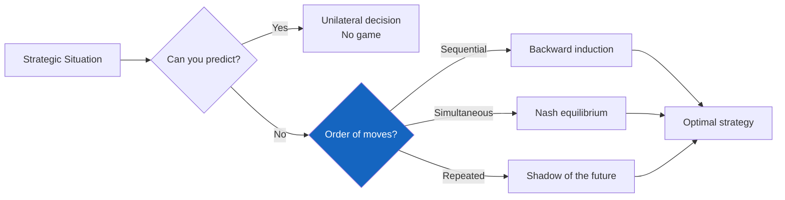
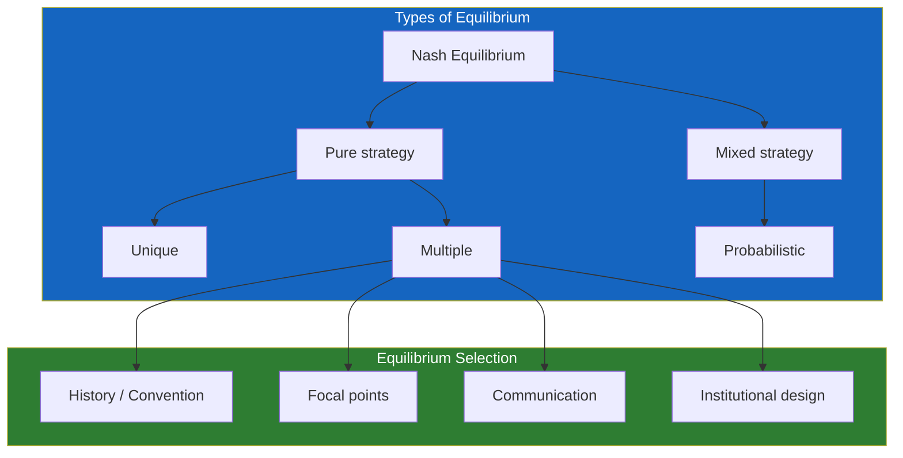
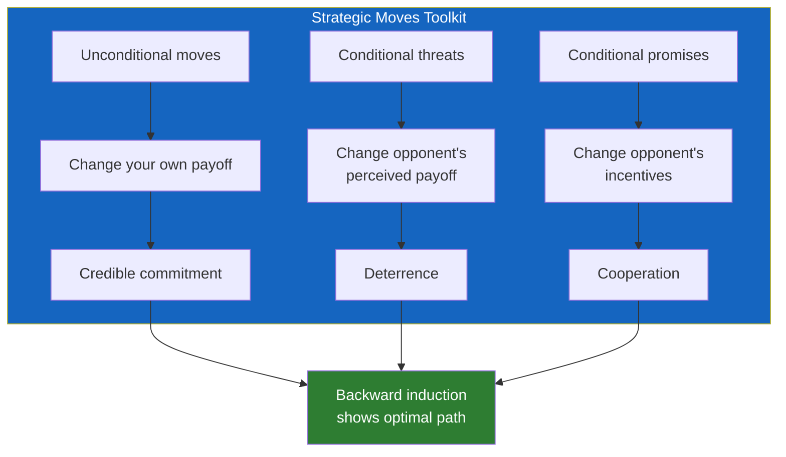

---

## Part 1: The Framework

### Chapter 1 — What Is Strategic Thinking?

Dixit and Nalebuff define strategic thinking as the art of outperforming an opponent who is trying to outperform you. The distinction from ordinary decision-making is crucial: in ordinary decision-making, the outcome depends only on your choice and nature. In strategic decision-making, the outcome depends on your choice and the choices of others who are also trying to optimize.

The authors emphasize that strategic thinking is not about being tricky or manipulative. It is about clarity: understanding the structure of the situation you are in, anticipating how others will respond, and choosing your moves accordingly. The book's subtitle — "The Competitive Edge in Business, Politics, and Everyday Life" — reflects the breadth of application.

The core method: **look forward and reason backward.** Identify the end of the game — what will happen when there are no more moves? — and then work backward to determine what you should do now. This is the single most important principle in the book.

### Chapter 2 — Understanding the Game

The authors introduce the basic elements of any game:

- **Players**: the decision-makers
- **Strategies**: the available choices
- **Payoffs**: the outcomes resulting from each combination of strategies
- **Information**: what each player knows when choosing
- **Order of moves**: sequential, simultaneous, or repeated

A simple matrix representation is used throughout: rows for player 1's strategies, columns for player 2's strategies, and numbers in each cell showing both players' payoffs. This visual convention — now standard in game theory — was novel to general audiences when the book was published.

The prisoner's dilemma is introduced as the first canonical game. Two firms in an oligopoly must decide whether to set high prices (cooperate) or low prices (defect). Each firm's dominant strategy is to defect — but when both defect, the outcome is worse for both than if they had cooperated. The prisoner's dilemma reveals that the structure of incentives, not the character of the players, determines the outcome in many strategic situations.

---

## Part 2: Strategic Moves

### Chapter 3 — Dominant and Dominated Strategies

A dominant strategy is one that is best regardless of what the opponent does. When a player has a dominant strategy, the decision is simple: use it. The prisoner's dilemma is notable precisely because both players have dominant strategies — and the equilibrium is bad for both.

When no dominant strategy exists, the next step is to eliminate dominated strategies — strategies that are worse than some other strategy regardless of what the opponent does. Iterated elimination of dominated strategies can dramatically simplify a game and sometimes yields a unique prediction.

The authors illustrate with the Cuban Missile Crisis: the US had a strategy (blockade) that dominated the alternatives (air strike, do nothing) once the Soviet response was considered. The analysis is clean and compelling.

### Chapter 4 — Nash Equilibrium

The Nash equilibrium is defined simply: a set of strategies where each player's strategy is a best response to the others. No player can improve their payoff by changing their strategy alone.

The authors walk through several examples: choosing a driving side (left vs. right — a coordination game), the battle of the sexes, and the game of chicken. They emphasize that a game can have multiple Nash equilibria, and the problem of equilibrium selection — which one will actually occur? — is often resolved by history, culture, or convention.

The concept of a **focal point** — a salient outcome that players converge on without communication — is introduced through Schelling's classic experiment: ask people to meet in New York City without specifying when or where; most pick Grand Central Terminal at noon. Focal points are culturally and contextually determined, but they powerfully influence equilibrium selection.

### Chapter 5 — Sequential Games

The authors return to their central methodological principle: look forward, reason backward. In chess, this is trivial to state (consider all possible continuations and choose the one that leads to checkmate) and impossible to execute (the branching factor is too large). But in many real strategic situations, the game tree is small enough that backward induction is practical.

The classic example: a firm considering entering a market. The incumbent can either fight (cut prices) or accommodate. The entrant must decide whether to enter or stay out. Using backward induction: if the entrant enters, the incumbent will accommodate (fighting is more costly), so the entrant should enter. The prediction is clear. But what if the incumbent can make a credible commitment to fight? If the incumbent builds excess capacity — which has no benefit unless they fight — the commitment becomes credible.

### Chapter 6 — Credible Commitments

The single most powerful strategic move is to commit yourself — to make it impossible or prohibitively costly to change course. Dixit and Nalebuff trace the history of this idea from Cortes burning his ships to modern business strategy.

A commitment must be **credible** to be effective. The authors identify several ways to achieve credibility:

- **Sunk costs**: invest in assets that have no value if you change course
- **Reputation**: build a history that makes defection costly
- **Contracts**: legally bind yourself to a course of action
- **Hostages**: give the other party something valuable that you lose if you defect
- **Burning bridges**: physically eliminate alternatives

The paradoxical implication: sometimes having fewer options is better than having more, because it signals commitment. The player who cannot retreat will fight harder, and the opponent knows it.

### Chapter 7 — Mixed Strategies

In many games, predictability is a weakness. In poker, if your opponents can predict when you bluff, you lose. In soccer, if the goalkeeper knows which way the kicker will shoot, they save it. The solution is to randomize — to use a mixed strategy.

The authors provide the mathematical intuition without equations: your randomization probabilities should be set so that your opponent is indifferent among their options. If you are the kicker in a penalty kick, you should shoot left and right with probabilities that make the goalkeeper's expected payoff equal whether they dive left or right. If you deviate from these probabilities, the goalkeeper can exploit you.

The authors emphasize that mixed strategies are not about mindless randomness. They are about **strategic unpredictability** — calibrating randomness to exploit the opponent's incentives.

---

## Part 3: Bargaining and Repeated Games

### Chapter 8 — Bargaining

Bargaining arises whenever two or more parties must agree on a division of surplus. The authors present the standard model: the surplus to be divided, the walk-away values (BATNAs), and the bargaining range.

The central insight: **patience is power.** The party that can wait longer — that discounts the future less heavily — will capture more of the surplus. This explains why labor unions strike: by demonstrating willingness to endure short-term costs, they signal that they will not concede.

Outside options are distinct from BATNAs. An outside option is an alternative deal with a third party; it caps what the other side can demand. If a seller has an offer for $10 from another buyer, the current buyer must beat $10. Outside options determine the negotiation range; patience determines where within that range the settlement falls.

### Chapter 9 — Repeated Games

The prisoner's dilemma changes fundamentally when it is repeated. In a one-shot game, defection is dominant. In an infinitely repeated game, cooperation can be sustained by the threat of future punishment.

The authors present Robert Axelrod's famous computer tournament: academics submitted strategies for the repeated prisoner's dilemma; the simplest one — tit-for-tat — won. Anatol Rapoport's tit-for-tat strategy (cooperate first, then mirror) succeeded because it was nice, provocable, forgiving, and clear.

The condition for cooperation is **the shadow of the future**: if the probability of continued interaction is high enough, and if players care enough about future payoffs, the short-term gain from defection is outweighed by the long-term loss of future cooperation. This insight explains why cooperation is more common in stable, long-term relationships than in anonymous, one-shot encounters.

---

## Part 4: Applications

### Chapter 10 — Auctions

The authors walk through auction theory without the mathematics. English auctions, Dutch auctions, sealed-bid auctions, and Vickrey auctions each create different strategic incentives.

The **winner's curse** — the winning bidder in a common-value auction systematically overpays — is explained through oil-drilling auctions: companies bid for drilling rights based on geological estimates; the winning company is typically the one that most overestimated the oil reserves. The rational response is to shade your bid downward to account for this bias.

### Chapter 11 — Strategy in Politics

Voting, lobbying, and legislative strategy are analyzed through a game-theoretic lens. The authors show how political actors use strategic behavior to achieve outcomes that simple majority voting would not produce. Logrolling — trading votes across issues — is a form of cooperation in a repeated game.

---

---

## Reading Guide

### Core Path (6 hours)

Read Chapters 1–4 for the foundations: what strategic thinking is, how to map a game, and the concept of Nash equilibrium. Then read Chapter 6 on credible commitments — the most practically useful chapter. Chapter 9 on repeated games completes the essential toolkit.

### Complete Treatment (12–15 hours)

Read the entire book. The chapters on bargaining, auctions, and politics are dated in some examples but structurally sound. The book rewards full reading because the concepts build cumulatively.

### What Has Changed Since 1991

Behavioral game theory — the study of how real humans deviate from rational play — has transformed the field since Thinking Strategically was published. The ultimatum game, which shows that people reject unfair offers even at a cost to themselves, is not discussed. Prospect theory, which shows that people are loss-averse, is absent. Readers should supplement with Kahneman's Thinking, Fast and Slow for the behavioral side.
