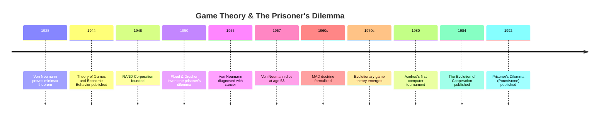
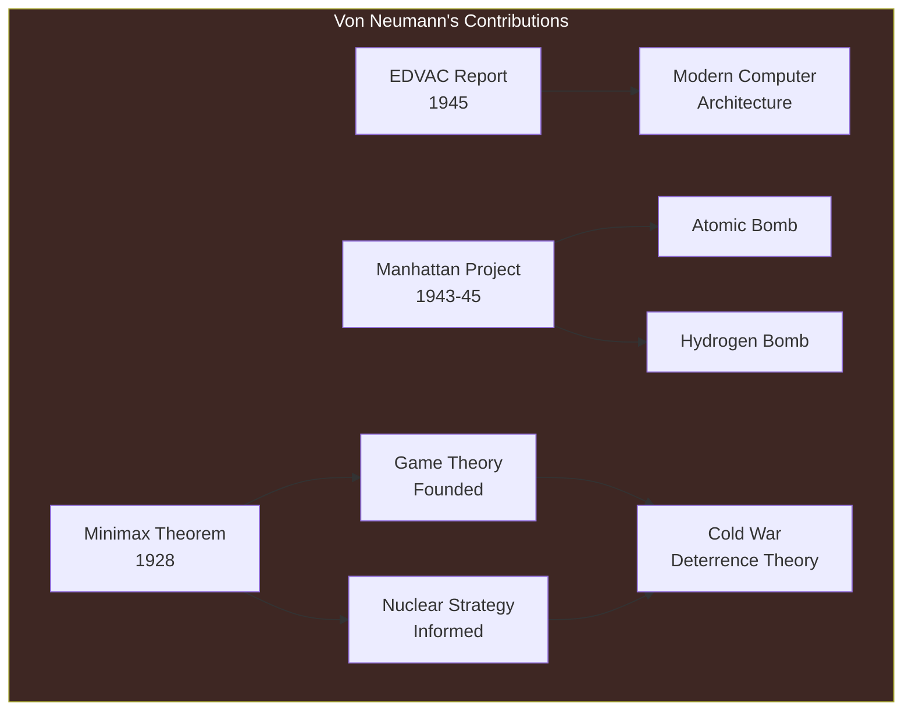
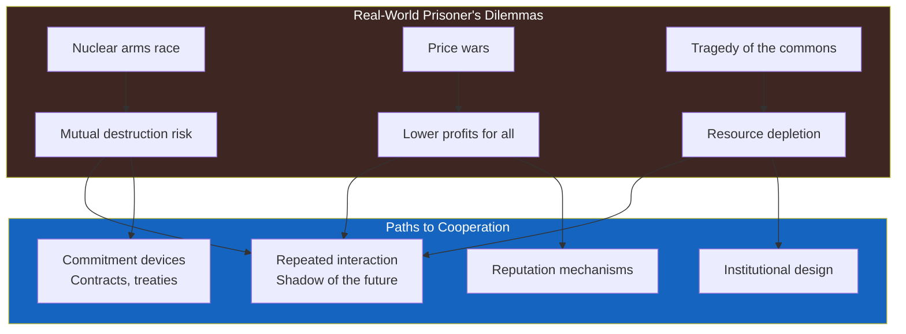

---

## Part 1: The Man

### Chapter 1 — The Prodigy

John von Neumann was born in Budapest in 1903 to a wealthy Jewish banking family. By the age of six, he could divide eight-digit numbers in his head and converse in ancient Greek. By eight, he had mastered calculus. By his early twenties, he had made foundational contributions to set theory, quantum mechanics (the mathematical formulation of the new quantum theory), and game theory (his 1928 minimax theorem). He earned a degree in chemical engineering at the request of his father, who wanted him to have a practical profession, and simultaneously a Ph.D. in mathematics from the University of Budapest.

Von Neumann was not just brilliant; he was abnormally, almost disturbingly fast. His contemporaries described his mind as a "perfect instrument." He could memorize a telephone book page after a single glance. He could read a book in minutes and recite it verbatim years later. He thought in a way that was less like ordinary human cognition and more like direct access to mathematical reality.

Poundstone's biography covers von Neumann's escape from Europe in the 1930s, his positions at Princeton (first at the Institute for Advanced Study, where Einstein was a colleague), his central role in the Manhattan Project, and his post-war influence on American nuclear strategy. Von Neumann was the model for the character of Dr. Strangelove — the brilliant, slightly inhuman intellectual who could contemplate the destruction of civilization as an optimization problem.

### Chapter 2 — The Mathematician

The minimax theorem (1928) was von Neumann's first major contribution to game theory. It states that in any finite, two-player, zero-sum game, there exists a mixed strategy for each player such that the expected payoff is uniquely determined, and the value of the game is the same from both players' perspectives. In plain language: in any strictly competitive game — poker, chess, war — there is always a rational solution, involving randomization if necessary.

This theorem was the founding result of game theory. It proved that rational strategy exists even in situations of pure conflict. The practical implication for the Cold War was staggering: if nuclear war could be modeled as a zero-sum game, then there was a rational strategy — and von Neumann believed it involved preemptive nuclear strikes.

---

---

## Part 2: The Game

### Chapter 3 — The Puzzle

The prisoner's dilemma was originally called the "prisoner's dilemma" by Albert W. Tucker, who popularized the story of two arrested prisoners to explain the game's structure. The actual inventors were Merrill Flood and Melvin Dresher at the RAND Corporation, who were studying whether rational decision-makers would cooperate in strategic situations.

The standard payoff structure is:

| | Cooperate | Defect |
|---|---|---|
| **Cooperate** | 3, 3 | 0, 5 |
| **Defect** | 5, 0 | 1, 1 |

From each player's perspective, defecting gives a higher payoff regardless of what the other does. If the other cooperates, defecting gives 5 instead of 3. If the other defects, defecting gives 1 instead of 0. Defection is dominant. Yet when both defect, both get 1 — worse than the 3 they would get if both cooperated.

The paradox is that the outcome that emerges from rational individual choice (1,1) is worse for both than the outcome that would emerge if both cooperated (3,3). This is not a flaw in rationality but a property of the game structure. The authors' core message: sometimes the game itself, not the players, is the problem.

### Chapter 4 — The RAND Corporation

RAND — Research And Development — was created in 1948 as a think tank for the US Air Force. Its mission: apply the best scientific and mathematical thinking to problems of national security. The atmosphere at RAND was extraordinary: mathematicians, physicists, and economists were given essentially unlimited freedom to think about strategy, deterrence, and nuclear war.

The prisoner's dilemma was invented at RAND because the organization's intellectual culture naturally led to game theory. If you were trying to understand Soviet-American relations as a strategic game, you needed to understand when cooperation was possible and when it was not. The paradox of the prisoner's dilemma — that rational players might destroy themselves — was not an abstract puzzle but the central problem of the age.

Poundstone paints a vivid picture of RAND's culture: the brilliant mathematicians (John Nash spent time there), the economists who would later win Nobel Prizes, and the strategists who shaped US nuclear doctrine. The organization was a crucible where abstract mathematics and concrete strategic decisions met — sometimes with terrifying implications.

### Chapter 5 — The Arms Race

The nuclear arms race between the US and the Soviet Union was a real-world prisoner's dilemma of staggering scale. Both sides would have been better off disarming: the money, the risk of accidental war, the environmental damage of nuclear testing — all were costs that could have been avoided. But neither could trust the other. If the US disarmed and the USSR did not, the USSR would have global dominance. If the US did not disarm and the USSR did, the US would have dominance. The dominant strategy was to build more weapons. And so both built, and the risk of mutual annihilation grew.

The M-A-D doctrine — Mutually Assured Destruction — was the equilibrium that stabilized this deadly game. If both sides had secure second-strike capabilities — nuclear weapons that could survive a first strike and retaliate — then neither side could attack without being destroyed in return. The equilibrium was stable but morally horrifying: the safety of civilization depended on the credibility of the threat to end it.

---

## Part 3: The Legacy

### Chapter 6 — Iterated Prisoner's Dilemma

Robert Axelrod, a political scientist at the University of Michigan, transformed the study of the prisoner's dilemma in the late 1970s. He organized a computer tournament: academics from around the world submitted strategies for playing the iterated prisoner's dilemma, and Axelrod pitted them against each other in a round-robin tournament.

The results were astonishing. The winning strategy — submitted by Anatol Rapoport — was the simplest of all: tit-for-tat. Cooperate on the first move, then mirror whatever your opponent did on the previous move. This strategy was:

- **Nice**: it never defected first
- **Provocable**: it immediately retaliated against defection
- **Forgiving**: it resumed cooperation after one punishment round
- **Clear**: opponents could easily understand its logic

Tit-for-tat won not by beating any single opponent but by achieving high scores across all interactions. It did well because it elicited cooperation from others, avoided being exploited, and forgave quickly enough to prevent spiraling defection.

### Chapter 7 — Evolutionary Game Theory

The iterated prisoner's dilemma turned out to have profound implications for biology. John Maynard Smith, an evolutionary biologist, independently developed evolutionary game theory in the 1970s. The key insight: in nature, strategies compete through reproduction, not conscious choice. A strategy that achieves higher payoffs produces more offspring and becomes more common over time.

This framework explains the evolution of cooperation. In environments where individuals interact repeatedly, cooperative strategies can thrive. Altruism, reciprocal altruism, and even morality can be understood as strategies that succeeded in the evolutionary game because they produced better long-term outcomes than pure selfishness.

### Chapter 8 — Beyond the Cold War

Prisoner's dilemma situations are everywhere: in the boardroom (should I cut prices? should my competitor?), in international relations (should I impose tariffs? should my trading partner retaliate?), in environmental policy (should I reduce emissions? should my neighbor?), and even in everyday life (should I trust this stranger? should I return their trust?).

The book closes with a sobering reflection: game theory gave humanity a framework for understanding strategic conflict but did not guarantee that we would use it wisely. Von Neumann, who did more than anyone to create both game theory and the nuclear weapons that made it terrifyingly relevant, died in 1957 at age 53. He left behind a world armed with the mathematics of strategy and the weapons of annihilation — and a puzzle, the prisoner's dilemma, that we have not fully solved.

---

---

## Reading Guide

### Essential Chapters

| Chapter | Topic | Importance |
|---------|-------|------------|
| 1-2 | Von Neumann biography | Understanding the man behind the mathematics |
| 3 | The prisoner's dilemma | The core concept |
| 4 | RAND Corporation | The Cold War crucible where game theory met policy |
| 5 | The arms race | The most important real-world application |
| 6 | Iterated prisoner's dilemma | The hope: cooperation from self-interest |

### For the History of Ideas

Read the whole book. It works as a triple biography: of von Neumann, of game theory, and of the Cold War. Each thread enriches the others.
