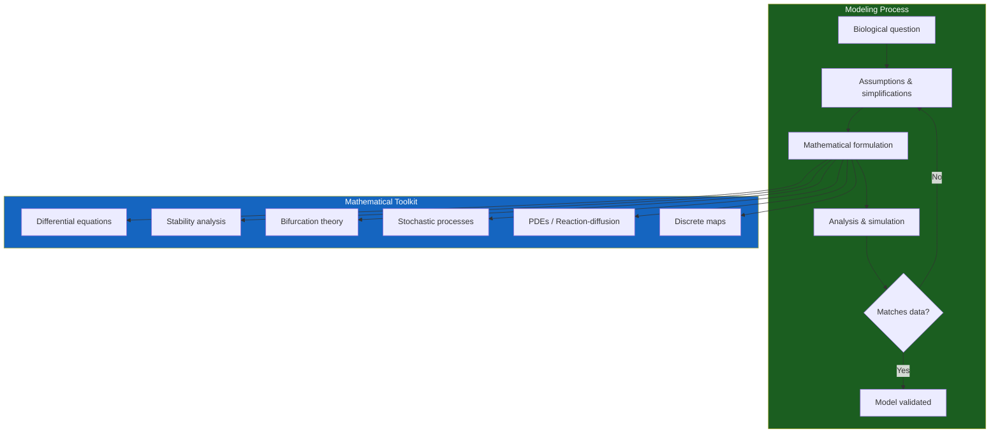
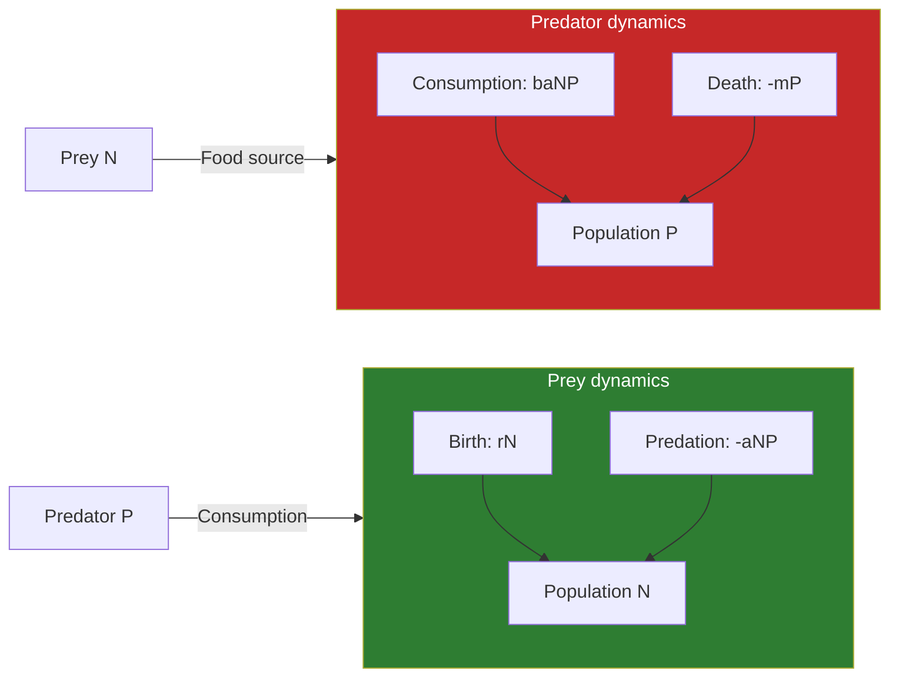
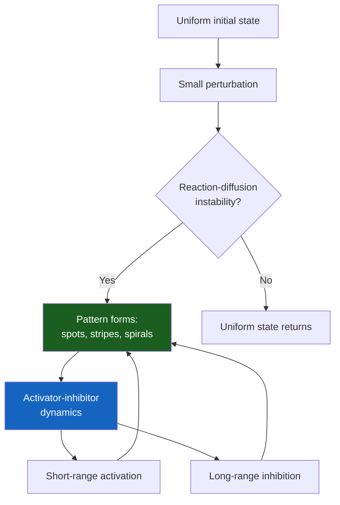

---

## Part 1: Continuous Population Models

### Chapter 1 — Exponential and Logistic Growth

Edelstein-Keshet begins with the simplest model: exponential growth, dN/dt = rN, where N is population size and r is the per capita growth rate. This model describes a population with unlimited resources: each individual reproduces at a constant rate, and the population grows without bound. It fits early colonization and bacterial growth in fresh culture — but nothing in nature grows exponentially forever.

The logistic equation adds a carrying capacity: dN/dt = rN(1 - N/K), where K is the maximum sustainable population. When N is small, growth is nearly exponential. As N approaches K, growth slows. At N = K, growth stops. The model produces an S-shaped (sigmoid) growth curve that matches many real populations — yeast in a chemostat, sheep on an island, human populations approaching carrying capacity.

The book emphasizes that while the logistic equation is the foundation of population dynamics, it is also a simplification. Real populations exhibit overshoot, oscillation, Allee effects (positive density dependence at low densities), and chaos — none captured by the simple logistic model.

### Chapter 2 — Interacting Populations

The Lotka-Volterra equations model two interacting species. For predator-prey:

dN/dt = rN - aNP  (prey: grows exponentially, eaten by predators)
dP/dt = baNP - mP  (predator: grows by eating prey, dies naturally)

The system produces persistent oscillations: as prey increase, predators have more food and increase; as predators increase, prey decrease; as prey decrease, predators starve and decrease; as prey recover and the cycle repeats.

The Lotka-Volterra model's great achievement is explaining why predator and prey populations cycle. Its great limitation is that the cycles are neutrally stable — any perturbation changes the amplitude permanently. Real predator-prey cycles are stable (they return to a fixed cycle after perturbation), requiring more sophisticated models with density-dependent prey growth, predator satiation, or functional responses.

The book introduces the **functional response** — how predator consumption rate changes with prey density. Holling's three types (linear, saturating, sigmoid) capture different predator behaviors and each produces different dynamics.

### Chapter 3 — Stability and Bifurcations

Phase plane analysis is introduced as the primary tool for two-variable systems. The nullclines — curves where dN/dt = 0 or dP/dt = 0 — divide the plane into regions of different flow direction. Equilibria occur where nullclines intersect. Their stability is determined by linearization: the Jacobian matrix is evaluated at the equilibrium, and its eigenvalues determine whether nearby trajectories approach (stable) or diverge (unstable).

The four types of equilibria in two dimensions:
- **Stable node**: both eigenvalues negative, all trajectories approach
- **Unstable node**: both eigenvalues positive, all trajectories diverge
- **Saddle point**: eigenvalues of opposite sign, stable in one direction, unstable in another
- **Spiral**: complex eigenvalues, oscillatory approach or departure

Bifurcations occur when parameter changes cause a qualitative change in the phase portrait. The most important for biology:
- **Saddle-node bifurcation**: two equilibria appear or disappear
- **Transcritical bifurcation**: equilibria exchange stability
- **Pitchfork bifurcation**: a symmetric equilibrium splits into three
- **Hopf bifurcation**: a stable equilibrium becomes unstable and a limit cycle emerges — the mechanism by which many biological oscillations arise

---

## Part 2: Reaction Kinetics

### Chapter 4 — Enzyme Kinetics

Michaelis-Menten kinetics describe enzyme-catalyzed reactions. The substrate S binds to enzyme E to form complex C, which then dissociates into product P and free enzyme:

S + E ⇌ C → P + E

Using the quasi-steady-state approximation (the complex C is approximately constant after an initial transient), the rate of product formation is:

V = Vmax * [S] / (Km + [S])

where Vmax is the maximum rate and Km is the substrate concentration at half-maximal rate. This hyperbolic relationship is one of the most widely used equations in all of biology.

The book derives the Michaelis-Menten equation from mass-action kinetics, explains its assumptions, and discusses deviations. It also covers more complex enzyme kinetics: competitive, uncompetitive, and mixed inhibition; allosteric regulation (cooperative binding); and multisubstrate reactions.

### Chapter 5 — Biochemical Oscillations

Biological systems oscillate: heart cells, circadian rhythms, calcium signaling, glycolytic oscillations in yeast. The book presents the mathematical framework for understanding why.

The Goodwin oscillator — a negative feedback loop with time delay — is the canonical model for biochemical oscillations. A gene produces mRNA, which produces protein, which inhibits the gene. If the inhibition is cooperative (steep response), the system can oscillate. The key: negative feedback with sufficient nonlinearity and delay can produce sustained oscillations.

The book also covers the Belousov-Zhabotinsky reaction — a chemical oscillator that produces striking spatial and temporal patterns — as an example of oscillations arising from coupled reaction kinetics far from equilibrium.

---

## Part 3: Spatial Models

### Chapter 6 — Diffusion and Random Walks

Random movement — diffusion — is modeled at three scales:
- **Individual-based**: random walk of a single particle
- **Population-level**: the diffusion equation (Fick's law)
- **Continuum**: partial differential equations for concentration fields

The diffusion equation: ∂c/∂t = D ∂²c/∂x², where D is the diffusion coefficient. Solutions spread out over time: a concentrated initial blob becomes a Gaussian that widens as √(Dt).

### Chapter 7 — Reaction-Diffusion Systems and Pattern Formation

Alan Turing's 1952 paper "The Chemical Basis of Morphogenesis" proposed that patterns — stripes, spots, spirals — can arise from the interaction of two chemicals diffusing at different rates. The mechanism: an activator promotes its own production and the production of an inhibitor; the inhibitor diffuses faster. Locally, the activator creates peaks. The faster-diffusing inhibitor suppresses activator production over a wider area. The result: spontaneous pattern formation from a uniform initial state.

The book explains the mathematical condition for Turing instability: the inhibitor must diffuse sufficiently faster than the activator. It also discusses the limitations: Turing patterns require specific parameter ranges, and biological pattern formation may involve multiple mechanisms (chemical gradients, mechanical forces, genetic networks) not captured by simple reaction-diffusion.

---

## Part 4: Discrete and Stochastic Models

### Chapter 8 — Discrete Population Models

When populations have discrete, non-overlapping generations (insects, annual plants), difference equations are more appropriate than differential equations. The logistic map:

N(t+1) = r N(t) (1 - N(t))

is the simplest discrete population model — and it exhibits extraordinary complexity. As r increases, the system undergoes a period-doubling cascade to chaos. The book uses the logistic map to introduce chaos theory and the concept of sensitive dependence on initial conditions.

### Chapter 9 — Stochastic Models

When populations are small or when randomness is intrinsic to the process, stochastic models are necessary. The book introduces the master equation (a differential equation for the probability distribution over states), the Gillespie algorithm (an exact simulation method for chemical reactions), and birth-death processes.

The relationship between deterministic and stochastic models is subtle: the deterministic model gives the mean behavior, but fluctuations can sometimes drive the system to states that the deterministic model never reaches (stochastic switching, extinction in small populations).

---

## Reading Guide

### Foundation Path

Chapters 1-3 (population models, stability, bifurcation theory) provide the essential mathematical toolkit. The remainder of the book applies these tools to different biological domains. A reader with limited time should master these chapters.

### Domain-Specific Paths

| Interest | Chapters |
|----------|----------|
| Ecology and evolution | 1-3, 8 |
| Cell biology and biochemistry | 4-5, 9 |
| Development and morphogenesis | 6-7 |
| Epidemiology | 2 (with supplemental reading) |
| Neuroscience | 5, 6 |

### Mathematical Prerequisites

The book assumes: calculus (differential and integral), basic differential equations, introductory linear algebra (matrices, eigenvalues). It does not assume prior biology — biological concepts are explained as needed.
