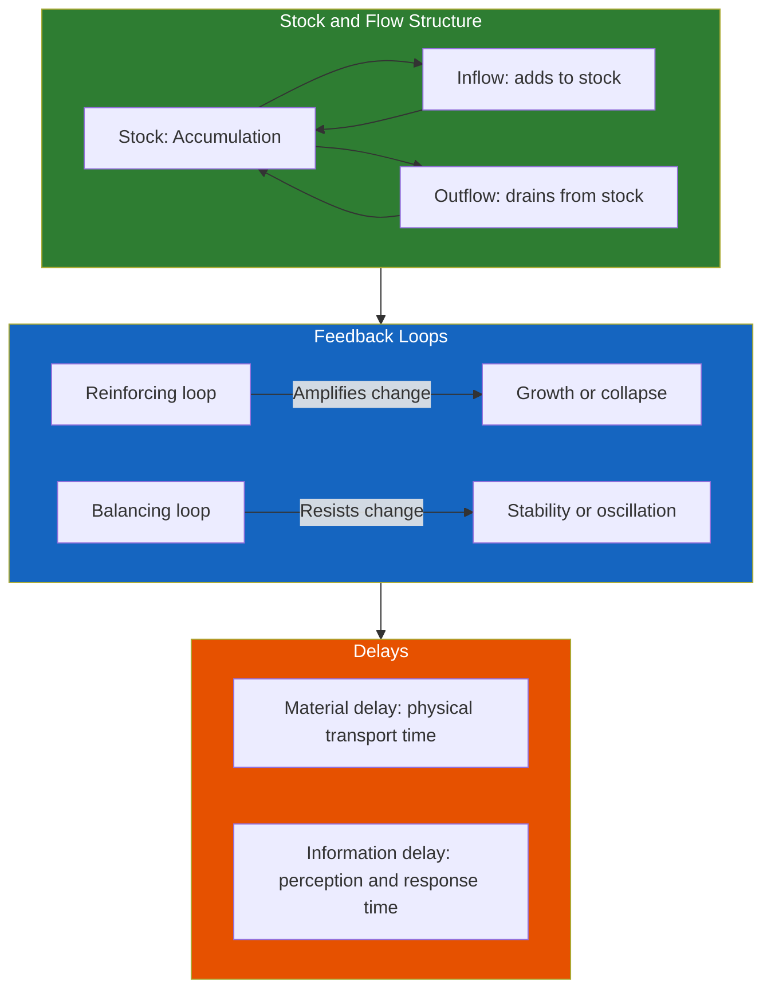
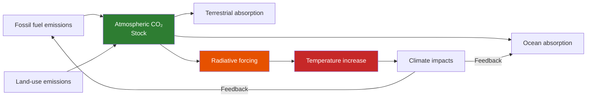
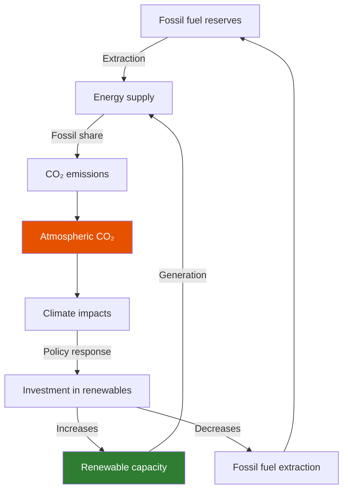
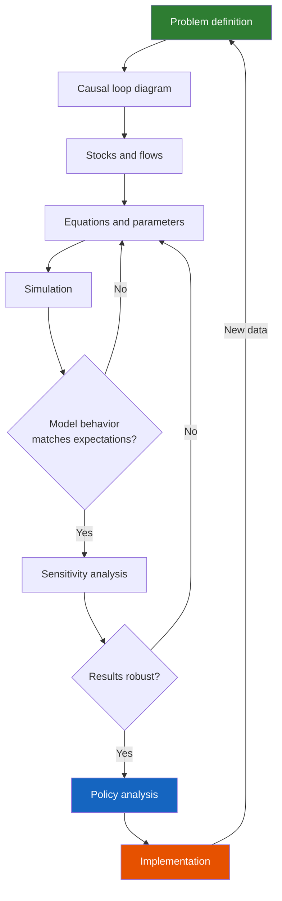

---

## Part 1: Foundations of System Dynamics

### Chapter 1 — The System Dynamics Approach

Andrew Ford introduces system dynamics as a method for understanding complex systems that change over time. Developed by Jay Forrester at MIT in the 1950s, system dynamics uses stocks (accumulations), flows (rates of change), and feedback loops to model the behavior of systems ranging from corporations to cities to the global climate.

The fundamental insight: the behavior of a system is determined by its feedback structure, not by external shocks. A system that repeatedly experiences boom-and-bust cycles is probably driven by internal feedback delays, not by random external events. Understanding the feedback structure is the key to designing effective policies.

Ford uses the metaphor of a bathtub: the water level is a stock; the faucet and drain are flows. The tub's behavior — filling, draining, or maintaining a constant level — is determined by the relationship between inflow and outflow. Environmental systems work the same way: CO₂ in the atmosphere is a stock; emissions and absorption are flows. The climate responds to changes in the stock, not directly to the flows.

### Chapter 2 — Causal Loop Diagrams

Before building a quantitative model, Ford insists that the modeler draw a causal loop diagram. These diagrams show the causal relationships between variables and identify feedback loops as either reinforcing (R) or balancing (B).

- **Reinforcing loops** amplify change: more A causes more B, which causes more A. They drive growth, collapse, and runaway processes. Examples: population growth (more people, more births, more people), economic growth (more investment, more output, more investment).

- **Balancing loops** resist change: more A causes more B, which causes less A. They drive stability, equilibrium-seeking, and oscillation. Examples: predator-prey dynamics (more prey, more predators, fewer prey), resource depletion (more extraction, less resource, higher cost, less extraction).

A classic environmental example: the CO₂-climate system. CO₂ emissions increase atmospheric CO₂ (a reinforcing loop: more economic activity → more emissions → more CO₂ → more warming → more economic impacts). But natural CO₂ absorption provides a balancing loop: more CO₂ → more absorption by oceans and plants → less CO₂. The balance between these loops determines whether CO₂ accumulates or stabilizes.

### Chapter 3 — Stocks and Flows

The quantitative heart of system dynamics. Stocks are accumulations that change only through flows. The equation is simple:

Stock(t) = Stock(t-1) + (Inflow - Outflow) * dt

Ford shows how to build stock-and-flow models for environmental systems: a groundwater aquifer (stock: water volume; inflows: recharge, outflows: pumping and natural discharge), a forest (stock: biomass; inflows: growth, outflows: harvest and decay), and a fishery (stock: fish population; inflows: reproduction, outflows: catch and natural mortality).

The critical concept: **stocks provide memory**. The system's state at any time depends on its entire history of flows. This is why environmental systems cannot be understood through static analysis — the history matters.

---

## Part 2: Environmental Case Studies

### Chapter 4 — The Global Climate System

Ford builds a climate model step by step. The stock is atmospheric CO₂. The inflow is anthropogenic emissions (from fossil fuels and land-use change). The outflow is natural absorption by oceans and terrestrial ecosystems.

The key dynamics:
- CO₂ accumulates because emissions exceed absorption
- The absorption rate is nonlinear: as CO₂ increases, ocean absorption decreases (warmer water holds less CO₂) — a reinforcing feedback
- Temperature increase has long delays: the CO₂ we emit today will affect temperature for decades to centuries
- Policy delays are critical: if we wait until we see serious climate impacts before acting, the CO₂ already in the atmosphere will continue warming the planet for generations

### Chapter 5 — Water Resources

Water systems exhibit classic system dynamics behavior: stocks (reservoirs, aquifers), flows (precipitation, evaporation, runoff, pumping), and feedback delays (groundwater recharge takes decades to centuries).

Ford uses the example of the Ogallala Aquifer in the US Great Plains: the stock is groundwater; inflows are natural recharge (very slow); outflows are pumping for irrigation (very fast). The system is fundamentally unsustainable at current pumping rates. The policy challenge is managing the transition from abundant to depleted groundwater without collapsing the agricultural economy.

The model reveals several counterintuitive insights:
- Improved irrigation efficiency can paradoxically increase total water use by making irrigation profitable on marginal land
- A slow, predictable decline in water availability is easier to manage than a rapid, unexpected one
- The discount rate used in policy analysis dramatically affects the optimal extraction path

### Chapter 6 — Energy and Climate Policy

Ford models the transition from fossil fuels to renewable energy. The stocks are fossil fuel reserves, renewable energy capacity, and atmospheric CO₂. The flows are rates of extraction, installation, and emissions.

The model illustrates the dynamics of the energy transition:
- The longer we delay reducing emissions, the faster the eventual reduction must be
- Building renewable capacity takes time — the transition is limited by the rate at which we can manufacture and install solar panels and wind turbines
- Fossil fuel infrastructure has long lifetimes (30-50 years for power plants); early retirement of this infrastructure is costly but may be necessary

---

## Part 3: Advanced Topics

### Chapter 7 — Nonlinearities and Thresholds

Many environmental systems have thresholds: critical levels beyond which behavior changes qualitatively. A forest fire spreads only above a threshold temperature. A lake ecosystem shifts from clear to turbid once nutrient levels cross a threshold. A glacier retreats rapidly once it retreats behind a topographic threshold.

Ford shows how to model thresholds using nonlinear functions. The key insight: threshold systems exhibit hysteresis — the path to recovery is different from the path to collapse. Once a lake becomes turbid, reducing nutrient levels below the original threshold may not restore the clear state; you must go much lower.

### Chapter 8 — Model Testing and Validation

Ford's approach to validation is pragmatic and honest: models cannot be validated in the sense of proven correct. They can only be tested for usefulness. A model is valid if:

1. It reproduces historical behavior (replication test)
2. It produces reasonable behavior under extreme conditions (extreme-condition test)
3. Its behavior is not overly sensitive to small parameter changes (sensitivity analysis)
4. Stakeholders find it plausible and useful (face validity)
5. Its structure corresponds to known physical and social processes (structural validity)

### Chapter 9 — Participatory Modeling

The final chapter argues that the most effective environmental models are built with stakeholders, not for them. Participatory modeling involves farmers, regulators, environmentalists, and industry representatives in the model-building process. The model becomes a shared representation of the system that all parties can trust — even if they disagree about policy.

---

---

## Reading Guide

### Core Path

Chapters 1-3 (foundations of system dynamics) are essential. Then choose case studies based on interest: Chapter 4 (climate), Chapter 5 (water), or Chapter 6 (energy). Chapter 7 (nonlinearities) is essential for anyone working on systems with thresholds. Chapter 8 (validation) is essential for anyone building models for policy.

### For the Self-Taught Modeler

Work through the book systematically, building each model as you go. The Stella/Vensim models on the companion CD-ROM are invaluable. Do not just read about the models — build them, modify them, break them, fix them. That is how you learn system dynamics.
