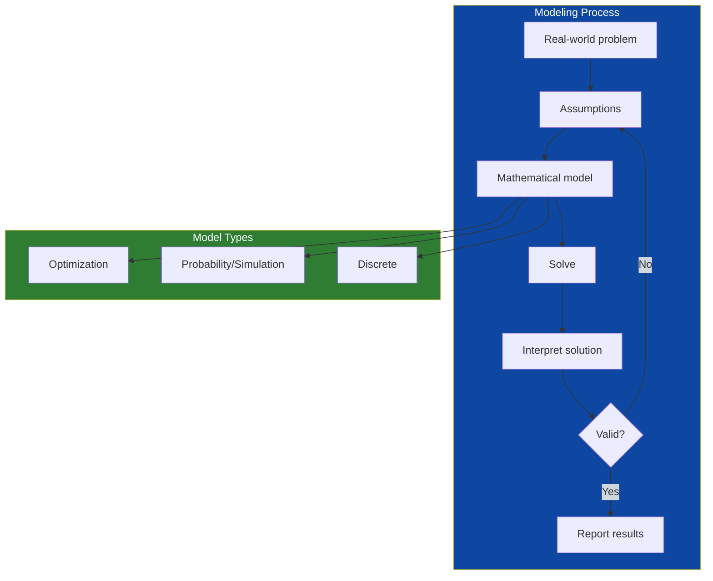
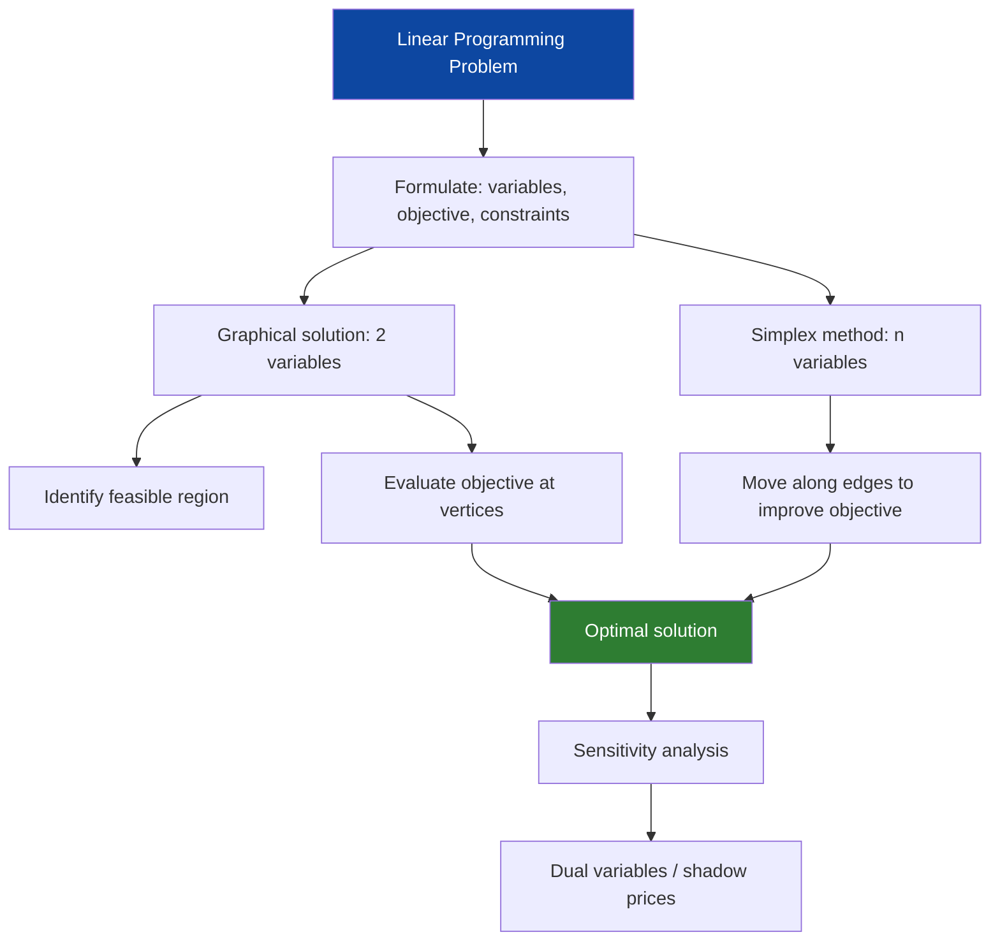
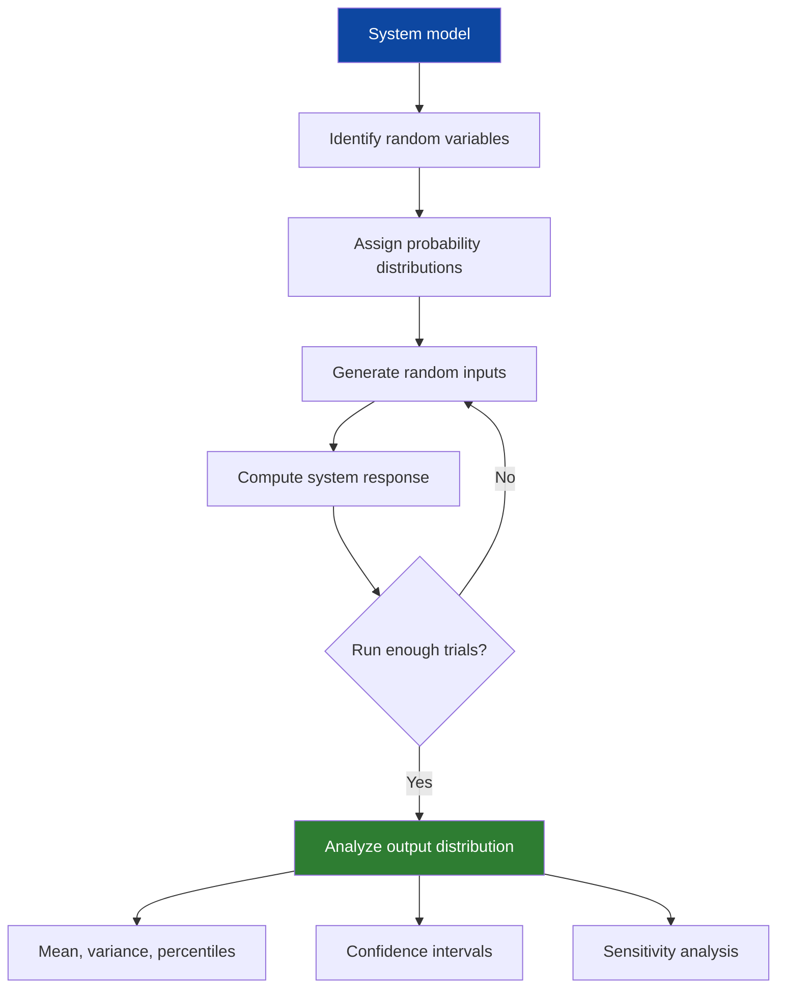
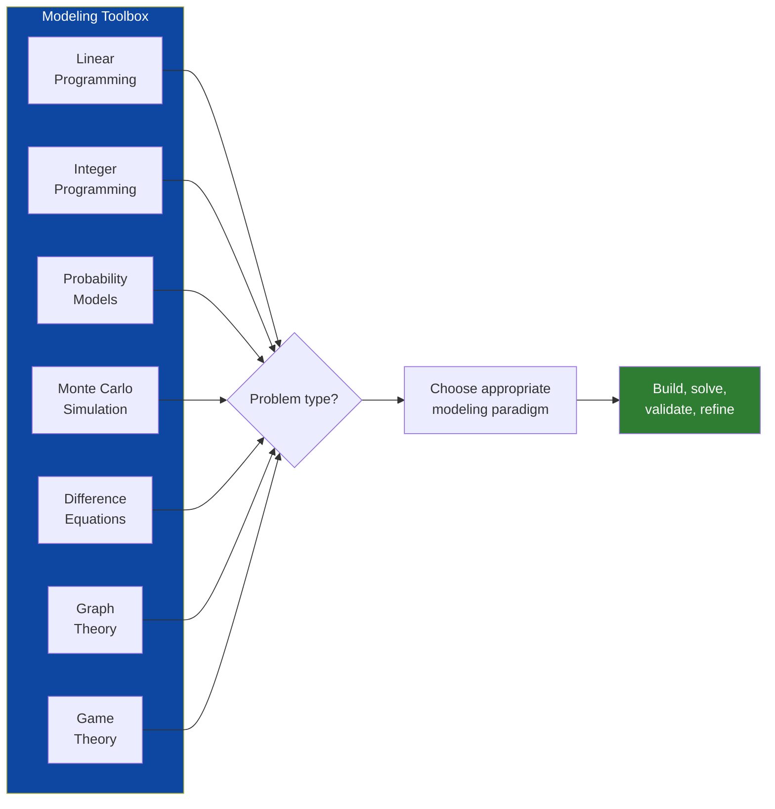

---

## Part 1: Optimization Models

### Chapter 1 — Introduction to Modeling

Giordano, Fox, and Horton introduce the modeling process through a simple example: deciding how many copies of a newspaper to order each day. The problem involves uncertain demand, fixed costs, and perishable inventory — all features of real business decisions.

The modeling process has five steps:
1. **Problem identification**: what decision must be made? what are the objectives? what are the constraints?
2. **Assumptions**: what simplifications are we making? are they justified?
3. **Model construction**: translate the problem into mathematical language (equations, inequalities, objective functions)
4. **Solution**: solve the mathematical problem using analytical or numerical methods
5. **Validation**: does the model produce reasonable results? does it match available data? are the conclusions robust to assumption changes?

The newspaper problem illustrates that modeling is not about getting the "right" answer but about getting a useful answer. The optimal order quantity depends on the ratio of overage cost (unsold papers) to underage cost (lost profit from unmet demand) — the classic newsvendor model.

### Chapter 2 — Linear Programming

Linear programming (LP) is the most widely used optimization technique in the world. It solves problems of the form: maximize (or minimize) a linear objective function subject to linear equality and inequality constraints.

The canonical example: a factory produces two products. Each product requires labor and raw materials. The factory has limited labor and materials. How many of each product should be produced to maximize profit?

The standard form:

Maximize: z = c₁x₁ + c₂x₂
Subject to: a₁₁x₁ + a₁₂x₂ ≤ b₁
             a₂₁x₁ + a₂₂x₂ ≤ b₂
             x₁, x₂ ≥ 0

The feasible region is a polygon. The optimal solution (if it exists) occurs at a vertex of this polygon. The simplex algorithm — developed by George Dantzig in 1947 — efficiently finds the optimal vertex by moving along edges of the polygon.

The book covers sensitivity analysis — how the optimal solution changes when parameters change — and duality — the relationship between the original (primal) problem and a related (dual) problem whose solution provides shadow prices for the constraints.

### Chapter 3 — Integer and Nonlinear Programming

Many real problems require integer solutions: you cannot build 3.7 factories or hire 2.4 employees. Integer programming is linear programming with the additional constraint that some variables must be integers. The book covers branch-and-bound, the primary algorithm for integer programming.

Nonlinear programming relaxes the assumption that objective and constraints are linear. The book covers the key concepts: convexity (which guarantees that a local optimum is global), Lagrange multipliers (for constrained optimization), and gradient-based search methods.

---

## Part 2: Probability Models

### Chapter 4 — Introduction to Probability Models

Probability models capture systems with inherent randomness. The building blocks: random variables, probability distributions, expected values, and variance.

The book covers:
- **Discrete distributions**: binomial (number of successes in n trials), Poisson (number of events in a fixed interval)
- **Continuous distributions**: normal (bell curve), exponential (time between events), uniform
- **Joint distributions**: modeling multiple random variables together

The central concept is **expected value**: the long-run average of a random variable. Expected value is the basis for decision-making under uncertainty: choose the action with the highest expected payoff.

### Chapter 5 — Monte Carlo Simulation

When analytical solutions are impossible, simulate. Monte Carlo simulation generates many random scenarios, computes the outcome for each, and analyzes the distribution of outcomes.

The book walks through a complete example: simulating an inventory system. Demand is random, lead times are random, costs depend on the interaction between ordering decisions and random demand. The model tracks inventory levels over time and computes total cost for a given ordering policy.

Key insights about Monte Carlo:
- The accuracy of the estimate improves as √(number of trials) — to double accuracy, quadruple the number of trials
- Variance reduction techniques (antithetic variates, control variates, importance sampling) can dramatically improve efficiency
- Simulation is not optimization — it evaluates a given policy but does not find the best policy without additional search

### Chapter 6 — Queuing Models

Queuing (waiting line) models are among the most widely applied probability models in operations research. The book covers the M/M/1 queue (Poisson arrivals, exponential service times, single server) and its variants.

The key performance measures: average queue length, average waiting time, probability that the system is empty, and the utilization factor (proportion of time the server is busy). The fundamental result is **Little's Law**: average number in system = arrival rate × average time in system. This simple relationship holds for virtually any queuing system.

---

## Part 3: Discrete Models

### Chapter 7 — Difference Equations

Difference equations model systems where time advances in discrete steps. They are the discrete-time analog of differential equations.

The book covers:
- **First-order linear difference equations**: x(t+1) = ax(t) + b
- **Second-order equations**: Fibonacci sequence, population models with two age classes
- **Systems of difference equations**: coupled populations, arms race models
- **Stability analysis**: when do solutions converge to equilibrium?

The logistic map — x(t+1) = rx(t)(1-x(t)) — is presented as an example of how simple deterministic models can produce complex behavior, including period-doubling and chaos.

### Chapter 8 — Graph Theory and Network Models

Graphs are mathematical structures for modeling pairwise relationships. A graph consists of vertices (nodes) and edges (connections). The book covers:

- **Shortest path problems**: finding the shortest route through a network (Dijkstra's algorithm)
- **Minimum spanning trees**: connecting all nodes with minimum total edge weight
- **Maximum flow problems**: finding the maximum flow through a capacitated network
- **Traveling salesman problem**: finding the shortest tour visiting all vertices — NP-hard, requiring heuristic methods for large instances

### Chapter 9 — Game Theory

The book provides an introduction to game theory as a discrete model of strategic interaction. Topics include zero-sum games, Nash equilibrium, mixed strategies, and the prisoner's dilemma.

---

---

## Reading Guide

### Essential Chapters

| Chapter | Topic | Why It Matters |
|---------|-------|----------------|
| 1 | Modeling process | The framework for everything else |
| 2 | Linear programming | The most widely used optimization technique |
| 5 | Monte Carlo simulation | The universal fallback method |
| 7 | Difference equations | Foundation for discrete-time dynamics |

### Recommended Paths

**Optimization focus**: Chapters 1-4, supplement with advanced texts
**Probability/Simulation focus**: Chapters 1, 4-6
**Discrete models focus**: Chapters 1, 7-9
**Comprehensive introduction**: All chapters, one per week in a semester course
