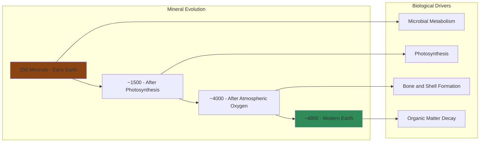

# Core Concepts

## The Co-Evolution Thesis

Hazen's central argument: Earth and life have evolved together as an integrated system. Life is not a late-arriving passenger on a geologically determined planet but an active agent that has shaped almost every aspect of Earth's surface and near-surface environment. From the oxygen in the atmosphere to the minerals in the ground, life has left its mark.

## The Expansion of Minerals

Hazen's most striking finding: the early Earth had only about 250 different minerals. Today there are over 4,900 known mineral species. Most of the new minerals are biological in origin — created by the chemical processes of living organisms. Life has literally diversified the mineral kingdom.

## The Great Oxygenation Event

The single most transformative event in Earth's history was the rise of oxygen in the atmosphere, caused by cyanobacteria performing photosynthesis. This killed most of the existing life (for which oxygen was toxic) but created the conditions for complex life to evolve. It also led to the formation of thousands of new minerals that required oxygen to form.

## Life as a Geological Force

Hazen shows that living organisms have driven most of the significant chemical transformations on Earth's surface. Microbes break down rocks, plants stabilize soil, animals burrow and mix sediments, and the carbon cycle is driven primarily by life. Without life, Earth would be geologically static.

## The Rare Earth Hypothesis

The co-evolution of life and geology suggests that planets with complex life may be extremely rare. The emergence of life and the development of plate tectonics, a magnetic field, and a stable atmosphere may all be linked in ways that make Earth-like planets uncommon in the universe.

# Chapter Insights

## Chapter 1: The Hadean Earth

The young Earth was a molten, hellish place bombarded by asteroids. But even in this seemingly inhospitable environment, the conditions for life were being prepared.

## Chapter 2: The Origin of Life

Hazen discusses how life may have emerged from non-living chemistry, focusing on the role of minerals as catalysts for the formation of organic molecules.

## Chapter 3: The Archean World

The first 2 billion years of life: single-celled organisms slowly transformed the planet, creating oxygen as a waste product that would eventually transform the atmosphere.

## Chapter 4: The Great Oxidation

The rise of oxygen was both a crisis and an opportunity. Most life died, but the survivors evolved the ability to use oxygen for respiration, enabling much more efficient energy production.

## Chapter 5: The Modern Earth

The last 500 million years: the explosion of complex life, the colonization of land, and the emergence of humans. Hazen emphasizes that even recent geological events like the formation of limestone and chalk are biological in origin.

# Practical Applications

- **Climate understanding**: Life as a geological force helps explain carbon cycling
- **Search for life**: Understanding co-evolution guides the search for life on other planets
- **Mineral resources**: Many mineral deposits are biological in origin

# Reading Guide

## Sufficiency Assessment

This summary captures Hazen's main thesis and the key stages of Earth's co-evolutionary history. The full book offers more detailed evidence and case studies.

## Recommended Reading Path

| Reader Type | Time | What to Read |
|---|---|---|
| Casual | ~15 min | This summary |
| Interested | ~3-4 hr | Summary + Chapters 2, 4, 5 |
| Full | ~6-8 hr | Full book |

## What You'll Miss

- Hazen's detailed mineralogical evidence
- The stories of individual scientists and discoveries
- Extended discussion of the search for extraterrestrial life
