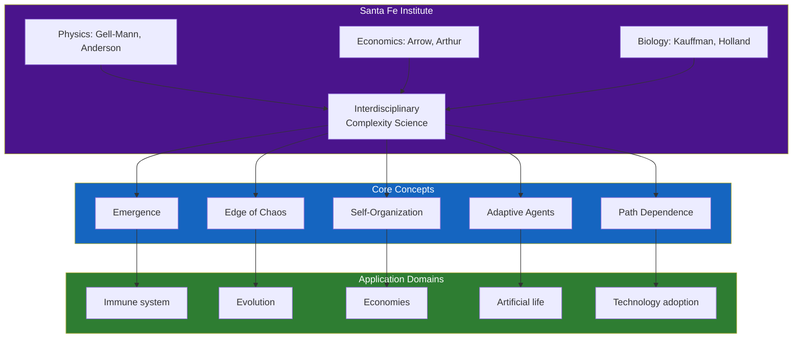
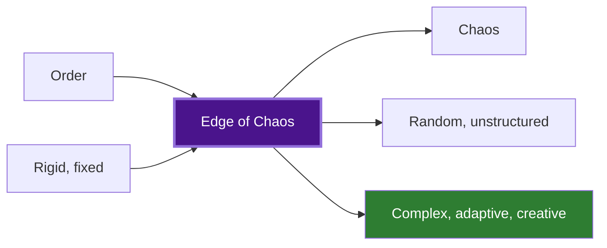
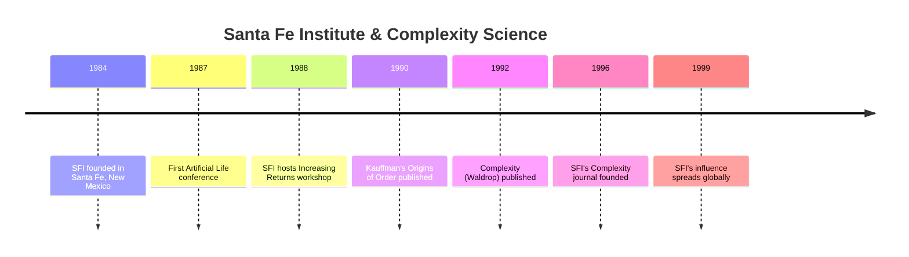

---

## Part 1: The Founding of the Santa Fe Institute

### Chapter 1 — The Crucible

The Santa Fe Institute was founded in 1984 by a group of scientists who felt constrained by the disciplinary boundaries of traditional academia. The founders included Nobel laureates Murray Gell-Mann (physics) and Kenneth Arrow (economics), along with Philip Anderson (Nobel, condensed matter physics), David Pines (physics), and George Cowan (former director of Los Alamos National Laboratory's chemistry division).

The Institute was deliberately created without departments. Physicists, biologists, computer scientists, and economists would share space, attend each other's seminars, and collaborate on problems that cut across disciplinary lines. The founding assumption — radical at the time — was that complex systems in different domains share deep structural similarities, and that understanding these similarities required bringing the disciplines together.

### Chapter 2 — The Economy as a Complex System

Brian Arthur, an economist at Stanford, had become frustrated with the assumptions of neoclassical economics: perfect rationality, diminishing returns, and equilibrium. Real economies, he argued, exhibited increasing returns, path dependence, and constant adaptation.

Arthur's theory of increasing returns: in knowledge-based industries, the more a technology is adopted, the more valuable it becomes (network effects). This can lead to lock-in — the dominance of an inferior technology (like the QWERTY keyboard or VHS over Betamax) due to the self-reinforcing dynamics of adoption. The economy, Arthur argued, is not an equilibrium system but a complex, evolving system that is constantly in transition.

---

## Part 2: Core Concepts

### Chapter 3 — The Edge of Chaos

Chris Langton, a graduate student at the University of Michigan, made a provocative proposal: complex adaptive systems function best at the edge of chaos. Langton studied cellular automata — simple computational grids where cells follow rules based on their neighbors. He discovered that cellular automata exhibit three regimes of behavior:

- **Ordered**: the system quickly settles into a fixed pattern or simple oscillation
- **Chaotic**: the system produces random, unpredictable behavior
- **Edge of chaos**: a narrow transition region where the system produces complex, structured patterns that are neither rigid nor random

Langton's insight: at the edge of chaos, the system has enough stability to maintain structure and enough flexibility to adapt. This is where life operates, where evolution happens, where intelligence emerges.

### Chapter 4 — Genetic Algorithms and Adaptive Agents

John Holland, a computer scientist at the University of Michigan, invented the genetic algorithm — a computational method for solving problems that mimics natural evolution. A population of candidate solutions evolves through selection, crossover, and mutation. Over many generations, the population adapts to the problem environment.

Holland's classifier systems extended this idea: a set of if-then rules competes and evolves through a genetic algorithm to solve problems in a changing environment. The system learns from experience without being explicitly programmed. This was one of the earliest demonstrations that adaptive, emergent intelligence could arise from simple competitive mechanisms.

### Chapter 5 — Boolean Networks and Order for Free

Stuart Kauffman, a biologist at the University of Pennsylvania, asked a provocative question: how much of biological order is the result of natural selection, and how much is the spontaneous outcome of complex systems? His work on Boolean networks suggested that much of the order we see in biology may be "order for free" — arising naturally in complex, interconnected systems without requiring natural selection.

A Boolean network consists of N nodes, each of which can be ON or OFF. Each node's state is determined by a Boolean function of K inputs from other nodes. Kauffman showed that for K=2, these networks spontaneously self-organize into a small number of stable attractors — dynamical states that the system settles into. The number of attractors scales as √N, which for N=100,000 (roughly the number of genes in a human cell) gives about 300 attractors — roughly the number of cell types in the human body.

### Chapter 6 — Self-Organized Criticality

Per Bak, a physicist at Brookhaven National Laboratory, introduced the concept of self-organized criticality: complex systems naturally evolve to a critical state where they are poised between order and chaos. His canonical example was the sandpile: as sand is added grain by grain, the pile reaches a critical slope where the next grain can trigger an avalanche of any size. The system organizes itself to this critical state without external tuning.

Bak argued that many natural phenomena — earthquakes, forest fires, evolution — exhibit self-organized criticality. The distribution of avalanche sizes follows a power law, which means events of all scales occur, with small events common and large events rare but not vanishingly rare. This has profound implications for prediction: in a critical system, the next event could be tiny or catastrophic, and you cannot tell which.

---

## Part 3: Applications

### Chapter 7 — Artificial Life

The field of artificial life (ALife) emerged at SFI: the attempt to understand life by building it from scratch in computers and robots. Chris Langton organized the first ALife conference in 1987. The central idea: life is a property of the organization of matter, not the matter itself. If we can understand the organizational principles of life, we can instantiate them in other media — and we will know we understand them when we can create them.

Craig Reynolds' boids demonstrated artificial life in action: simple agents with local rules (steer toward neighbors, steer away from collisions, match velocity) produce flocking behavior indistinguishable from real birds. No leader bird issues commands. The flock emerges from local interactions.

### Chapter 8 — The Immune System as a Complex System

The immune system, Waldrop argues, is a perfect example of a complex adaptive system. It consists of billions of cells that learn, adapt, and remember. The system must distinguish self from non-self, mount appropriate responses, and maintain tolerance. Immune systems evolved, not designed. Understanding them as complex systems — with emergent behavior, adaptation, and self-organization — may be the key to treating autoimmune diseases, allergies, and transplant rejection.

---

---

## Reading Guide

For a narrative history, read the entire book. The chapters are organized chronologically and intellectually — each builds on the last. If time is limited, the essential chapters are:

| Chapter | Topic | Why |
|---------|-------|-----|
| 1-3 | Founding and Edge of Chaos | The core intellectual framework |
| 5 | Boolean Networks | Kauffman's order-for-free argument |
| 6 | Self-Organized Criticality | Bak's provocative universal theory |
| 7 | Artificial Life | ALife and emergence in action |
