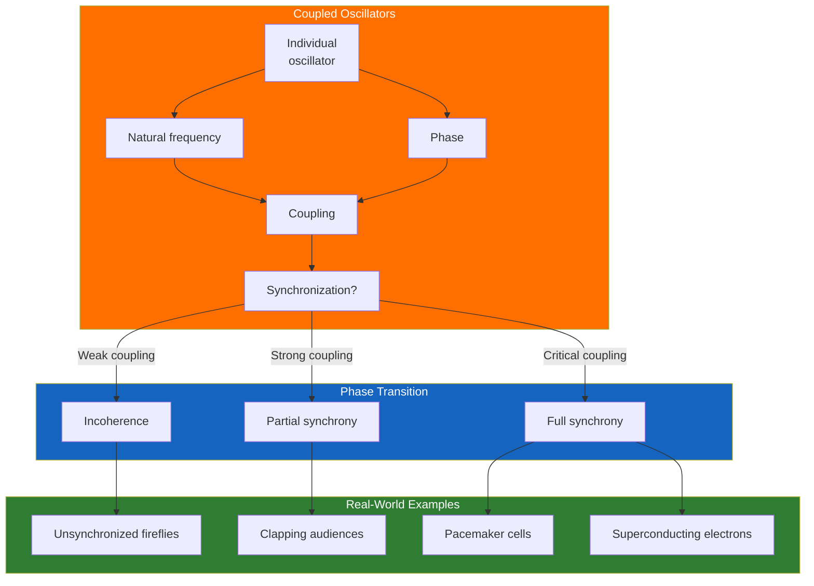
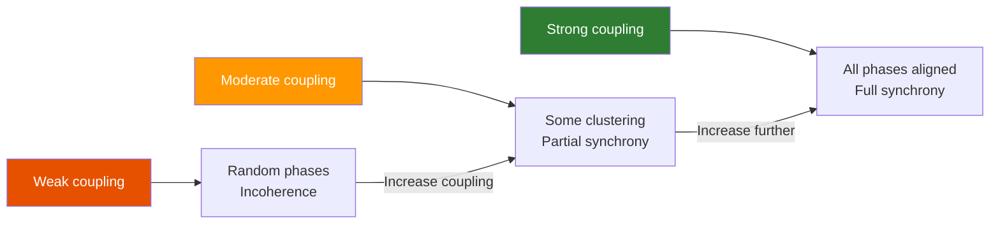
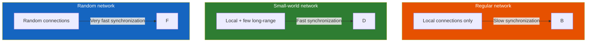

---

## Part 1: The Discovery

### Chapter 1 — The Mysterious Mr. Huygens

Christiaan Huygens, the great 17th-century Dutch scientist, was sick in bed in 1665. He had nothing to do but watch two pendulum clocks on the wall. He noticed something strange: the pendulums swung in perfect opposite phase — mirror images of each other. When he disturbed them, they returned to opposite phase within an hour. Huygens investigated and concluded that the clocks were communicating through vibrations in the wall. He had discovered synchronization.

Strogatz opens with this story because it contains all the elements of the field: individual oscillators (pendulums), coupling (vibrations through the wall), and emergent order (opposite-phase synchrony). The details are different for fireflies, neurons, and electrons, but the core phenomenon is the same.

### Chapter 2 — The Firefly's Secret

In Southeast Asia, some species of fireflies flash in perfect unison — thousands of males blinking on and off in the same rhythm, lighting up entire trees like Christmas trees. How? Each firefly has its own internal rhythm, but when it sees another firefly flash, it adjusts. The adjustment rule is simple: if the other firefly flashes before you expect it, flash a little earlier next time; if it flashes later, flash a little later. This mutual adjustment, repeated across thousands of fireflies, produces global synchrony.

Strogatz uses the firefly to introduce the mathematical concept of the **phase response curve** — a function that describes how an oscillator adjusts its phase in response to a stimulus. The shape of this curve determines whether a population of oscillators will synchronize.

---

## Part 2: The Theory

### Chapter 3 — Winfree's Dream

Arthur Winfree, a theoretical biologist at the University of Arizona, was the first to develop a mathematical theory of biological synchronization in the 1960s. His key insight: you do not need to know the detailed mechanism of each oscillator to understand synchronization. If you know the phase response curve and the distribution of natural frequencies, you can predict whether the population will synchronize.

Winfree's model showed that synchronization is a phase transition. As coupling strength increases, the population abruptly shifts from incoherence to partial synchrony. The transition is analogous to the freezing of water: below a critical temperature (coupling strength), the system is disordered; above it, order emerges.

### Chapter 4 — The Kuramoto Model

Yoshiki Kuramoto, a Japanese physicist, simplified Winfree's model to its essence. The Kuramoto model describes N oscillators, each with its own natural frequency, coupled to all others with strength K. The equation for each oscillator's phase is:

dθᵢ/dt = ωᵢ + (K/N) Σ sin(θⱼ - θᵢ)

The model exhibits beautiful behavior:
- Below a critical coupling K_c, the oscillators drift incoherently
- At K_c, a cluster of oscillators locks into synchrony
- Above K_c, the synchronized cluster grows as coupling increases
- In the limit of infinite coupling, all oscillators lock together

The order parameter r measures synchrony: r = 0 means complete incoherence; r = 1 means perfect synchrony. The transition at K_c follows a square-root law: r ∝ √(K - K_c).

The Kuramoto model is to synchronization what the Ising model is to magnetism — a minimal model that captures the essential physics of a phase transition. It is remarkable for its simplicity, its analytical tractability, and its ability to describe real systems.

---

## Part 3: Applications

### Chapter 5 — Synchrony in the Body

The human body is full of oscillators. The heart's pacemaker cells fire together to produce the heartbeat. The circadian clock in the brain synchronizes to the 24-hour light-dark cycle. Neural oscillations in different frequency bands coordinate brain activity.

Strogatz discusses how synchronization can go wrong. In epilepsy, massive numbers of neurons fire in pathological synchrony, producing seizures. In Parkinson's disease, synchronized oscillations in the basal ganglia produce tremor. The emerging field of **desynchronization** — using electrical stimulation to break pathological synchrony — offers new treatment approaches.

### Chapter 6 — Superconductivity and Josephson Junctions

At the quantum scale, synchronization produces superconductivity — the flow of electricity without resistance. In a superconductor, electrons form Cooper pairs that all occupy the same quantum state, moving in perfect synchrony. The Josephson junction — two superconductors separated by a thin insulator — can be modeled as a coupled oscillator. Arrays of Josephson junctions have been used to test the predictions of the Kuramoto model with extraordinary precision.

### Chapter 7 — Networks and Small Worlds

Not all connections are equal. The structure of the network — which oscillators are coupled to which — dramatically affects synchronization. Strogatz and his collaborators showed that small-world networks — a mix of local connections (your neighbors) and long-range shortcuts (your friends across the country) — synchronize much faster than regular lattices.

This insight has implications for understanding how synchrony spreads in power grids, social networks, and the brain. The brain's wiring is approximately a small-world network — a compromise between connection cost and synchronization speed.

---

## Part 4: The Limits of Synchrony

### Chapter 8 — The Dark Side of Sync

Not all synchrony is good. The 2003 Northeast blackout — the largest in US history — was triggered by a cascading failure in the power grid caused by oscillations in generators that fell out of step with each other. The system was designed to be synchronized, and when synchrony broke, the entire grid collapsed.

In finance, synchronized behavior among traders can produce market crashes — everyone selling at once. In biology, synchronized locust swarms can devastate agriculture. Synchrony is not inherently beneficial; it depends on the context.

### Chapter 9 — The Edge of Sync

Strogatz concludes by reflecting on the relationship between synchrony and complexity. At one extreme, complete synchrony is simple: everything does the same thing. At the other, complete incoherence is simple: everything does its own thing. In between lies the complex region — partial synchrony, clustering, chimera states — where groups of oscillators synchronize internally but not with each other. This middle ground, Strogatz suggests, may be where the most interesting phenomena occur.

---

## Reading Guide

### Essential Chapters

| Chapter | Topic | Why |
|---------|-------|-----|
| 1 | Huygens' discovery | The historical origin |
| 2 | Fireflies | The biological motivation |
| 3-4 | Winfree and Kuramoto | The mathematical theory |
| 5 | The body | Medical applications |
| 7 | Networks | The structural dimension |

For a complete picture, read the entire book. It is short and each chapter introduces a new facet of synchronization.
