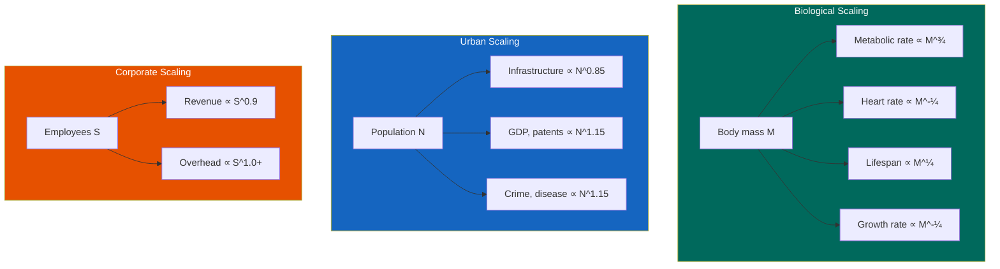
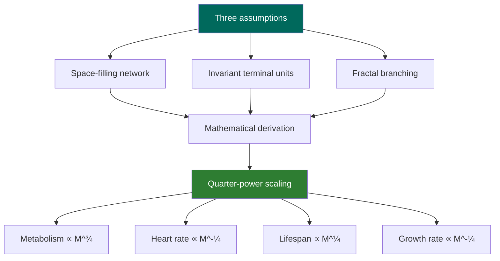
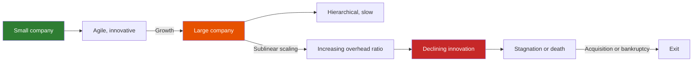
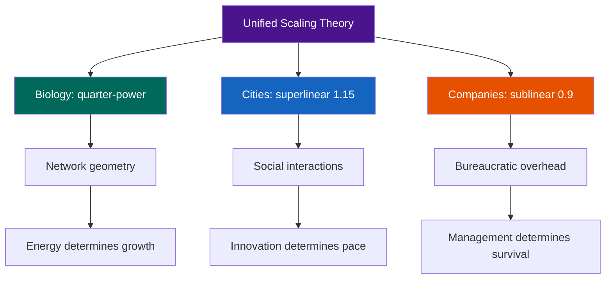

---

## Part 1: The Biology of Scaling

### Chapter 1 — The Elephant and the Mouse

Geoffrey West opens with a puzzle: an elephant is about 10 million times heavier than a mouse, but it uses only 10,000 times more energy. This is not a linear relationship. It is a power law: metabolism ∝ mass^0.75. This quarter-power scaling — Kleiber's law — is one of the most important and most mysterious patterns in all of biology.

The puzzle generalized: why do so many biological quantities scale with quarter-power exponents? Heart rate ∝ mass^(-1/4). Lifespan ∝ mass^(1/4). The number of heartbeats per lifetime is roughly constant across mammals. A mouse's heart beats 600 times per minute and lives 2 years. An elephant's heart beats 30 times per minute and lives 70 years. They get about the same number of total heartbeats — roughly 1.5 billion. The pace of life scales with size.

### Chapter 2 — The Geometry of Networks

West's explanation: scaling laws arise from the physics of distribution networks. Every living organism needs to deliver resources (oxygen, nutrients) to every cell and remove waste. The network that does this — the circulatory system, the respiratory system, the plant vascular system — must be space-filling (reach every cell), have terminal units of the same size (capillaries are universal), and be fractal (self-similar branching).

From these three assumptions, the quarter-power scaling laws follow mathematically. The network must increase in volume as mass^1 but in length only as mass^(1/4). This geometric constraint produces the 3/4 power law for metabolism and the associated scaling of times and rates.

### Chapter 3 — Growth and Mortality

Growth is the difference between energy intake and maintenance costs. West derives the growth curve from the scaling laws: initially, growth is nearly exponential. As the organism approaches its adult size, growth slows and eventually stops. The maximum size is determined by the scaling of the distribution network — no organism can grow beyond the point where the network can deliver resources to all cells.

Why do organisms stop growing? Because the energy required to maintain existing cells eventually equals the energy coming in. The organism reaches a steady state. This is why there is a maximum size for any given body plan. Elephants are as big as a land mammal can be with a skeleton and lungs; whales can be bigger because water supports their weight.

---

## Part 2: The Scaling of Cities

### Chapter 4 — The New Science of Cities

Cities, West argues, are also complex systems governed by scaling laws. But the scaling is different from biology. When West and his collaborators analyzed data from thousands of cities worldwide, they found two distinct patterns:

1. **Infrastructure scales sublinearly**: gasoline stations, road surface, and electrical cable length scale with population^0.85. Larger cities are more efficient per capita in infrastructure. This is like biological scaling.

2. **Socioeconomic activity scales superlinearly**: GDP, patents, research output, and even crime scale with population^1.15. Double the population, and you get 115% of the economic output, 115% of the innovation, and 115% of the crime.

The superlinear scaling is remarkable: it means that cities are not just scaled-up towns. They are qualitatively different. The density of social interaction increases with city size, creating a kind of "social metabolism" that accelerates the pace of life.

### Chapter 5 — The Pace of Urban Life

Everything speeds up in larger cities. Walking speed, GDP growth, disease transmission, and idea generation all increase superlinearly. West draws the analogy with biological scaling: just as a mouse lives faster and dies younger than an elephant, a large city lives faster than a small one.

The implication: the "tempo" of a city is not a cultural choice but a mathematical consequence of its size. This has profound implications for urban planning: you cannot have the innovation benefits of a big city without the accelerated pace and the social problems that come with it.

### Chapter 6 — The Sustainability Problem

Cities must grow to remain vibrant — but growth is constrained by resource availability. West's analysis shows that cities, like organisms, face a fundamental scaling challenge. Innovation — new technologies, new energy sources, new social structures — acts like a "reset button" that allows cities to escape the constraints of their current scaling regime.

The history of human civilization can be read as a sequence of such resets: the agricultural revolution, the industrial revolution, the information revolution. Each allowed the population to grow beyond the limits of the previous regime. But the intervals between resets are getting shorter, raising the question: can we innovate fast enough to sustain growth without triggering collapse?

---

## Part 3: The Scaling of Companies

### Chapter 7 — The Biology of the Firm

Companies, West found, scale more like organisms than like cities. The key financial metrics (revenue, profit, assets) scale sublinearly with company size. As companies grow, the ratio of overhead to output increases. Bureaucracy expands faster than productivity.

This sublinear scaling explains the corporate lifecycle: young companies grow rapidly and are innovative; as they mature, they become more efficient but less innovative. Eventually, they stagnate and either die (bankruptcy) or are absorbed by larger entities. The average lifespan of a publicly traded company is about 40 years.

### Chapter 8 — The Innovation Imperative

To survive, companies must innovate. But innovation, West argues, follows its own scaling laws. The number of innovations per unit time decreases as companies grow. Large companies are systematically less innovative per capita than small ones.

This creates a paradox: companies need scale to compete (resources, market share, brand) but scale suppresses the innovation that drove their growth in the first place. The solution: internal structures that mimic the scaling of cities — semiautonomous divisions, internal startups, acquisitions.

---

## Part 4: The Big Picture

### Chapter 9 — A Unifying Theory?

West concludes by asking whether scaling theory can provide a truly unified framework for understanding complex systems — from cells to cities to companies. The evidence is suggestive but far from conclusive.

The scaling of biological systems is the most solidly established: the quarter-power laws have been confirmed across orders of magnitude, and the fractal network theory provides a compelling mechanism. The scaling of cities is empirically robust (the exponents have been replicated across nations and time periods) but the theory is less developed. We know that cities scale superlinearly, but we do not fully understand the mechanism. The scaling of companies is the least established: the data are limited and the theory is still evolving.

---

---

## Reading Guide

### Essential Chapters

| Chapter | Topic | Why |
|---------|-------|-----|
| 1 | Kleiber's law | The foundational observation |
| 2 | Network geometry | The explanatory mechanism |
| 4 | Urban scaling | The most provocative extension |
| 5 | Pace of life | Implications for sustainability |
| 7 | Corporate scaling | Practical applications |

### For Maximum Impact

Read the biology chapters (1-3) first. They are the most rigorously established and provide the framework for everything else. Then read the cities chapters (4-6) and companies chapters (7-8) as intriguing but more speculative extensions.
