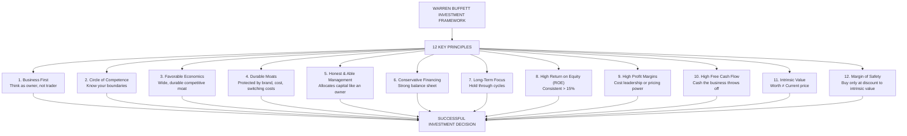
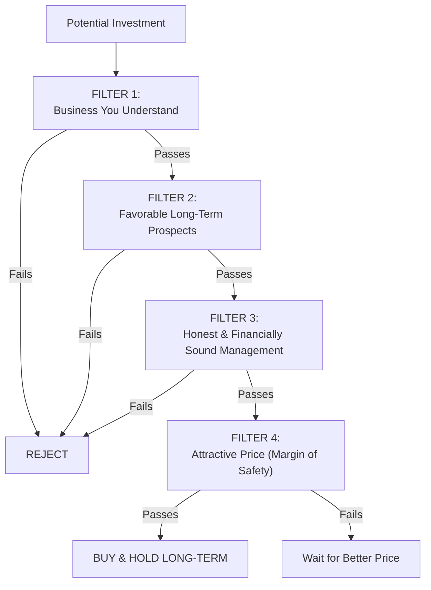
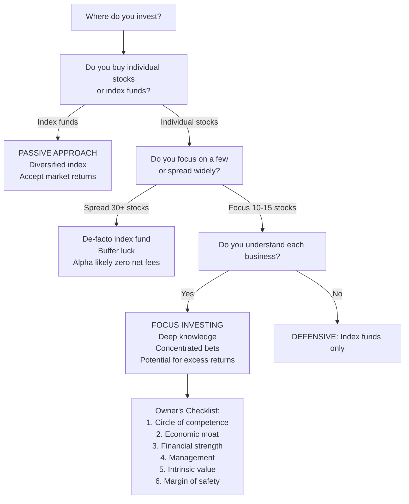
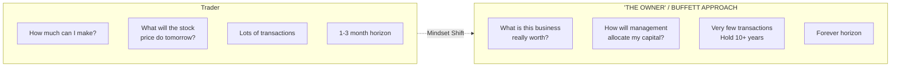
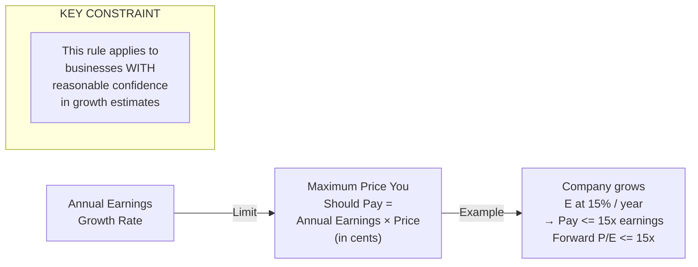
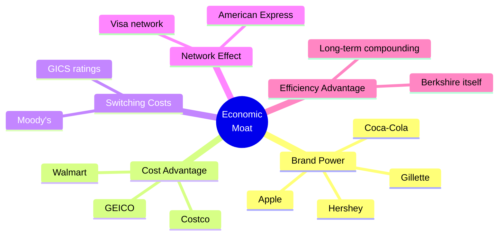
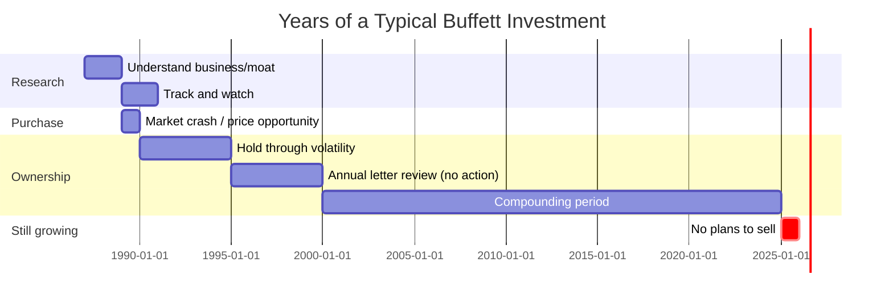

## The 12 Investment Principles



## The Four Investment Filters

Every potential investment must pass all four filters before Buffett considers it:



## The Focus Investing Decision Tree



## The Owner's Attitude vs. The Trader's Attitude



## The 10% Cap Rule



## Buffett's Circle of Competence Model

```mermaid
flowchart TD
    subgraph Known["KNOWN — YOUR CIRCLE OF COMPETENCE"]
        A["Consumer brands<br/>(Coca-Cola, Hershey)"]
        B["Insurance<br/>(GEICO, Berkshire Re)"]
        C["Media & publishing"]
    end

    subgraph Knowable["KNOWABLE — You CAN learn these"]
        D["Railroads (Burlington)"]
        E["Industrial companies"]
    end

    subgraph Unknown["UNKNOWN — Stay out"]
        F["Biotech"]
        G["Semiconductors"]
        H["Cryptocurrencies"]
    end

    Investor["YOU"] --> Known
    Investor -.->|"Expand slowly"| Knowable
    Investor -.X-|"Never invest"| Unknown
```

## Chapter-by-Chapter Study Guide

### Part I: The Foundation — Value Principles from Ben Graham

**Introduction: What This Book Is About**  
Hagstrom establishes his thesis: Warren Buffett is the world's most successful investor not because he's smarter than others, but because he has a superior system. His system is built on three pillars: (1) BUY businesses, not stocks, (2) apply stringent quality filters before buying anything, and (3) never overpay — always demand a margin of safety.

**Chapter 1: The Graham School of Value Investing**  
David Dodd at Columbia Business School created the framework that became value investing. Benjamin Graham formalized it in *Security Analysis* (1934) and *The Intelligent Investor* (1949). Graham's students — including Buffett — learned to find companies trading below intrinsic value. Hagstrom introduces the foundational vocabulary: float, net current asset value, margin of safety.

**Chapter 2: Value Principles Applied Through the Ages**  
Graham's principles are timeless, not tied to a specific era. They rely on two assumptions about human behavior: (1) prices swing between optimism and pessimism, and (2) crowds are wrong more often than they are right. The inevitable mean reversion of stock prices gives the focused, patient investor an edge.

### Part II: The Evolution — Buffett's Investment Technique

**Chapter 3: The Berkshire Withdrawal**  
Berkshire Hathaway's early years as a textile mill were not an investment success story — they were a cautionary tale about the limits of operating a bad business even with good financial management. Buffett learned: "Time is the friend of the wonderful company, the enemy of the mediocre." He shifted Berkshire from a textile operation to a pure investment holding company, laying the groundwork for what it is today.

**Chapter 4: The Education of a Contrarian Thinker**  
Buffett's education unfolded through three important relationships: (1) Ben Graham, who taught him the language of intrinsic value; (2) Charlie Munger, who taught him to pay up for great businesses that compound for decades; and (3) the partnership format that taught him about the economics of compounding capital at scale.

**Chapter 5: A Business-First Buying Philosophy**  
The mass media describes investors as "long" or "short" or "trading around" stocks. Buffett thinks about businesses. Hagstrom frames the Buffett approach: if the stock market disappeared for two years, would this be a good business to own? This thought experiment reframes every investment decision away from price action toward business quality.

**Chapter 6: The Management Evaluation**  
The quality of management is often the most important variable in a long-term investment. Hagstrom discusses what to look for: does management think like owners (allocate capital efficiently), or like empire-builders (grow headcount, acquire for ego)? Buffett looks for the "owner's eyes" in management's annual letters. Two tests: how do they describe failures? How do they allocate excess cash?

### Part III: The Process — Analyzing Quality and Price

**Chapter 7: The Significance of Profit Margins**  
Hagstrom analyzes profitability's role in the Buffett framework. High profit margins signal pricing power or cost efficiency — two durable competitive advantages. He traces how Buffett used Berkshire's earnings reports to identify companies with wide, stable profit margins as evidence of economic moats.

**Chapter 8: The Importance of Owner Earnings**  
Reported earnings can be distorted by accounting choices. Buffett prefers "owner earnings" — a cash-flow measure that strips out accounting adjustments. This aligns with the owner philosophy: a business generates cash you can spend or reinvest. If the reported accounting earnings are high but owner earnings are low, be skeptical.

**Chapter 9: The Return on Equity Evaluation**  
ROE is Buffett's favorite metric for a reason: it measures how well a company generates profits relative to shareholder capital. Consistent ROE above 15% signals a strong, unchanged competitive position. At least 10 years of data is needed to know if a high ROE is temporary or structural.

### Part IV: The Application — Case Studies in Focus Investing

**Chapter 10: The Washington Post Company**  
Buffett bought shares in the Washington Post in 1973. At the time, the company's identifiable assets (TV stations, newspapers, educational division) were worth at least $400 million. The market cap was $80 million. A 20-to-1 margin of safety. But the real story is the business quality Bob Woodruff and Katharine Graham had built — a newspaper with near-monopoly economics in Washington D.C. that generated stable cash. Hindsight makes this decision look obvious. It was anything but.

**Chapter 11: General Reinsurance (Gen Re)**  
The Gen Re case illustrates an uncomfortable lesson in the book: even Buffett makes mistakes. Gen Re's acquisition in 1998 at $9.7 billion was a difficult investment for Berkshire. The underwriting culture clashed with Berkshire's approach. Hagstrom uses this honestly to show that even the world's best investor occasionally pays too much for quality — and that patience, additional capital, and time sometimes resolve the mistake.

**Chapter 12: American Express**  
After the 1963 Salad Oil scandal destroyed AmEx's share price, Buffett invested 40% of his partnership's capital into the stock. Other investors fled. Buffett saw the brand — and the counterintuitive evidence that the charge-card business was not harmed — and bought aggressively. He realized the public had confused a management failure with a business failure. This is a case study in patience at good businesses.

**Chapter 13: Coke and Gillette**  
Coca-Cola (1988) and Gillette (1989) are the iconic "paying up for quality" investments. Neither was cheap. But both had durable, widening moats. Buffett bought them at prices that gave him modest, not spectacular, margins of safety — because the quality of the businesses was exceptional. This phase represents Munger's influence on Buffett: great businesses at fair prices beat mediocre businesses at cheap prices.

### Part V: The Synthesis — The Three-Pillar Framework

**The Business Ten Cap Rule**  
Rough heuristic: never pay more than 10% of a company's annual earnings growth rate in the form of its P/E multiple. A 15%-grower should not trade above 15x. A 20%-grower should not trade above 20x. This rule guards against paying bubble prices for stories. Combined with the owner earnings concept, it keeps valuation grounded in cash, not accounting manipulation.

**Moat Assessment Framework**


**Decision Timeline for a Typical Buffett Investment**


## Key Formulas

### Intrinsic Value Estimate
```
Intrinsic Value = Expected Future Owner Earnings / Long-Term Govt Bond Yield
```

This is Buffett's stated formula: value equals the expected future cash flows discounted back at a safe rate (long-term government bond yield). No risk premium is added — because the owner understands the risk via the circle of competence. The formula produces a present-value estimate that anchors buying decisions.

### Changes in Intrinsic Value
```
Change in Intrinsic Value = Business Earnings Growth - &lt;10%
```
The 10% cap on the price you will pay for a growth stock means that the capital gains from owning a compounder are dominated by the quality compounding, not the multiple expansion.

### ROE Minimum Standard
```
Qualifying ROE > 15% for 10+ years
```
A one or two year high ROE is not enough. Buffett wants structural ROE — something to do with the business model, not a transient opportunity.

## Actionable Advice

1. **Draw your circle of competence on paper.** List industries and companies you truly understand. Stick to them for the first five years of serious investing.

2. **Apply all four filters before any purchase.** If any one filter is uncertain, pass. Patience over knowledge generates compounding.

3. **Qualify potential investments by owner earnings, not reported earnings.** Subtract normal capex from operating cash flow. This is your real income number.

4. **Check ROE history.** Require at least 10 years of ROE above 15% before buying growth-oriented stocks.

5. **Audit management via reading their letters.** Do CEOs describe their industry and competitors honestly? Do they explain mistakes openly? Do they allocate excess cash in shareholder-friendly ways?

6. **Use the 10% cap rule.** If a business grows earnings at 12% compounded, never pay more than 120% of trailing earnings. Patience for fair prices is itself an edge.

7. **When uncertain, pass.** Buffett passed on tech stocks throughout the dot-com boom and on most financial stocks in 2008. Both decisions cost him little — and saved him from bigger losses.

8. **Hold for at least five years minimum.** Annual turnover over 30% is almost certainly a sign you are not running a focus strategy. If you check stock prices more than quarterly, you are probably too focused on price action and not enough on business fundamentals.

9. **Define your moat checklist.** Before owning a stock, write down what its competitive advantage is, how wide it is, and what threatens it. Revisit the checklist annually.

10. **Assume the market is occasionally wrong in your favor.** Use market pessimism as a source of opportunity, not a warning sign.
