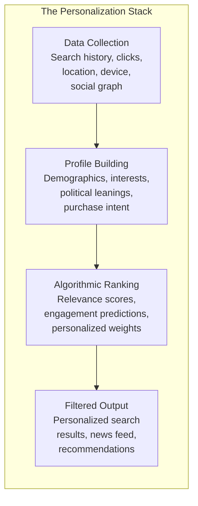
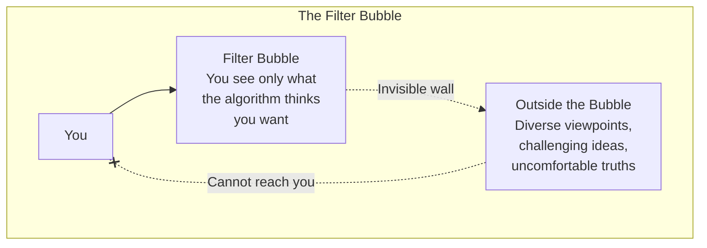

# Core Concepts

## The Personalization Revolution

Pariser traces how internet personalization evolved from simple customization (choosing your own preferences) to invisible algorithmic curation (the platform decides for you). Google began personalizing search results for all users in 2009, even when logged out. Facebook's News Feed algorithm, introduced in 2006, was already shaping what billions of people saw. The shift was quiet, gradual, and largely unnoticed by the public.

## The Filter Bubble Defined

Three key properties define a filter bubble:

| Property | Description | Consequence |
|----------|-------------|-------------|
| Invisibility | You do not know it exists | No opportunity to resist or compensate |
| Isolation | You are alone in your bubble | No shared reality with others |
| Passivity | Content comes to you | You do not choose what to see |

## The Code of the Filter Bubble

Pariser identifies three core mechanisms:

**Personal data extraction.** Every click, search, like, share, and scroll feeds the profile. Your location, device type, time of day, and browsing history all become signals that shape what you see.

**Relevance scoring.** The algorithm assigns a relevance score to every possible piece of content based on your profile. The highest-scoring items appear in your feed or search results. The scoring function is a trade secret, optimized for engagement metrics.

**Iterative feedback.** What you click on trains the algorithm to show you more of the same. The system learns what content keeps you engaged and delivers an endless supply of it, whether it is news, cat videos, or conspiracy theories.

# Chapter Insights

## Part I: The Rise of Personalization

Pariser opens with the story of Google's 2009 personalization announcement and the quiet way it changed the internet. He traces the history of personalization from early Amazon recommendations through to Facebook's News Feed, showing how the commercial logic of engagement drove each step.

## Part II: The Mechanics of the Bubble

The middle section explores how filter bubbles work in practice. Pariser uses his own experiments — having friends search the same terms and comparing results — to demonstrate the dramatic differences in what people see. He interviews engineers who defend personalization as improving user experience and critics who warn of its civic dangers.

## Part III: The Consequences

The final section examines the societal impact: political polarization, the erosion of shared facts, the rise of niche extremist communities, and the challenge to democratic deliberation. Pariser argues that filter bubbles threaten the kind of serendipitous encounter with difference that healthy democracies require.

# Practical Applications

## For Individuals

- **Use incognito or private browsing** for important searches to get unpersonalized results.
- **Deliberately seek out opposing viewpoints.** Follow news sources across the political spectrum.
- **Delete and reset your advertising profiles** on Google, Facebook, and other platforms.
- **Use specialized news aggregators** like AllSides that explicitly present multiple perspectives side by side.
- **Log out** of your accounts before searching for political, civic, or health information.

## For Educators

- **Teach algorithmic literacy** as a core information skill alongside source evaluation.
- **Assign filter-bubble audits** where students compare search results while logged in and logged out.
- **Discuss the business model** of free platforms and how it shapes what users see.

# Actionable Lessons

- **Recognize that your feed is curated.** What you see on Facebook, YouTube, or Google News is not the whole picture — it is one algorithm's best guess at what will keep you engaged.
- **Seek discomfort.** If you have not encountered a viewpoint that made you uncomfortable recently, you are likely in a filter bubble.
- **Verify before sharing.** Filter bubbles amplify misinformation because the algorithm does not care about truth — it cares about engagement.
- **Support public-interest alternatives.** Ad-free, algorithm-free platforms and public media are antidotes to the filter bubble.

# Reading Guide

## Sufficiency Assessment

This summary captures the core thesis of the filter bubble, its three defining properties, and the mechanisms that create and sustain it. It covers the major consequences for democracy and individual information consumption. The full book provides richer case studies, interviews with industry insiders, and more detailed proposals for reform.

## Recommended Reading Path

| Reader Type | Time | What to Read |
|---|---|---|
| Casual | 20 min | This summary |
| Interested | 2–3 hrs | Summary + Part I (chapters 1–4) + Part III (chapters 7–10) |
| Scholar/Practitioner | 6–8 hrs | Full book |

## Chapters to Read in Full

- **Chapters 1–3** for the foundational argument
- **Chapters 7–8** for consequences and solutions

## What You'll Miss by Not Reading the Full Book

- The vivid examples of personalization in action — Pariser's friends search for "BP" and get radically different results after the Deepwater Horizon spill.
- The insider interviews with Google and Facebook engineers about how algorithms are designed.
- The historical parallel to the printing press and the public sphere transformations of earlier eras.
