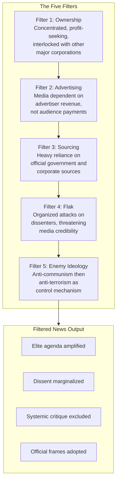
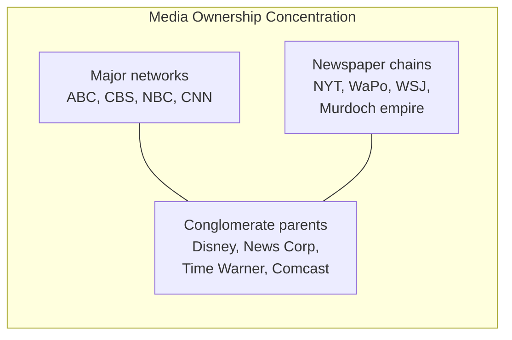

# Core Concepts

## The Propaganda Model

The propaganda model is not a theory of conspiracy but of structure. These five filters operate independently and cumulatively. A story that passes through all five filters is almost certain to serve elite interests. A story that challenges elite interests will struggle to survive even one or two filters.

## Filter 1: Ownership

Herman and Chomsky document the increasing concentration of media ownership. A small number of large corporations own most major media outlets. These corporations have substantial holdings in other industries and close relationships with government and financial institutions. This structural position creates a powerful incentive to produce news that does not threaten the system from which these corporations profit.

## Filter 2: Advertising

Traditional media derived most of their revenue not from audience payments but from advertisers. This creates a fundamental dynamic: media compete for audiences to sell to advertisers, not to inform citizens. Advertisers prefer content that creates a suitable buying mood — serious investigative journalism into corporate misdeeds is not conducive to selling products. Media outlets therefore shape their content to attract affluent demographics and avoid controversy that might alienate advertisers.

## Filter 3: Sourcing

Media rely heavily on official sources: government agencies, corporate press releases, think tanks, and credentialed experts. These sources provide a steady, predictable flow of information at low cost. The result is a systematic deference to official narratives. A White House press conference is news; an activist's press release is not. This sourcing dependency means government and corporate frames dominate news coverage, while oppositional perspectives must work much harder to be heard.

## Filter 4: Flak

Flak refers to organized attacks on journalists or media outlets that produce content challenging elite interests. It can take the form of letter-writing campaigns, complaints to publishers or regulators, threats of libel suits, or pressure from political figures. The threat of flak creates a chilling effect: journalists learn which topics are safe and which invite trouble. This self-censorship is more effective than overt censorship because it is internalized.

## Filter 5: Anti-Communism / Anti-Terrorism

The fifth filter was originally identified as anti-communism — a controlling ideology that could be used against any challenge to the established order. After the Cold War, it shifted to anti-terrorism and the War on Drugs. The function is the same: to provide a framework that delegitimizes dissent by associating it with a feared enemy.

# Chapter Insights

## Part I: The Propaganda Model

The book opens with the theoretical framework, laying out the five filters in detail and explaining how they work together as a system.

## Part II: Case Studies

The bulk of the book applies the propaganda model to detailed case studies: the coverage of elections in Central America, the killing of priests and activists in Latin America, the treatment of the Vietnam War, and the contrasting coverage of atrocities in friendly versus enemy states. These case studies are the books evidentiary backbone.

## Part III: Implications

The final chapters explore what the propaganda model means for democratic theory and practice. If media systematically manufacture consent rather than facilitating informed public deliberation, then democratic theory needs fundamental revision.

# Practical Applications

## For Critical News Readers

- **Identify the sources** used in a story. Are they official or independent? Government or grassroots? Domestic or foreign?
- **Notice what is not covered.** The propaganda model predicts significant omissions — stories that never make it into the news.
- **Compare coverage of similar events** in friendly versus hostile countries. The model predicts systematic double standards.

## For Journalists

- **Diversify sourcing.** Deliberately seek out non-official, grassroots, and oppositional sources.
- **Name the filters.** Explicitly note when official sources are providing self-serving accounts.
- **Cover the media.** Treat media behavior as a legitimate subject of journalistic investigation.

# Actionable Lessons

- **Seek out the perspectives that the filters exclude** — independent media, international sources, grassroots organizers.
- **Understand that omissions are political.** What is not in the news is as significant as what is.
- **Apply the propaganda model to alternative media too.** No media system is filter-free.
- **Support public service and non-commercial media.** Structures that break the advertising and ownership filters produce different journalism.

# Reading Guide

## Sufficiency Assessment

This summary captures the five-filter framework and the core logic of the propaganda model. The full book provides extensive case studies that are essential for understanding how the filters operate in practice.

## Recommended Reading Path

| Reader Type | Time | What to Read |
|---|---|---|
| Casual | 30 min | This summary |
| Interested | 4–6 hrs | Summary + Chapter 1 (propaganda model) + one case study chapter |
| Scholar/Practitioner | 14–18 hrs | Full book — the case studies are evidence, not illustration |

## Chapters to Read in Full

- **Chapter 1** — The propaganda model framework
- **Chapters 3 and 5** — The most powerful case studies

## What You'll Miss by Not Reading the Full Book

- The detailed case study evidence that makes the argument concrete and persuasive.
- The systematic comparison of atrocities in enemy versus friendly states (the "worthy" versus "unworthy" victims analysis).
- The historical examples of media self-censorship and flak in action.
