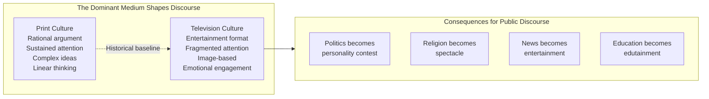
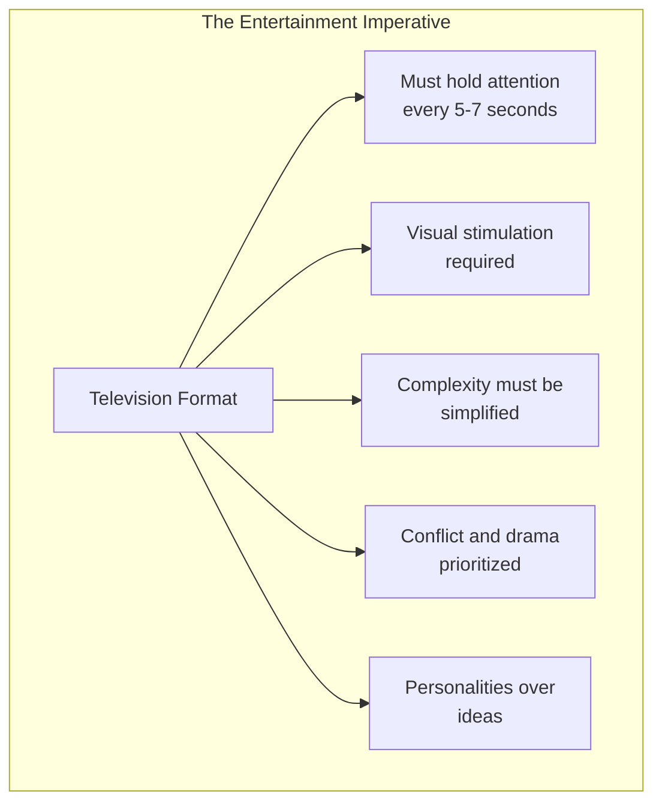

# Core Concepts

## Medium as Metaphor

Postman's central argument, drawn from McLuhan, is that the dominant communication medium in any society serves as a metaphor for what counts as knowledge and truth. In a print culture, truth is associated with logical argument, evidence, coherence, and the ability to follow a sustained line of reasoning. In a television culture, truth is associated with immediacy, visual appeal, emotional resonance, and the charisma of the presenter. The shift from print to television is not just a change in technology but an epistemological revolution.

## The Peek-a-Boo World

Postman introduces the concept of the "peek-a-boo world" — a media environment in which information appears and disappears in rapid succession, connected by no narrative, no context, and no coherence. Each news segment lasts thirty seconds, each commercial twenty seconds, each sound bite ten seconds. The viewer is left not with understanding but with a sensation of knowing, a superficial familiarity with events that masks genuine ignorance.

## Tyranny of Entertainment

Television is not merely a medium that sometimes carries entertainment content. It is an entertainment medium by its very nature. The format demands that anything appearing on it be adapted to the requirements of entertainment: visual interest, emotional engagement, simplicity, brevity, and accessibility. This means that any serious content — news, politics, education, religion — is inevitably transformed into entertainment by the very act of being televised.

# Chapter Insights

## Part I: The Medium

Postman establishes the theoretical framework, tracing the shift from typographic to television culture. He contrasts the rational, argument-based public discourse of Lincoln-Douglas era America with the image-based, personality-driven politics of the television age.

## Part II: The Corruption of Discourse

Each chapter in this section examines a specific domain: news, politics, education, and religion. Postman shows how television transforms each. Television news becomes "news theater," a performance that uses current events as raw material. Politics becomes a beauty contest. Education becomes "Sesame Street" — learning made effortless and entertaining. Religion becomes a televangelist spectacle.

## Part III: The Way Out

The concluding chapter offers a grim assessment and a tentative prescription. Postman argues that recognizing the problem is the first step, but he offers no easy solutions. The book ends with a call for media literacy and a plea for schools to teach students to understand and resist the biases of their media environment.

# Practical Applications

## For Media Literacy

- **Recognize the format.** When watching television news, notice how the format shapes the content. Why is this story told this way? What is left out?
- **Distinguish between information and understanding.** Television provides information (facts, images, sound bites). It rarely provides understanding (context, analysis, sustained argument).
- **Practice sustained reading.** Reading books is a counter-discipline to television culture. It requires the sustained attention and linear reasoning that television undermines.

## For Citizenship

- **Read election coverage.** Do not rely on televised debates or news segments for political information. Read long-form analysis, policy documents, and investigative journalism.
- **Demand substance.** When public figures appear on television, notice what the format allows them to say. A thirty-second sound bite cannot convey a complex position.
- **Limit television consumption.** Postman's implicit prescription: reduce exposure to the entertainment format.

# Actionable Lessons

- **Be suspicious of any serious topic presented in entertaining form.** If the format is designed to amuse, the content has already been compromised.
- **Read books.** Reading is the antidote to television culture. It trains sustained attention, logical reasoning, and the ability to follow complex arguments.
- **Teach media ecology.** Understanding how media shape thought should be a core part of education.
- **Recognize historical contingency.** The way we communicate is not natural or inevitable — it is shaped by technology and can be reshaped.

# Reading Guide

## Sufficiency Assessment

This summary captures Postman's core argument about how television transforms public discourse into entertainment. It covers the McLuhan-influenced theoretical framework, the concept of the peek-a-boo world, and the tyranny of the entertainment format.

## Recommended Reading Path

| Reader Type | Time | What to Read |
|---|---|---|
| Casual | 20 min | This summary |
| Interested | 2–3 hrs | Summary + Part I (chapters 1–4) + Conclusion (chapter 11) |
| Scholar/Practitioner | 5–7 hrs | Full book |

## Chapters to Read in Full

- **Chapters 1–4** for the theoretical framework
- **Chapters 5–7** for the analysis of news and politics
- **Chapter 11** for Postman's conclusion

## What You'll Miss by Not Reading the Full Book

- The beautiful prose and rhetorical elegance — Postman is a gifted writer.
- The historical contrast between print and television culture, illustrated through Lincoln-Douglas debates and other examples.
- The specific analysis of how television news, politics, education, and religion are each transformed by the medium.
