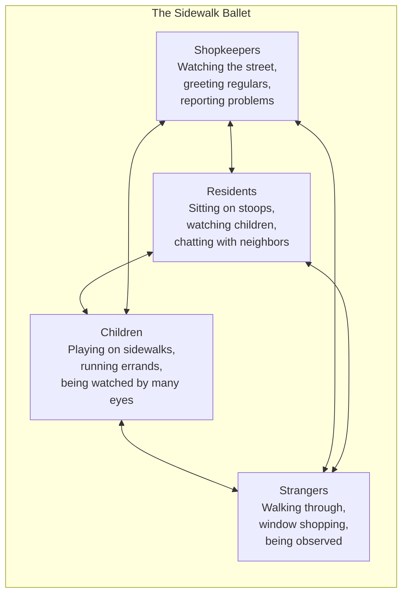
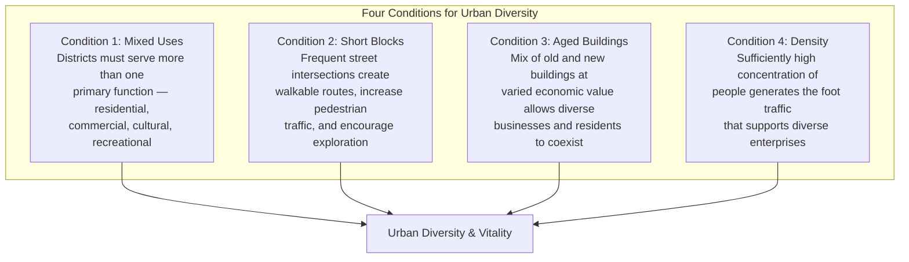

# Core Concepts

## The Sidewalk Ballet

Jacobs's most famous concept is the "sidewalk ballet" — the intricate, unplanned choreography of daily street life in a successful urban neighborhood. It is not a planned performance but an emergent pattern of countless small interactions: shopkeepers sweeping their sidewalks, residents sitting on stoops, children playing, neighbors chatting, strangers passing through. This ballet is the foundation of urban vitality.

## The Four Generators of Diversity

The heart of Jacobs's positive argument is that four physical conditions, working together, generate the kind of urban diversity that makes neighborhoods thrive:

**Mixed primary uses.** A district must serve more than one primary function. People need reasons to be on the street at different times of day — working, shopping, eating, living, playing. This ensures a continuous flow of foot traffic.

**Short blocks.** Long blocks concentrate pedestrian traffic on major avenues while leaving side streets deserted. Short blocks with frequent intersections spread pedestrian traffic throughout the neighborhood, creating more routes and more opportunities for interaction.

**Aged buildings.** A mix of building ages means a mix of rents. New buildings are expensive; old buildings are cheap. This allows a diverse mix of businesses and residents — from profitable chains to marginal startups, from wealthy professionals to artists and immigrants.

**Dense concentration.** Sufficient density of people generates the foot traffic that supports diverse enterprises. Without density, there are not enough customers to sustain the variety of shops, restaurants, and services that make a neighborhood interesting and convenient.

# Chapter Insights

## Part I: The Peculiar Nature of Cities

Jacobs establishes her core argument: cities are fundamentally different from towns or suburbs, and the planning principles developed for other settings are disastrous when applied to cities. She introduces the concept of "organized complexity" — the idea that cities are systems of such intricate interconnection that they cannot be understood through simple cause-and-effect models.

## Part II: The Conditions for Diversity

The most famous section of the book, developing the four generators of diversity in detail and illustrating them with examples from successful neighborhoods.

## Part III: The Forces of Decline and Regeneration

Jacobs analyzes what kills city neighborhoods: subsidized housing projects, large-scale redevelopment, the withdrawal of capital (redlining and disinvestment), and the self-fulfilling prophecies of planners who declare neighborhoods "slums" and then demolish them.

## Part IV: Different Tactics

The final section offers alternative approaches to city planning, emphasizing the need for gradual, small-scale, incremental change rather than grand master plans.

# Practical Applications

## For Planners and Officials

- **Study successful neighborhoods.** Before redesigning a district, spend time observing how it actually works. Who uses the streets? When? For what purposes?
- **Avoid large-scale land assembly.** Bulldozing an entire neighborhood destroys the organic fabric that makes cities work. Redevelop incrementally.
- **Design for pedestrian traffic.** Short blocks, mixed uses, and active ground floors generate the foot traffic that creates safe, vibrant streets.

## For Citizens and Activists

- **Defend the sidewalk ballet.** The small, informal interactions of street life are not trivial — they are the foundation of urban safety and community.
- **Resist use segregation.** When planners want to separate residential from commercial, fight it. Mixed uses are essential.
- **Preserve old buildings.** The character and affordability of a neighborhood depend on a stock of aged, low-rent buildings.

# Actionable Lessons

- **Watch the street before you plan anything.** Jacobs's method was patient observation. The best urban insights come from watching, not theorizing.
- **Increase street intersections.** Short blocks are better than long ones. If your city has superblocks, advocate for breaking them up.
- **Protect mixed-use zoning.** The separation of uses is the single most destructive legacy of modernist planning.
- **Reject the "slum clearance" mindset.** Declaring a neighborhood a slum is often the first step to destroying what vitality it has.

# Reading Guide

## Sufficiency Assessment

This summary captures Jacobs's core framework: the sidewalk ballet, the four generators of diversity, and her critique of modernist planning. The full book provides much richer observation and argument.

## Recommended Reading Path

| Reader Type | Time | What to Read |
|---|---|---|
| Casual | 30 min | This summary |
| Interested | 4–6 hrs | Summary + Part II (chapters 7–10) + Introduction |
| Scholar/Practitioner | 12–16 hrs | Full book |

## Chapters to Read in Full

- **Chapters 1–3** — The foundational critique of modernist planning
- **Chapters 7–10** — The four generators of diversity
- **Chapters 15–17** — The critique of subsidized housing and urban renewal

## What You'll Miss by Not Reading the Full Book

- The detailed street-level observations that make Jacobs's argument concrete and persuasive.
- The devastating specific critiques of Robert Moses's projects and other planning disasters.
- The rich language and polemical energy that make the book a literary as well as analytical achievement.
