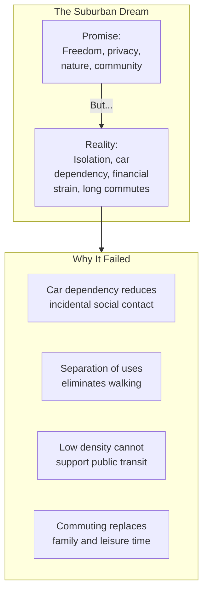

# Core Concepts

## The Urban Happiness Framework

```mermaid
flowchart LR
    subgraph Design[Urban Design Factors]
        D1["Density & Mix<br/>Compact, mixed-use<br/>neighborhoods"]
        D2["Mobility<br/>Walking, cycling,<br/>public transit"]
        D3["Public Space<br/>Parks, plazas,<br/>streets as places"]
        D4["Social Fabric<br/>Third places,<br/>neighbor interaction"]
    end

    subgraph Psychology[Psychological Mechanisms]
        P1["Social Connection<br/>Belonging, trust,<br/>community"]
        P2["Autonomy & Control<br/>Freedom, choice,<br/>mastery"]
        P3["Competence<br/>Challenge, growth,<br/>efficacy"]
        P4["Restoration<br/>Nature, quiet,<br/>beauty"]
    end

    subgraph Outcome[Well-Being Outcomes]
        O1["Life Satisfaction"]
        O2["Positive Affect"]
        O3["Reduced Stress"]
        O4["Sense of Meaning"]
    end

    Design --> Psychology
    Psychology --> Outcome
```

Montgomery synthesizes research from psychology and neuroscience to build a framework connecting urban design to well-being. Four key psychological needs — social connection, autonomy, competence, and restoration — are directly affected by how we build our cities.

## The Suburban Experiment

Montgomery traces the history of the suburban ideal — from the 19th-century romanticism of the countryside through Levittown to modern exurbs — and argues that the promise of suburban happiness was based on flawed assumptions. The house with the yard and the car seemed to offer the best of both worlds: space, privacy, and mobility. In practice, it delivered isolation, dependence, and stress.

## The Commuting Tax

One of the book's most compelling sections documents the relationship between commuting and happiness. Montgomery cites research showing that every additional minute of commuting time reduces satisfaction with life and relationships. People who commute more than 45 minutes each way are significantly less happy than those who commute less than 15 minutes. Crucially, people systematically underestimate the negative impact of commuting when making housing choices, trading off longer commutes for more space in a calculation that does not pay off in happiness.

# Chapter Insights

## Part I: The Promise of the City

Montgomery opens with the story of his own urban awakening and the history of how cities came to be designed around cars rather than people. He introduces the key tension: cities can make us happier or unhappier, and the choice is largely determined by design decisions.

## Part II: The Science of Urban Happiness

The middle section presents the psychological evidence, drawing on happiness research, neuroscience, and environmental psychology. Montgomery visits cities around the world — Copenhagen, Bogota, Paris, Vancouver — to see examples of happiness-oriented design in practice.

## Part III: Building Happy Cities

The final section synthesizes the lessons into principles for urban design: prioritize social connection over privacy, walking over driving, public space over private consumption, and diversity over segregation.

# Practical Applications

## For Urban Planners

- **Measure happiness outcomes.** Add subjective well-being metrics to the standard toolkit of transportation and economic indicators.
- **Reduce commute times.** This is the single most impactful change for urban happiness.
- **Design for social connection.** Public benches, plazas, pedestrian streets, and third places are happiness infrastructure.

## For Individuals

- **Choose walkability.** When deciding where to live, prioritize walkable neighborhoods. The happiness return on a walkable commute is enormous.
- **Join the street.** Participate in public life. The evidence shows that casual social contact with neighbors predicts happiness.
- **Rethink the suburban dream.** Before moving to the suburbs for more space, honestly assess the tradeoffs in commute time, social isolation, and financial stress.

# Actionable Lessons

- **Prioritize proximity over space.** A smaller home in a walkable neighborhood produces more happiness than a larger home in a car-dependent location.
- **Design streets as places, not conduits.** Streets should be destinations for social life, not just channels for traffic.
- **Build at human scale.** Buildings and streets should be designed for walking speed, not driving speed.
- **Invest in public transit.** Good transit reduces the commuting tax and enables access to urban amenities without car ownership.

# Reading Guide

## Sufficiency Assessment

This summary captures Montgomery's core framework linking urban design to happiness. The full book provides richer examples, more detailed research evidence, and deeper exploration of specific cities and policies.

## Recommended Reading Path

| Reader Type | Time | What to Read |
|---|---|---|
| Casual | 25 min | This summary |
| Interested | 3–4 hrs | Summary + Part II (chapters 5–8) |
| Scholar/Practitioner | 8–10 hrs | Full book |

## Chapters to Read in Full

- **Chapters 1–3** — The suburban promise and its failure
- **Chapters 5–6** — The happiness research and commuting evidence
- **Chapters 9–10** — Case studies of happier cities

## What You'll Miss by Not Reading the Full Book

- Montgomery's vivid reporting from Bogota, Copenhagen, and Paris.
- The personal story of his own journey from suburbanite to urbanist.
- The detailed research on how specific design features — street width, block length, building height — affect social behavior.
