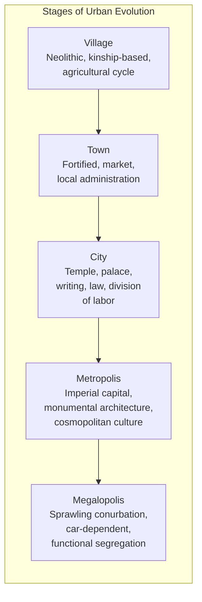
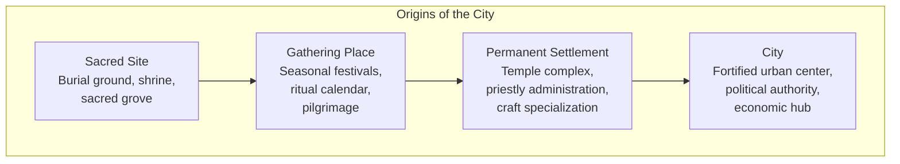

# Core Concepts

## The Evolution of Urban Form

Mumford traces the city through five stages of development, each representing a different balance of the city's functions: container of culture, center of power, focus of economic exchange, and setting for community life.

## The Sacred Origins

Mumford's most distinctive argument is that the city originated not as a fortress or market but as a sacred place. The first urban settlements grew around burial sites, shrines, and ritual gathering places. The calendar, the division of labor, and the first forms of writing and measurement all developed within the temple precinct. The city's economic and defensive functions were secondary to its sacred purpose: to bring the community together in collective celebration and worship.

## The Medieval Achievement

Mumford idealizes the medieval city as the high point of urban civilization. Medieval towns were compact, walled, and pedestrian-scaled. They mixed residential, commercial, and civic uses within a small area. The street was a social space as well as a thoroughfare. Public squares, markets, and church plazas provided gathering places. The city was embedded in its surrounding countryside, with gardens, fields, and pastures within the walls. Mumford argues that this organic integration of human activities produced a quality of urban life that has never been surpassed.

## The Baroque Counter-Revolution

The Baroque city represented a radical break with the organic medieval tradition. From the 16th century onward, European monarchs and their architects imposed geometric order on cities: straight avenues radiating from central squares, symmetrical facades, monumental perspectives designed to display state power. Haussmann's reconstruction of Paris under Napoleon III is the paradigmatic example. Mumford argues that Baroque planning prioritized spectacle and control over community and human scale.

# Chapter Insights

## Chapters 1–4: The Origins

Mumford traces urban origins from Paleolithic gathering places through Neolithic villages to the first cities of Mesopotamia, Egypt, and the Indus Valley.

## Chapters 5–8: The Ancient City

Covers the Greek polis, the Roman urbs, and the decline of classical urbanism. Greek cities achieved democracy and culture; Roman cities achieved scale and engineering.

## Chapters 9–12: The Medieval City

The heart of the book, arguing for the medieval city as the ideal urban form.

## Chapters 13–16: The Modern City

From the Baroque through the Industrial Revolution to the 20th-century megalopolis.

## Chapter 17: Retrospect and Prospect

Mumford's conclusion: a call for regional planning, decentralization, and the restoration of human scale.

# Practical Applications

## For Contemporary Planners

- **Study the medieval city.** Not to copy its form literally, but to understand how organic, human-scaled urbanism works.
- **Resist the megaproject.** The Baroque impulse to impose grand geometric schemes from above is alive and well in contemporary development.
- **Plan regions, not just cities.** Mumford was an early advocate of regional planning — understanding the city in its environmental and economic context.

## For Citizens

- **Know your city's history.** Understanding how your city developed helps you understand why it works or fails to work.
- **Protect public space.** The medieval city's squares and markets were the setting for civic life. Protect your city's public spaces.
- **Resist car-centric planning.** The automobile is the most powerful force reshaping cities in the image of the megalopolis.

# Actionable Lessons

- **Value human scale.** The best urban environments are designed for walking speed, not driving speed.
- **Integrate uses.** The medieval city's mix of residential, commercial, and civic uses within a small area is a model for sustainable urbanism.
- **Connect to nature.** The medieval city's integration of gardens and fields into the urban fabric is a lesson we have forgotten.
- **Measure cities by human outcomes, not economic metrics.** A city's first purpose is not wealth but human flourishing.

# Reading Guide

## Sufficiency Assessment

This summary captures Mumford's evolutionary framework and his central value judgments about different urban forms. The full book's richness lies in its detail and its prose.

## Recommended Reading Path

| Reader Type | Time | What to Read |
|---|---|---|
| Casual | 30 min | This summary |
| Interested | 6–8 hrs | Summary + Chapters 9–12 (medieval) + Chapter 17 (conclusion) |
| Scholar/Practitioner | 20–24 hrs | Full book |

## Chapters to Read in Full

- **Chapters 1–2** — Urban origins
- **Chapters 9–12** — The medieval city
- **Chapters 16–17** — The megalopolis and conclusion

## What You'll Miss by Not Reading the Full Book

- Mumford's gorgeous, muscular prose — he is one of the great American public intellectuals.
- The vast range of historical examples, from Catal Huyuk to Chandigarh.
- The passionate moral argument that makes the book not just a history but a critique of modernity.
