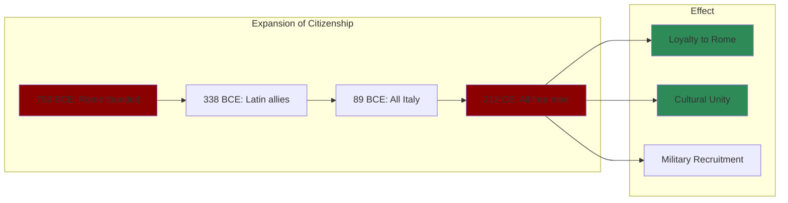
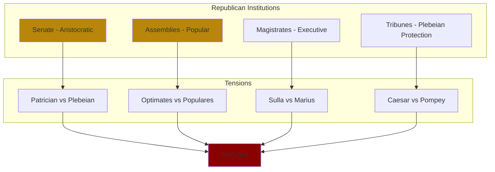

# Core Concepts

## Citizenship as Rome's Genius

Beard argues that the key to Rome's success was not military might but its unique approach to citizenship. Rome was remarkably generous in extending citizenship to conquered peoples, first in Italy and later across the empire. This created a powerful incentive for elites throughout the Mediterranean to identify with Rome rather than resist it.

## The Fragile Republic

Beard challenges the idealized picture of the Roman Republic. She shows that it was always a site of violent conflict between elite families, with the common people periodically rising up against aristocratic dominance. The Republic's institutions were designed for a small city-state and could not scale to govern an empire.

## Roman Diversity

One of Beard's most important contributions is showing how diverse the Roman Empire was. Far from being a monolithic "Roman" culture, the empire was a patchwork of local traditions, languages, and identities held together by a common legal and administrative framework.

## Rethinking Roman History

Beard encourages readers to question traditional narratives. She points out that much of what we "know" about early Rome is legend, that our sources are deeply biased toward the senatorial class, and that the emperors portrayed as monsters (Caligula, Nero) may have been more complex than the sources suggest.

# Chapter Insights

## Chapter 1: Cicero's Finest Hour

Beard opens with the murder of Cicero in 43 BCE, using this dramatic event to ask: what was Rome? The book's non-linear structure begins here rather than with Romulus to signal that this is not a conventional narrative.

## Chapter 2: The Early Republic

The foundation stories of Romulus, the rape of Lucretia, and the expulsion of the kings are treated not as literal history but as myths that reveal Roman values and self-understanding.

## Chapter 3: Conquest and Empire

Rome's expansion from Italy to the Mediterranean is traced through the Punic Wars and the conquest of Greece. Beard shows that Rome did not set out to build an empire but stumbled into it through a combination of opportunism and fear.

## Chapter 4: The Revolution

The late Republic is examined as a period of escalating violence and institutional breakdown. The Gracchi brothers, Marius, Sulla, and the civil wars are presented not as the fall of a golden age but as the logical outcome of a system that rewarded elite competition.

## Chapter 5: Augustus and the Empire

Augustus is shown as a master of propaganda who maintained the forms of the Republic while establishing one-man rule. Beard emphasizes the precariousness of the Augustan settlement.

# Practical Applications

- **Empire analysis**: Rome offers case studies in how empires incorporate and manage diverse populations
- **Political theory**: The Roman Republic's institutions and their failure illuminate challenges of representative government
- **Identity studies**: Roman citizenship as a model for multi-ethnic political identity

# Reading Guide

## Sufficiency Assessment

This summary captures SPQR's main themes and arguments but cannot replicate Beard's detailed argumentation and scholarly engagement.

## Recommended Reading Path

| Reader Type | Time | What to Read |
|---|---|---|
| Casual | ~20 min | This summary |
| Interested | ~4-5 hr | Summary + Chapters 1, 5, 10 |
| Scholar | ~12-15 hr | Full book |

## What You'll Miss

- Beard's engagement with archaeological evidence
- Her discussions of what we cannot know
- The digressions on Roman social life and culture
