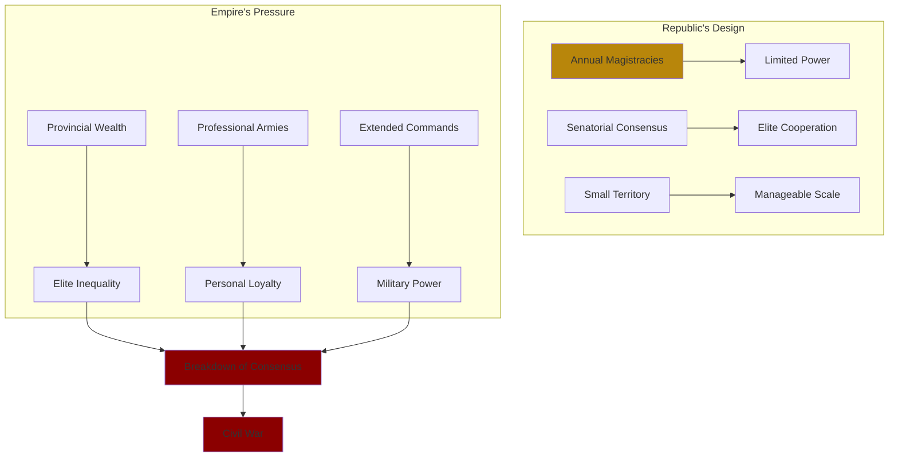

# Core Concepts

## The Republic's Fatal Flaw

Holland's central argument: the Roman Republic was designed for a small city-state where elite competition was contained by shared norms and limited resources. Rome's conquest of a Mediterranean empire created opportunities for wealth and power that shattered those norms. Generals like Marius, Sulla, Pompey, and Caesar commanded armies more loyal to themselves than to the state.

## The Politics of Glory

Roman elite culture revolved around the pursuit of gloria — glory earned through military conquest and political achievement. This competitive drive fueled Roman expansion abroad but became destructive at home. Holland shows how men like Caesar and Pompey were driven by a desperate need to outdo their ancestors and rivals.

## The Rubicon as Symbol

The title refers to Caesar's 49 BCE decision to cross the Rubicon River with his army in defiance of the Senate's orders. This was illegal — a general could not bring troops into Italy proper. Holland uses this moment as the central symbol of the Republic's collapse: the point at which a Roman chose personal ambition over the laws and traditions of the state.

## Caesar: The Great Destroyer

Holland presents Caesar not as a visionary reformer but as a brilliant, ruthless gambler who destroyed the Republic to satisfy his ambition. His genius was military and political, but he failed to understand that the Republic could not be restored. His mistake was trying to reform a system that was already dead.

## Augustus: The Great Illusionist

Octavian, later Augustus, learned from Caesar's fate. He understood that Romans needed the illusion of the Republic even as they accepted autocracy. His achievement was creating a system that preserved Republican forms — the Senate, the magistracies — while concentrating real power in his own hands.

# Chapter Insights

## The Tarpeian Rock

Holland opens with the dramatic story of the Tarpeian Rock, from which traitors were thrown to their deaths, establishing the theme that Rome was a city of violent extremes.

## Hannibal and the Crisis of Empire

Rome's victory over Carthage created the conditions for the Republic's fall. The wealth and power that flowed from empire corrupted the institutions that had won it.

## Marius and Sulla

The first civil wars established the pattern: generals using their armies against their political rivals. Sulla's dictatorship and proscriptions were a dress rehearsal for what was to come.

## The Conspiracy of Catiline

Cicero's suppression of the Catilinarian conspiracy is presented as a crucial moment, showing both the fragility of the Republic and the senatorial class's willingness to use extralegal force.

## Caesar in Gaul

Caesar's conquest of Gaul gave him the wealth, military reputation, and loyal army he needed to challenge the Republic itself.

## The Crossing

The climax: Caesar's decision to cross the Rubicon, triggering the civil war that ended the Republic.

# Practical Applications

- **Institutional design**: The Republic's failure shows the danger of institutions that cannot adapt to changing scales
- **Leadership**: Compare Caesar's direct challenge with Augustus's subtle approach to gaining power
- **Elite competition**: Lessons in how competitive dynamics can destroy cooperative systems

# Reading Guide

## Sufficiency Assessment

This summary captures the narrative arc and key themes. The full book offers vivid character portraits and dramatic storytelling that the summary cannot replicate.

## Recommended Reading Path

| Reader Type | Time | What to Read |
|---|---|---|
| Casual | ~15 min | This summary |
| Interested | ~3-4 hr | Summary + Chapters on Caesar and Augustus |
| Full | ~8-10 hr | Read the whole thing — it's that good |

## What You'll Miss

- Holland's vivid character sketches
- The dramatic set-piece battles and assassinations
- The dark humor and irony throughout
