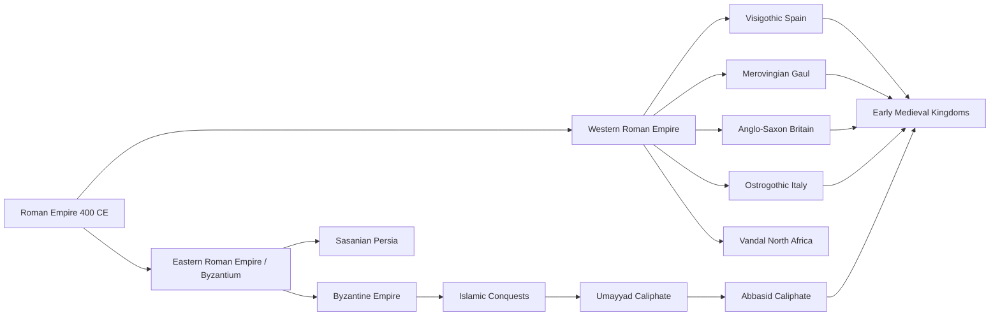
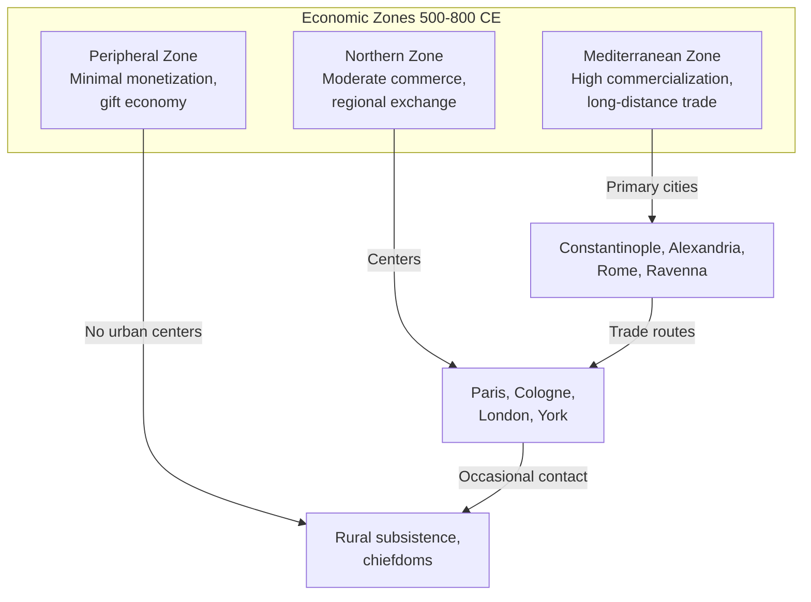
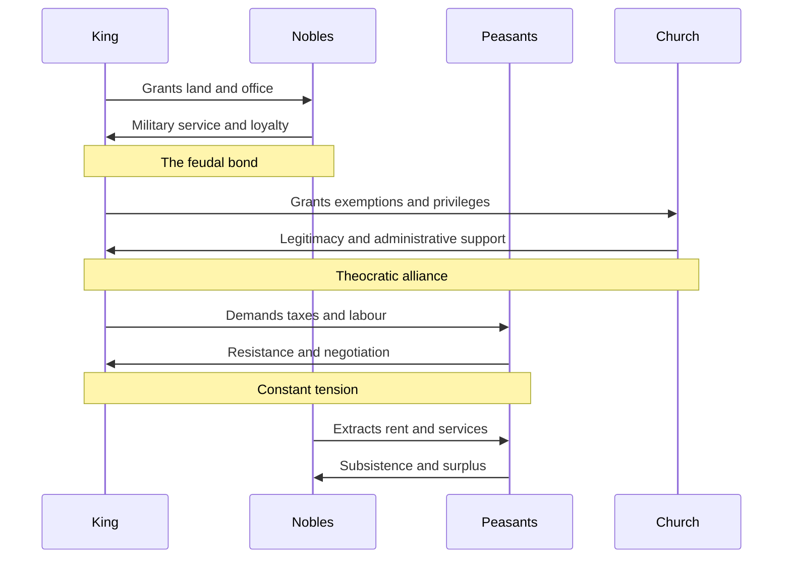
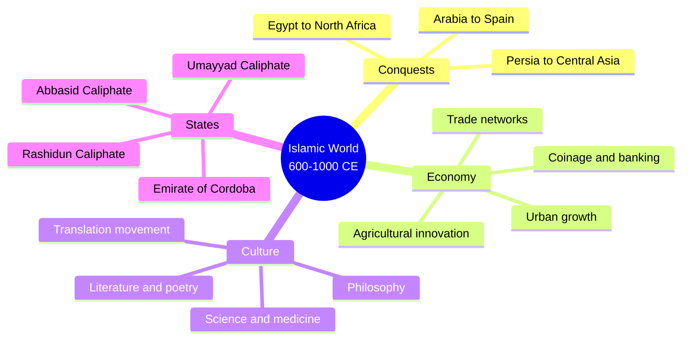

## The Transformation of the Roman World

Wickham opens with a fundamental revision of the traditional narrative. The Roman Empire did not fall in 476 CE when the last Western emperor was deposed; it transformed over centuries through a process of political fragmentation, economic restructuring, and cultural change. The Eastern Roman Empire (Byzantium) continued for another thousand years, and even in the West, Roman institutions — law, taxation, municipal government, the Latin language — persisted in various forms for generations after the conventional end date.

The key driver of transformation was the collapse of the Roman tax system. The Roman state extracted taxes on a scale not seen again in Europe until the early modern period. When this system disintegrated in the West, the economic logic that had supported long-distance trade, urban life, and a professional military vanished. The post-Roman kingdoms were poorer, smaller, and less administratively capable than the empire they replaced, but they were also more flexible and locally responsive.

## Economic Structures

Wickham's analysis of the early medieval economy is the book's most distinctive contribution. He divides Europe into three economic zones based on the density of exchange and the extent of commercialization.

The first zone, centred on the Mediterranean, maintained significant long-distance trade through networks linking Byzantium, Egypt, Syria, and Italy. The second zone, covering northern Gaul, the Rhineland, and southern Britain, saw a dramatic contraction of exchange but maintained local markets and some regional trade. The third zone, including Scandinavia, the Slavic lands, and much of Britain, was largely non-commercial, with exchange limited to gift-giving and occasional trade.

Wickham's key argument is that economic change was driven primarily by demand from elites. When Roman aristocrats stopped demanding luxury goods from the East, the trade networks that supported Mediterranean unity collapsed. When new elites — Carolingian nobles, Byzantine officials, Islamic merchants — developed new tastes and demands, new trade networks formed.

## Political Structures: Kingdoms and Empires

Early medieval states were built on personal relationships rather than bureaucratic institutions. A king's power depended on his ability to reward followers with land and treasure, not on his control of territory or administration. This made early medieval politics inherently unstable — a king who could not reward his followers would soon find himself without followers.

Wickham devotes substantial attention to the Carolingian Empire, the most ambitious state-building project of the early Middle Ages. Charlemagne's empire united much of Western Europe under a single ruler for the first time since Rome, and it created an administrative infrastructure — counts, missi dominici, capitularies — that later states would imitate. But the Carolingian achievement was fragile. The empire fragmented within a generation of Charlemagne's death, undermined by the logic of partible inheritance, the power of regional aristocracies, and the pressure of Viking, Magyar, and Muslim raids.

## The Carolingian Renaissance

Wickham presents the Carolingian cultural revival as a genuine transformation of intellectual life, not just a preservation of classical texts. The reform of Latin, the standardization of script (Carolingian minuscule), the establishment of cathedral and monastic schools, and the production of lavishly illuminated manuscripts created a shared culture that would define medieval Europe for centuries.

The key figure was Alcuin of York, whom Charlemagne recruited to lead his palace school. Alcuin and his colleagues rescued texts that would otherwise have been lost, developed new methods of teaching, and created a curriculum that remained standard in European education for centuries.

## The Rise of Islam

Wickham's treatment of the Islamic world is one of the book's great strengths. He shows how the Arab conquests of the seventh and eighth centuries created a new economic superpower that stretched from Spain to Central Asia. The Islamic world inherited the commercial networks of late antiquity and expanded them dramatically, creating an integrated economic zone that was larger and more prosperous than anything the Mediterranean had seen under Rome.

The Abbasid caliphate, centered on Baghdad, was the richest and most sophisticated state of the early Middle Ages. Its tax revenues dwarfed those of any European kingdom. Its cities — Baghdad, Cairo, Cordoba, Damascus — were centres of learning, commerce, and culture that had no parallel in the Latin West.

## Byzantium: The Roman Empire That Didn't Fall

Wickham provides a detailed account of Byzantine history that challenges the common view of Byzantium as a declining, decadent empire. The Byzantine state was the direct continuation of the Roman Empire, with the same legal system, the same administrative structure, and the same imperial ideology. It survived because it maintained the Roman tax system, which funded a professional army and a sophisticated bureaucracy.

The Byzantine economy was the most commercialized in the early medieval world. Constantinople, with a population that may have reached half a million, was the largest city in Europe until the High Middle Ages. Byzantine luxury goods — silk, ivory, jewelry, icons — were traded across Europe, the Islamic world, and even into Scandinavia and Central Asia.

## Vikings, Slavs, and New Peoples

The final section of the book examines the impact of new peoples on the post-Roman world. Wickham presents the Vikings not as barbarian invaders but as traders and settlers who were integrated into European society within a few generations. The Viking Age was a phenomenon of the ninth and tenth centuries, and by the year 1000, Vikings had become Christian kings, merchants, and mercenaries indistinguishable from their neighbours.

The Slavic peoples, who had been largely invisible in the Roman period, emerged as significant political actors in the ninth and tenth centuries. The conversion of the Rus to Orthodox Christianity under Prince Vladimir in 988 brought the Slavic world into the Byzantine cultural sphere, creating the foundations of Russian civilization.

## Chapter Insights

### Chapters 1-3: The Roman Legacy
Wickham surveys the Roman world in 400 CE and traces the processes of political and economic change that transformed it.

### Chapters 4-7: The Post-Roman Kingdoms
Detailed studies of the Visigothic, Merovingian, Ostrogothic, and Anglo-Saxon kingdoms, with emphasis on their adaptation of Roman institutions.

### Chapters 8-12: Byzantium and the Islamic World
The continuation of the Roman state in the East and the revolutionary impact of the Arab conquests.

### Chapters 13-16: The Carolingian Empire
The rise and fall of the most ambitious state-building project of the early Middle Ages.

### Chapters 17-21: The Tenth Century
The emergence of new political structures, the end of the Viking Age, and the transformation of Europe on the eve of the High Middle Ages.

## Reading Guide

### Sufficiency Assessment

This summary captures the main arguments and structure of Wickham's survey, including the economic framework, the transformation of the Roman world, the Carolingian achievement, and the parallel histories of Byzantium and the Islamic world. It omits the detailed regional case studies that make up the bulk of the book.

### Recommended Reading Path

| Reader Type | Time | What to Read |
|---|---|---|
| Casual | ~30 min | This summary |
| Interested | ~6 hr | Summary + Chapters 1, 8, 12, 14, 20 |
| Scholar | ~24 hr | Full book |

### Chapters to Read in Full

- **Chapter 1** — The Roman legacy and the transformation thesis
- **Chapter 8** — Byzantium as the continuing Roman state
- **Chapter 12** — The Islamic world and its impact on Europe
- **Chapter 14** — The Carolingian experiment

### What You'll Miss by Not Reading the Full Book

The detailed regional studies that make Wickham's argument persuasive, and the footnotes that point to the scholarly debates behind every claim.
