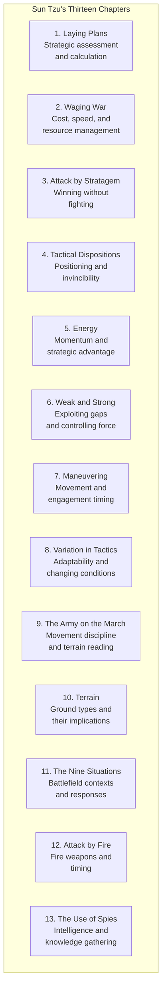
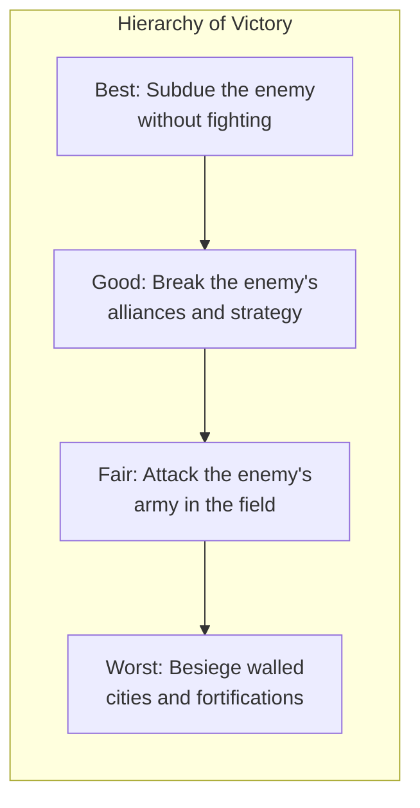

# Core Concepts

## The Thirteen Chapters

Each chapter is a brief, concentrated treatment of a single aspect of warfare. The chapters are not sequential instructions but thematic lenses through which strategy should be viewed.

## Key Principles

**Sun Tzu's Strategic Hierarchy**

Sun Tzu ranks forms of victory by their cost and risk. The highest form is to achieve your objectives without fighting at all — through superior positioning, psychological warfare, and strategic pressure. The lowest form is a siege, which is costly, time-consuming, and requires overwhelming force.

**The Five Factors**

Every strategic situation should be assessed according to five factors: moral influence (the cause), weather, terrain, command (leadership), and doctrine (organization). Sun Tzu provides systematic questions for each factor. A leader who has correctly assessed all five factors will win; one who has not will lose.

**Know Yourself and Know Your Enemy**

This is Sun Tzu's most famous teaching. Knowledge of both your own capabilities and your opponent's is the foundation of all strategic action. Without it, every move is a gamble.

# Chapter Insights

## Chapter 1: Laying Plans

The opening chapter establishes the strategic framework. War is a matter of vital importance; it must be approached through careful calculation. Sun Tzu lists the five factors and seven questions that must be answered before any military action.

## Chapter 3: Attack by Stratagem

The most famous chapter. Sun Tzu presents his hierarchy of victory and explains how to win without fighting. Breaking the enemy's resistance through strategy is superior to destroying his army.

## Chapter 6: Weak and Strong

The art of managing force: appearing where you are not expected, concentrating strength against weakness, and controlling the rhythm of battle. This chapter contains the often-misused maxim "avoid the strong, attack the weak."

## Chapter 13: The Use of Spies

The concluding chapter on intelligence, which Sun Tzu considers the foundation of all strategy. He identifies five types of spies and argues that no expenditure on intelligence is too great.

# Practical Applications

## In Business Strategy

- **Assess the competitive landscape** using Sun Tzu's five factors before entering a new market.
- **Win without fighting.** Use positioning, differentiation, and strategic alliances to achieve market dominance without price wars.
- **Gather intelligence.** Understand your competitors, your customers, and your own capabilities before making strategic decisions.

## In Leadership

- **Lead by moral authority.** Soldiers fight better for a cause they believe in. The same applies to employees.
- **Be flexible.** Adapt your strategy to changing conditions. Sun Tzu warns against rigid adherence to plans.
- **Know when not to fight.** Retreat and repositioning are strategic, not dishonorable.

## In Personal Development

- **Know yourself.** Honest self-assessment is the foundation of improvement.
- **Create advantages before you need them.** Preparation determines outcome.
- **Use indirect approaches.** When direct confrontation is costly, find a way around the obstacle.

# Actionable Lessons

- **Calculate before you act.** Do not move until you have assessed the situation thoroughly.
- **Make the enemy come to you.** Control the timing and location of engagement.
- **Use deception consistently.** Keep opponents uncertain of your intentions and capabilities.
- **Strike where the enemy is weak.** Concentrate force against vulnerability.
- **Adapt to circumstances.** No plan survives contact with the situation.

# Reading Guide

## Sufficiency Assessment

This summary captures the core structure and key principles of The Art of War. The full text is short and rewards direct reading — it is only about fifty pages.

## Recommended Reading Path

| Reader Type | Time | What to Read |
|---|---|---|
| Casual | 15 min | This summary + key chapters (1, 3, 6, 13) |
| Interested | 2–3 hrs | Summary + the full text with commentary |
| Scholar/Practitioner | 4–6 hrs | Multiple translations with historical commentary |

## What You'll Miss by Not Reading the Full Book

- The precise language and aphoristic power of the original, which no summary can capture.
- The historical context and commentary that explain the military and philosophical background.
- The cumulative effect of reading all thirteen chapters as a coherent system of thought.
