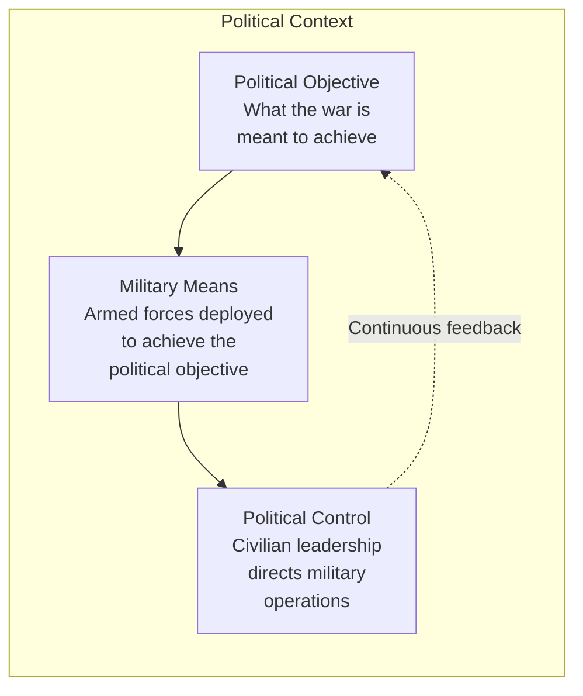
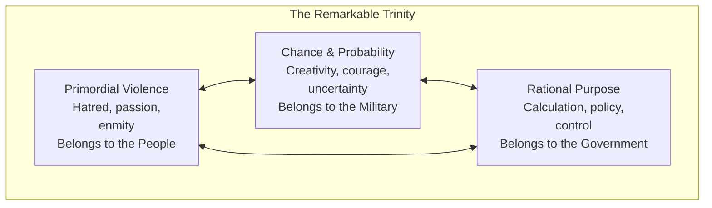
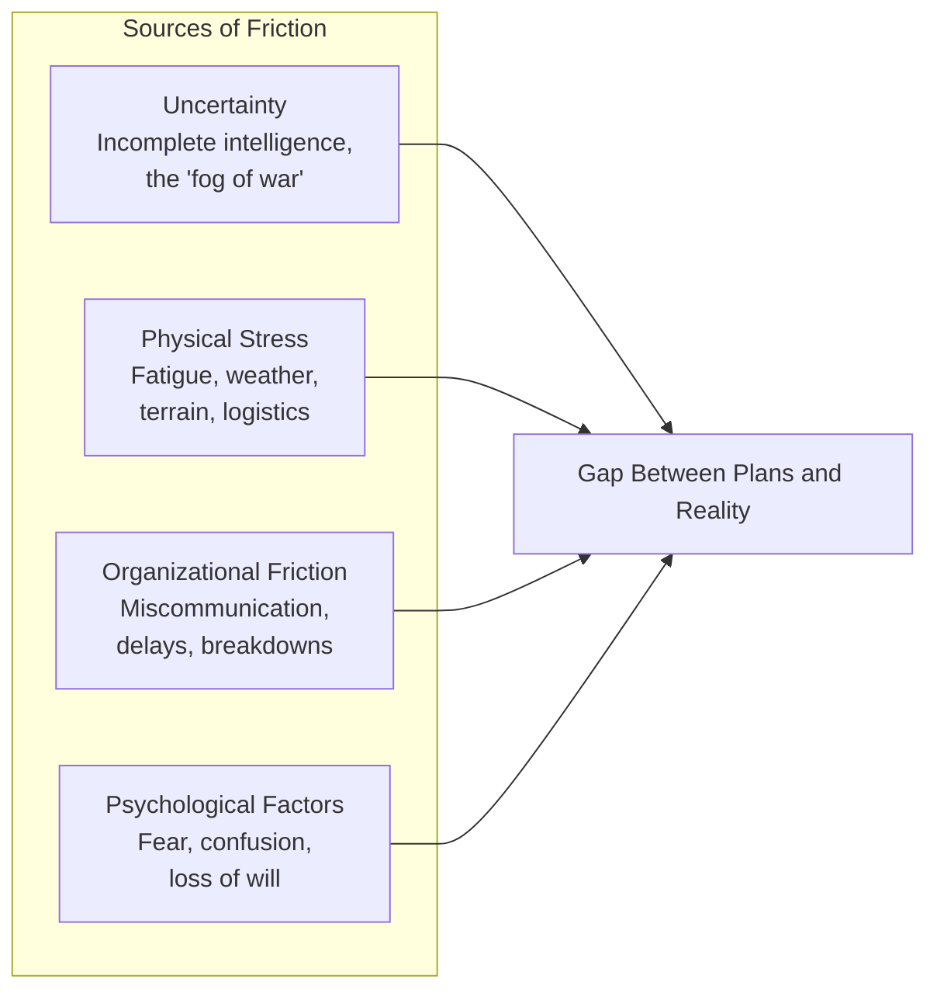

# Core Concepts

## War as Politics

Clausewitz's most famous contribution: "War is not merely an act of policy but a true political instrument, a continuation of political intercourse, carried on with other means." This means that war cannot be understood in isolation. Military action always serves political ends, and the political objective should determine the military objective. The failure to maintain this connection is a common cause of strategic failure.

## The Remarkable Trinity

War is not a single phenomenon but a composite of three tendencies. The first is primordial violence, hatred, and enmity, which belong to the people. The second is the play of chance and probability, within which the creative spirit is free to roam, belonging to the military. The third is the element of subordination as an instrument of policy, belonging to the government. These three tendencies are in constant interaction, and the theorist must keep them all in view.

## Friction

Friction is Clausewitz's term for the accumulated difficulties that make real war different from war on paper. Everything in war is simple, but the simplest thing is difficult. A battalion that should be in position by morning arrives at noon. A message that should be clear is misunderstood. A plan that looked perfect on the map fails in execution. Friction is not an exception but the normal condition of war. The purpose of training, discipline, and experience is to reduce but never eliminate friction.

## Center of Gravity

Clausewitz defines the center of gravity as "the hub of all power and movement, upon which everything depends." It is the source of the enemy's strength. All energy should be directed toward striking it. The center of gravity may be the enemy's army (the most common case), their capital city, their alliances, their public opinion, or their leadership. Identifying the enemy's true center of gravity is one of the commander's most important responsibilities.

# Chapter Insights

## Book One: On the Nature of War

The most important and finished section of the book. Clausewitz establishes his core concepts: war as an act of force, the trinity, friction, and the relationship between war and politics.

## Book Three: Strategy in General

Discusses the relationship between strategy and tactics, the concept of the center of gravity, and the principle of concentration of force.

## Book Eight: War Plans

The concluding book, intended to synthesize the entire work into a theory of war plans. Here Clausewitz develops his most complete statement on the relationship between war and politics.

# Practical Applications

## For Strategic Thinking

- **Always connect means to ends.** Every military action should be traceable back to a political objective. If it cannot, it should not be undertaken.
- **Expect friction.** Plans will not survive contact with reality. Build buffers, redundancy, and adaptability into strategic planning.
- **Identify the center of gravity.** Focus overwhelming force on the enemy's source of strength. A dispersed effort achieves nothing.

## For Leadership

- **Embrace uncertainty.** The fog of war is not an excuse for inaction but a condition to be managed. Decisive action under uncertainty is the mark of a commander.
- **Build morale.** The psychological dimension of war matters as much as the physical. Soldiers and units with high morale overcome friction.
- **Maintain political-military dialogue.** Clausewitz insists on civilian control of the military but also on genuine dialogue between political and military leaders.

# Actionable Lessons

- **War is not an independent activity.** Never separate military action from its political context.
- **The simplest thing is difficult.** Plan for friction, expect delays, build redundancy.
- **Concentrate force.** Identify the decisive point and apply maximum force there.
- **Theory is a guide, not a recipe.** War resists theoretical reduction; adapt principles to circumstances.

# Reading Guide

## Sufficiency Assessment

This summary captures Clausewitz's four core concepts. The full book develops these concepts over hundreds of pages of dense argument.

## Recommended Reading Path

| Reader Type | Time | What to Read |
|---|---|---|
| Casual | 30 min | This summary |
| Interested | 6–8 hrs | Summary + Book One (all chapters) + Book Eight |
| Scholar/Practitioner | 25–30 hrs | Complete work (Books One through Eight) |

## Chapters to Read in Full

- **Book One, Chapter 1** — The most important single chapter: the trinity, friction, war as politics
- **Book Three, Chapter 9-10** — The center of gravity
- **Book Eight, Chapters 1-6** — War plans and the political object

## What You'll Miss by Not Reading the Full Book

- The full development of the trinity concept across multiple chapters.
- The detailed discussion of military genius and the qualities of command.
- The exploration of tactical topics like battle, engagement, and defensive versus offensive operations.
- The unfinished quality and internal tensions that make the book a living document of strategic thinking.
