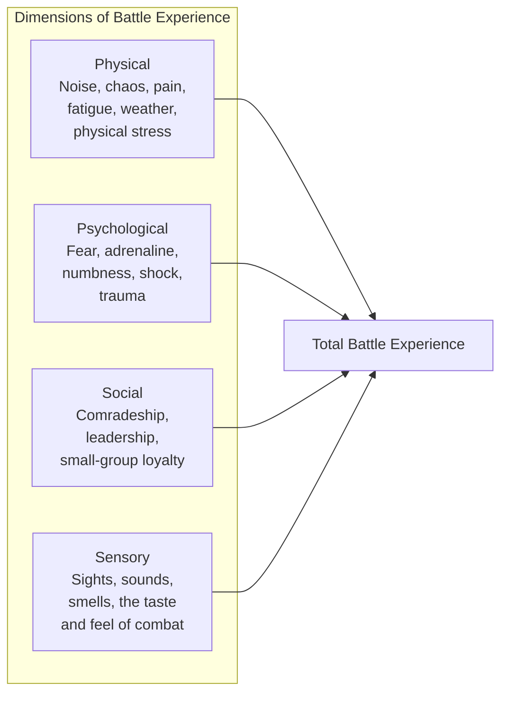
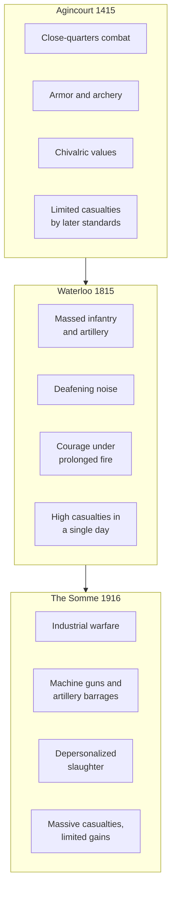

# Core Concepts

## The Experience of Battle

Keegan's innovation is to treat battle as a human experience to be understood through multiple dimensions, not as a tactical problem to be analyzed. He reconstructs what soldiers saw, heard, smelled, and felt — the sensory reality that conventional military history ignores.

## Three Battles, Three Eras

Each battle represents a different era of military technology and organization, and Keegan shows how these differences shaped the experience of the soldiers who fought.

## The Changing Nature of Wounds

Keegan examines the medical evidence from each battle to reveal the nature of the weapons involved. At Agincourt, arrow wounds caused massive bleeding but were often survivable if the arrow missed vital organs. At Waterloo, musket balls caused devastating compound fractures and infections. On the Somme, high-explosive artillery and machine-gun fire produced wounds of unprecedented severity. The kind of wound a soldier suffered tells the story of the weapons they faced.

# Chapter Insights

## Chapter 1: Old, Unhappy, Far-Off Things

The introductory chapter explains Keegan's approach and critiques traditional military history. He argues that military historians have focused on "battle as a historical entity" — the who, what, when, where — while ignoring the human experience.

## Chapter 2: Agincourt

Keegan reconstructs the 1415 battle from the soldier's perspective. He discusses armor, the longbow, close-quarters combat, and the chivalric code that shaped how medieval soldiers understood their experience. The famous description of the archers and the mud-soaked final stages of the battle is among the most vivid passages in military history.

## Chapter 3: Waterloo

A larger, more complex battle, Waterloo involved massive formations of infantry, cavalry, and artillery. Keegan focuses on the sensory and psychological experience of standing in a square while cavalry charged, the terrifying noise of artillery, and the prolonged physical and emotional strain of a battle that lasted all day.

## Chapter 4: The Somme

The longest and most devastating chapter. Keegan describes the first day of the Somme (July 1, 1916), when the British army suffered nearly 60,000 casualties, including 20,000 dead, in a single day. He examines the psychology of going over the top, the nature of machine-gun and artillery wounds, and the breakdown of traditional military cohesion under industrial warfare.

## Chapter 5: The Future of Battle

Keegan speculates about the future of battle in an era of nuclear weapons and asks whether the traditional face-to-face battle has become obsolete.

# Practical Applications

## For Historians

- **Look beyond the generals.** The experience of ordinary participants is a legitimate and essential subject of military history.
- **Use multiple sources.** Letters, memoirs, medical reports, and material culture provide perspectives that official records omit.
- **Reconstruct sensory reality.** Understanding what battle felt, sounded, and smelled like is as important as understanding what happened.

## For Military Professionals

- **Prepare for friction.** Keegan confirms Clausewitz's insight that battle is chaos. Training must prepare soldiers for confusion, not just for executing plans.
- **Understand small-group dynamics.** Soldiers fight for each other, not for abstractions. Unit cohesion is the foundation of combat effectiveness.
- **Study the psychology of battle.** The gap between what leaders expect and what soldiers can endure is a persistent challenge.

## For Citizens

- **Understand what war actually costs.** The casualty figures on the news are not abstractions — they represent individual humans whose experience Keegan helps us imagine.
- **Be skeptical of romanticized war.** Keegan's battle is terrifying, confusing, and brutal, not glorious.

# Actionable Lessons

- **Military history should include the soldier's perspective.** Without it, we do not understand what battle is.
- **Technology changes the experience of battle fundamentally** — but the psychological challenges of fear, fatigue, and group loyalty are constant.
- **Battle is not a test of plans but of human endurance.** The side that can endure the most fear and chaos longest tends to win.
- **The memory of battle is shaped by culture.** How soldiers interpret their experience depends on the stories their society tells about war.

# Reading Guide

## Sufficiency Assessment

This summary captures Keegan's approach and the key contrasts among the three battles. The full book provides the detailed reconstruction that brings each battle to life.

## Recommended Reading Path

| Reader Type | Time | What to Read |
|---|---|---|
| Casual | 20 min | This summary |
| Interested | 3–4 hrs | Summary + one battle chapter (Agincourt or Somme recommended) |
| Scholar/Practitioner | 8–10 hrs | Full book — the cumulative effect of three battles is essential |

## Chapters to Read in Full

- **Chapter 1** — The methodological introduction
- **Chapters 2 and 4** — Agincourt and the Somme (the most vivid case studies)
- **Chapter 5** — The conclusion on the future of battle

## What You'll Miss by Not Reading the Full Book

- The extraordinary sensory detail that makes Keegan's reconstruction so powerful.
- The comparative analysis across six centuries that reveals both continuity and change in the experience of battle.
- The medical evidence that provides an objective window into the physical reality of combat.
