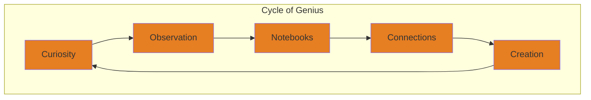
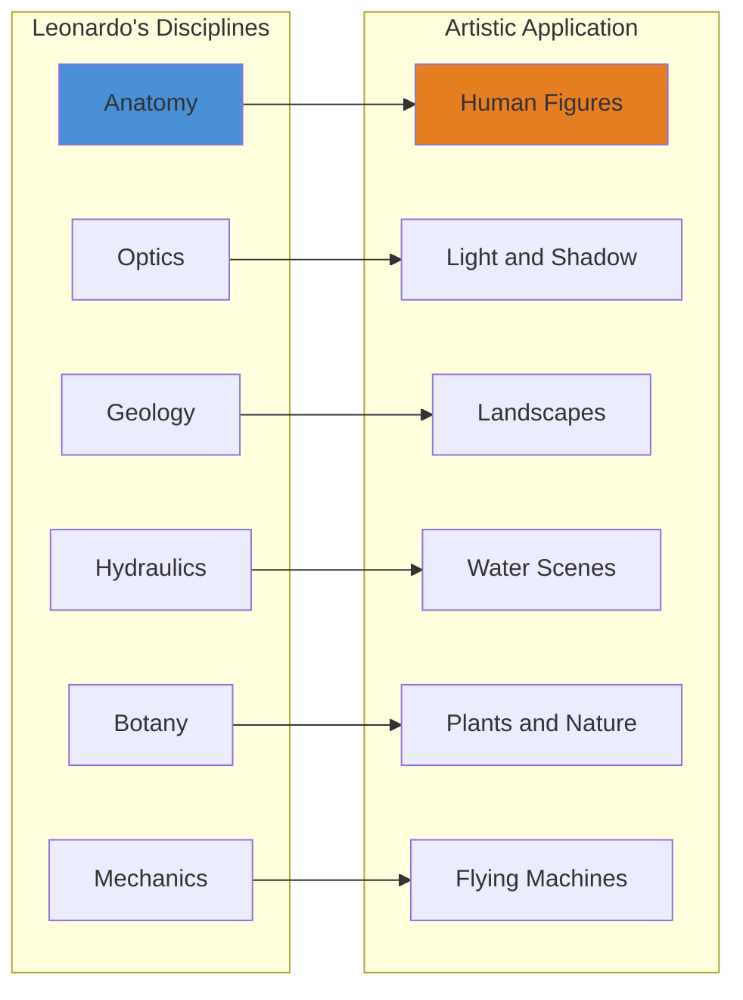

# Core Concepts

## Curiosity as the Engine of Genius

Isaacson's central argument: Leonardo's genius was not supernatural but the product of relentless, inexhaustible curiosity. His notebooks contain thousands of questions — about the flow of water, the flight of birds, the muscles of the face, the growth of trees. He was never satisfied with received wisdom and insisted on observing nature directly.

## Making Connections

Leonardo's greatest skill was synthesizing knowledge across disciplines. He dissected human corpses to understand muscles, then used that knowledge to paint more lifelike figures. He studied fluid dynamics to paint water, geology to paint landscapes, optics to paint light and shadow.

## The Unfinished Masterpiece

Leonardo left many works unfinished — the Adoration of the Magi, the Battle of Anghiari, and others. Isaacson argues this was not laziness but a perfectionism that made him unable to declare a work complete. He was always revising, always finding new problems to solve. This same trait drove his greatest research.

## Observation Over Authority

Leonardo rejected the medieval method of relying on ancient authorities like Aristotle and Galen. He insisted on direct observation. When he dissected a heart and found something that contradicted Galen, he trusted his eyes. This made him a pioneer of modern empirical science.

# Chapter Insights

## The Childhood

Illegitimate son of a Florentine notary and a peasant woman, Leonardo received no formal education in Latin or Greek. This lack of traditional learning may have freed him to think originally — he learned by observing rather than reading.

## Verrocchio's Workshop

Apprenticed to Andrea del Verrocchio, Leonardo learned painting, sculpture, mechanics, and the systematic observation that would define his career. His first documented work is an angel in Verrocchio's Baptism of Christ.

## The Notebooks

Isaacson devotes substantial attention to Leonardo's notebooks — over 7,200 surviving pages of observations, drawings, inventions, and speculations. They reveal a mind ranging from the sublime (the nature of the soul) to the mundane (grocery lists).

## The Last Supper

Painted on the wall of Santa Maria delle Grazie in Milan, The Last Supper is analyzed in detail. Isaacson explains its innovations in perspective, composition, and psychological realism.

## Mona Lisa

The most famous painting in the world receives extended treatment. Isaacson explores the sfumato technique, the mysterious smile, and what the painting reveals about Leonardo's understanding of human emotion and light.

## Anatomy

Leonardo dissected over thirty human corpses, producing anatomical drawings that remained unsurpassed for centuries. He discovered the cross-section of the heart's chambers and predicted modern understanding of atherosclerosis.

## The Final Years

Leonardo spent his last years in France under the patronage of Francis I. His health declined, but he continued to draw and speculate until the end.

# Practical Applications

- **Cultivate curiosity**: Ask questions about everything you observe
- **Keep notebooks**: Record observations, questions, and ideas regularly
- **Make connections**: Look for links between different fields of knowledge
- **Embrace incompleteness**: The drive for perfection fuels discovery

# Reading Guide

## Sufficiency Assessment

This summary captures the book's main themes and key episodes. The full book offers much deeper analysis of Leonardo's art, notebooks, and intellectual development.

## Recommended Reading Path

| Reader Type | Time | What to Read |
|---|---|---|
| Casual | ~20 min | This summary |
| Interested | ~4-5 hr | Summary + chapters on Mona Lisa, notebooks |
| Full | ~12-14 hr | Full book |

## What You'll Miss

- Detailed analysis of individual paintings
- The full range of notebook drawings
- Isaacson's synthesis of recent scholarship
